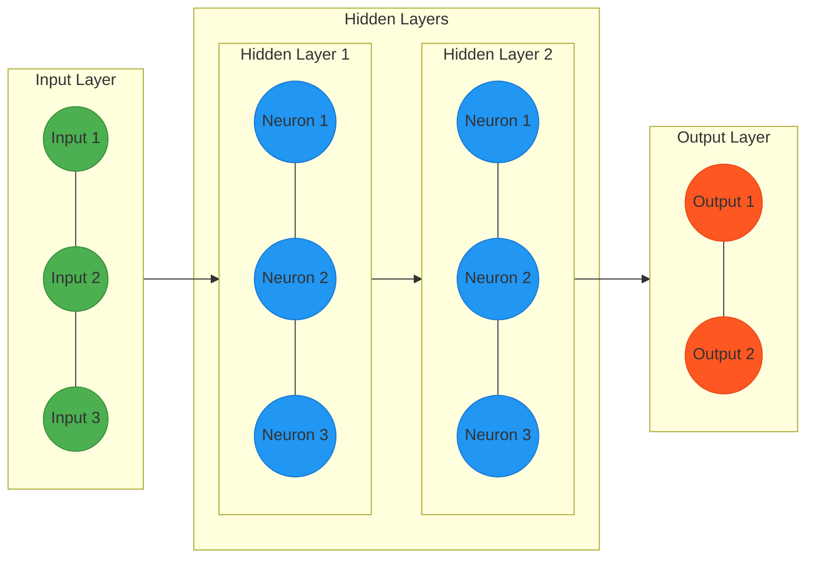

### **1. Supervised Learning (Học có giám sát)**

**Supervised Learning (Học có giám sát)** là một loại machine learning trong đó các thuật toán được huấn luyện trên các tập dữ liệu được gắn nhãn(labeled datasets). Mục tiêu của phương pháp này là xây dựng một mô hình, thông qua việc nhận diện các mẫu và quy luật để học mối quan hệ giữa **đầu vào (X)** và một **đầu ra tương ứng (Y). T**ừ đó có thể đưa ra dự đoán chính xác(predict outcomes) dữ liệu mới.

[When Models Meet Data](https://www.notion.so/When-Models-Meet-Data-1961e3ae47b880f2af8fc985b15e02de?pvs=21)

### **Regression (Hồi quy):**

- **Decision Tree Algorithms** (Thuật toán cây quyết định) → Dùng cho phân loại và hồi quy

[**Regularization Algorithms** (Thuật toán điều chuẩn)](https://www.notion.so/Regularization-Algorithms-Thu-t-to-n-i-u-chu-n-1961e3ae47b880bdbf07d5fa9494fbb1?pvs=21)

- → Ví dụ: Ridge Regression, Lasso

[**Hồi quy tuyến tính (Linear Regression)**](https://www.notion.so/H-i-quy-tuy-n-t-nh-Linear-Regression-1851e3ae47b8803d96b2c0e8f6e0b8fd?pvs=21)

- Jackknife Regression
- Ordinary Least Squares Regression (OLSR)
- Stepwise Regression
- Multivariate Adaptive Regression Splines (MARS)
- Locally Estimated Scatterplot Smoothing (LOESS)
- Time Series Forecasting

### **Classification (Phân loại):**

**Classification** là bài toán mà mô hình phải dự đoán một **nhãn (label)** cho mỗi dữ liệu đầu vào. Nhãn này là một phần tử thuộc một tập hợp, có C phần tử khác nhau và hữu hạn các lớp (**finite set of classes**).

Biểu diễn dưới dạng hàm số $f: \mathbb{R}^d \to \{1,2,\dots,C\}$

[**Ensemble Algorithms (Thuật toán tập hợp)**](https://www.notion.so/Ensemble-Algorithms-Thu-t-to-n-t-p-h-p-1b31e3ae47b880678575e6b88b1dad9d?pvs=21)

[**Hồi quy Logistic (Logistic Regression)**](https://www.notion.so/H-i-quy-Logistic-Logistic-Regression-1851e3ae47b880a0899df4ed21d5a213?pvs=21)

Multinomial Logistic Regression (hay Softmax Regression) là một mở rộng của Logistic Regression dùng cho bài toán phân loại nhiều lớp

- **Bayesian Algorithms** (Thuật toán Bayes) → Ví dụ: Naïve Bayes, Bayesian Network
- **Instance-based Algorithms** (Thuật toán dựa trên mẫu) → Ví dụ: k-Nearest Neighbors (k-NN)
- **Bộ phân loại Naive-Bayes (Naive Bayes Classifier)**
- **Thuật toán học Perceptron (Perceptron Algorithm)**
- **Máy vector hỗ trợ (Support Vector Machines - SVM)**
- **Máy vector hỗ trợ lề mềm (Soft Margin SVM)**
- **Máy vector hỗ trợ hạt nhân (Kernel SVM)**
- **Máy vector hỗ trợ đa lớp (Multi-class SVM)**

---

### **2. Unsupervised Learning (Học không giám sát)**

**Unsupervised Learning** (Học không giám sát) là một nhánh của Machine Learning, trong đó mô hình học từ dữ liệu **không có nhãn** và **không có kết quả đầu ra xác định trước(**without labeled responses). Mục tiêu chính của Unsupervised Learning là **tìm ra các cấu trúc ẩn hoặc quy luật tiềm ẩn(**identify hidden patterns or intrinsic structures) trong dữ liệu đầu vào.

### **Association(liên kết):**

### **Clustering (Phân nhóm):**

- **K-lân cận (K-nearest Neighbors - KNN)**
- **Phân cụm K-means (K-means Clustering)**

### **Dimensionality Reduction Algorithms (Thuật toán giảm chiều):**

- **Phân tích giá trị suy biến (Singular Value Decomposition - SVD)**
- **Phân tích thành phần chính (Principal Component Analysis - PCA)**

---

### **3. Semi-Supervised Learning (Học bán giám sát)**

**Semi-supervised learning (học bán giám sát)**: là phương pháp học máy kết hợp giữa **Supervised Learning (học có giám sát)** và **Unsupervised Learning (học không giám sát)**. Trong đó, mô hình được huấn luyện với một tập dữ liệu gồm cả **dữ liệu có nhãn (labeled data) và dữ liệu không có nhãn (unlabeled data)**

---

### **4. Reinforcement Learning (Học củng cố)**

**Reinforcement learning** là các bài toán giúp cho một hệ thống tự động xác định hành vi dựa trên hoàn cảnh để đạt được lợi ích cao nhất (**maximizing the performance**). Hiện tại, Reinforcement learning chủ yếu được áp dụng vào Lý Thuyết Trò Chơi (**Game Theory**), các thuật toán cần xác định nước đi tiếp theo để đạt được điểm số cao nhất.

---

### **Artificial Neural Network Algorithms (Thuật toán mạng neuron nhân tạo):**

- **Mạng neuron đa tầng và lan truyền ngược (Multi-layer Neural Networks and Backpropagation)**

---

### **6. Các lĩnh vực toán học hỗ trợ**

### [[**Probability and Statistics**]]  **(Xác suất và thống kê):**

- **Ôn tập xác suất (Probability Review)**
- **Ước lượng tham số mô hình (Parameter Estimation)**

### **Linear Algebra:**

- **Phân tích biệt thức tuyến tính (Linear Discriminant Analysis - LDA)**

### **Optimization (Tối ưu hóa):**

- **Tập lồi và hàm lồi (Convex Sets and Convex Functions)**
- **Bài toán tối ưu lồi (Convex Optimization Problems)**
- **Đối ngẫu (Duality in Optimization)**

### **Matrix Decompositions (Phân rã ma trận):**

- **Phân tích giá trị suy biến (Singular Value Decomposition - SVD)**

---

### **7. Ứng dụng (Applications)**

### **Recommendation Systems (Hệ thống gợi ý):**

- **Hệ thống gợi ý dựa trên nội dung (Content-based Recommendation Systems)**
- **Lọc cộng tác lân cận (Collaborative Filtering - Neighbor-based)**
- **Lọc cộng tác phân tích ma trận (Collaborative Filtering - Matrix Factorization)**

- Applications: Healthcare, Finance, Automotive, Chatbots, Gaming, etc. 
- Definition: Systems learning from data, identifying patterns, making decisions 
- How it Works: Builds mathematical models from training data 
- Key Concepts: Data, Features, Algorithms, Model, Training, Prediction, Evaluation Metrics
- Main Types: 
- Supervised Learning 
- Concept: Learns from *labeled* data 
- Tasks: Classification, Regression - Algorithms: Linear Regression, Logistic Regression, Decision Trees, SVMs, KNN - Applications: Image recognition, Spam detection 
- Unsupervised Learning
- Concept: Learns from *unlabeled* data, finds hidden patterns 
- Tasks: Clustering, Dimensionality Reduction, Association Rule Mining 
- Algorithms: K-Means, PCA, Apriori - Applications: Customer segmentation, Anomaly detection 

- Reinforcement Learning (RL) - Concept: Learns by interacting with environment, maximizing rewards - Components: Agent, Environment, State, Action, Reward, Policy - Algorithms: Q-learning, SARSA, DQN - Applications: Game playing AI, Robotics - Deep Learning (DL) - (A subset of ML) - Definition: Uses artificial neural networks with multiple layers - Core Concept: Neural Networks (inspired by brain) - Layers: Input, Hidden (multiple), Output - Neurons, Weights, Biases, Activation Functions - How it Works: Learns hierarchical representations, automatic feature extraction - Key Architectures: - Convolutional Neural Networks (CNNs): Images/Video - Recurrent Neural Networks (RNNs): Sequential data (LSTMs, GRUs) - Transformers: NLP (Attention mechanisms, LLMs) - Generative Adversarial Networks (GANs): Data generation - Applications: Image/Speech recognition, NLP, Autonomous vehicles, Drug discovery - Relationship (Hierarchy): - AI (Broadest) - ML (Subset of AI) - DL (Subset of ML)

