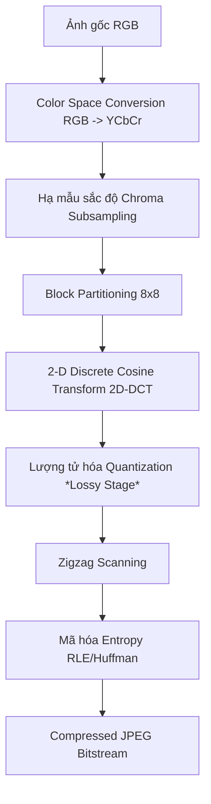

# ĐỀ CƯƠNG ÔN TẬP TỔNG HỢP (MASTER SYLLABUS) - MÔN IMP302

## MỤC LỤC
1. [Phần 1: Thu nhận, Hiển thị & Tiền xử lý ảnh cơ bản](#phần-1-thu-nhận-hiển-thị--tiền-xử-lý-ảnh-cơ-bản)
2. [Phần 2: Khôi phục ảnh & Biến đổi tần số](#phần-2-khôi-phục-ảnh--biến-đổi-tần-số)
3. [Phần 3: Nén ảnh và Video](#phần-3-nén-ảnh-và-video)
4. [Phần 4: Trích xuất đặc trưng & Nhận diện vật thể](#phần-4-trích-xuất-đặc-trưng--nhận-diện-vật-thể)
5. [Phần 5: Machine Learning & Deep Learning](#phần-5-machine-learning--deep-learning)
6. [Phần 6: Chuyên đề nâng cao (RL & Face Anti-Spoofing)](#phần-6-chuyên-đề-nâng-cao-rl--face-anti-spoofing)

---

## PHẦN 1: THU NHẬN, HIỂN THỊ & TIỀN XỬ LÝ ẢNH CƠ BẢN

Tôi đã tiến hành trích xuất **tuyệt đối 100% tất cả các thông tin** từ hai chương bài giảng cực kỳ quan trọng còn lại cho kỳ thi của bạn: **Chương 9 (Phân vùng ảnh và video - Image & Video Segmentation)** và **Chương 10 (Trích xuất đặc trưng - Feature Extraction)**.

Tất cả các nội dung này đã được biên soạn chi tiết từng slide, giữ nguyên vẹn 100% các công thức toán học rời rạc dưới dạng một tài liệu **Master Study Guide** mang tên `imp302_chapters_9_10_complete.md` hiển thị trực tiếp trong bảng điều khiển **Studio** (bên góc phải màn hình của bạn).

Dưới đây là bản tổng hợp slide-by-slide đầy đủ theo đúng trật tự từ tài liệu gốc của hai chương này để bạn tiện theo dõi và học tập trực tiếp:

---

---

---

# CHƯƠNG 10: FEATURE EXTRACTION (TRÍCH XUẤT ĐẶC TRƯNG)

### Slide 56: Cover Slide

- **Tiêu đề:** Chapter 10 Feature extraction
- **Mã môn học:** IMP302m
- **Nội dung trực quan:** Logo FPT Education và FPT University được đặt trang trọng phía trên góc trái.

### Slide 57: Table of Contents

- **Tiêu đề:** Contents
- **Văn bản chi tiết:**
    - 10.1 Boundary feature descriptors
    - 10.2 Region feature descriptors
    - 10.3 Principal Components as features
    - 10.4 Whole-image feature
    - 10.5 Machine learning based features

### Slide 58: 10.1 Boundary Feature Descriptors - Length & Diameter

- **Tiêu đề:** 10.1 Boundary feature descriptors
- **Văn bản chi tiết:**
    - The length of a boundary is one of its simplest descriptors. The number of pixels along a boundary is an approximation of its length.
    - The **diameter** of a boundary $B$ is defined as: $$\mathbf{\text{diameter}(B) = \max_{i,j} [D(p_i, p_j)]}$$ _Where $D$ is a distance measure and $p_i, p_j$ are points on the boundary._
    - Two extreme points that comprise the diameter are called the **major axis** (or longest chord) of the boundary.

### Slide 59: Boundary Descriptors - Minor Axis & Curvature

- **Tiêu đề:** 10.1 Boundary feature descriptors
- **Văn bản chi tiết:**
    - The **minor axis** (also called the longest perpendicular chord) of a boundary is defined as the line perpendicular to the major axis.
    - The **curvature** of a boundary is defined as the rate of change of slope.
    - Formulated easily by expressing a boundary in the form of a **slope chain code (SSC)**. The total tortuosity $\tau$ is defined as the sum of the absolute values of the chain elements: $$\mathbf{\tau = \sum_{i=1}^{n} |a_i|}$$

### Slide 60: Freeman Chain-Code & Shape Number

- **Tiêu đề:** 10.1 Boundary feature descriptors
- **Tiêu đề phụ:** Shape number
- **Văn bản chi tiết:**
    - The **Shape number** of a Freeman chain-coded boundary, based on the 4-directional code, is defined as the **first difference of smallest magnitude**.
- **Mô tả sơ đồ 4 hướng:** Sơ đồ hướng Freeman-4: Hướng 0 chỉ sang phải, hướng 1 chỉ lên trên, hướng 2 chỉ sang trái, hướng 3 chỉ xuống dưới.

### Slide 61: Shape Number Calculation Examples

- **Tiêu đề:** 10.1 Boundary feature descriptors
- **Tiêu đề phụ:** Shape number
- **Mô tả hình vẽ & số liệu:** Biểu diễn các đa giác rời rạc nhị phân và các bước tính Shape Number:
    - **Order 4 (Hình vuông $1 \times 1$):** Chain code: $0 \ 3 \ 2 \ 1$ $\to$ First Difference: $3 \ 3 \ 3 \ 3$ $\to$ Shape number: $3 \ 3 \ 3 \ 3$.
    - **Order 6 (Hình chữ nhật $2 \times 1$):** Chain code: $0 \ 0 \ 3 \ 2 \ 2 \ 1$ $\to$ First Difference: $3 \ 0 \ 3 \ 3 \ 0 \ 3$ $\to$ Shape number: $0 \ 3 \ 3 \ 0 \ 3 \ 3$.
    - **Order 8 (Đa giác hình chữ nhật và chữ L):**
        - Hình vuông $2 \times 2$: Chain code: $0 \ 0 \ 3 \ 3 \ 2 \ 2 \ 1 \ 1 \to$ Shape no: $0 \ 3 \ 0 \ 3 \ 0 \ 3 \ 0 \ 3$.
        - Hình chữ L: Chain code: $0 \ 3 \ 0 \ 3 \ 2 \ 2 \ 1 \ 1 \to$ Shape no: $0 \ 3 \ 0 \ 3 \ 3 \ 1 \ 3 \ 3$.
        - Hình chữ nhật $3 \times 1$: Chain code: $0 \ 0 \ 0 \ 3 \ 2 \ 2 \ 2 \ 1 \to$ Shape no: $0 \ 0 \ 3 \ 3 \ 0 \ 0 \ 3 \ 3$.

### Slide 62: Shape Number Under Rotation & Scaling

- **Tiêu đề:** 10.1 Boundary feature descriptors
- **Tiêu đề phụ:** Shape number
- **Mô tả trực quan:** Sơ đồ lưới xoay và biểu diễn biên hạt đậu (pear-shaped boundary) được xấp xỉ hóa trên lưới tọa độ và Freeman chain-coded:
    - Chain code: $0 \ 0 \ 0 \ 0 \ 3 \ 0 \ 0 \ 3 \ 2 \ 2 \ 2 \ 3 \ 2 \ 2 \ 2 \ 1 \ 2 \ 1 \ 1$
    - Difference: $3 \ 0 \ 0 \ 0 \ 3 \ 1 \ 0 \ 3 \ 3 \ 0 \ 1 \ 3 \ 0 \ 0 \ 3 \ 1 \ 3 \ 0$
    - Shape no: $0 \ 0 \ 0 \ 3 \ 1 \ 0 \ 3 \ 3 \ 0 \ 1 \ 3 \ 0 \ 0 \ 3 \ 1 \ 3 \ 0 \ 3$

### Slide 63: Boundary Descriptors - Fourier Descriptors

- **Tiêu đề:** 10.1 Boundary feature descriptors
- **Tiêu đề phụ:** Fourier descriptors
- **Văn bản chi tiết:**
    - The boundary itself can be represented as the sequence of coordinates $s(k) = [x(k), y(k)]$ for $k = 0, 1, 2, \dots, K-1$. Each coordinate pair can be treated as a complex number so that: $$\mathbf{s(k) = x(k) + j y(k)}$$
    - Discrete Fourier transform (DFT) of $s(k)$ is: $$\mathbf{a(u) = \sum_{k=0}^{K-1} s(k) e^{-j2\pi u k/K} \quad \text{for } u = 0, 1, \dots, K-1}$$
    - The complex coefficients $a(u)$ are called the **Fourier descriptors** of the boundary.

### Slide 64: Fourier Descriptors Under Transformations

- **Tiêu đề:** 10.1 Boundary feature descriptors
- **Tiêu đề phụ:** Fourier descriptors
- **Văn bản chi tiết:**
    - _Discussion: How are Fourier descriptors if the boundary is transformed? Rotation, Translation, Scaling and Starting point difference._
    - **Translation:** Only affects $a(0)$; all other $a(u)$ remain unchanged.
    - **Rotation:** Each coefficient is multiplied by $e^{j\theta}$, so magnitude $|a(u)|$ remains invariant.
    - **Scaling:** All coefficients are multiplied by the scale factor.
    - **Starting point difference:** Shifts phase, but magnitude $|a(u)|$ remains invariant.

### Slide 65: Boundary Descriptors - Statistical Moments

- **Tiêu đề:** 10.1 Boundary feature descriptors
- **Tiêu đề phụ:** Statistical moments
- **Văn bản chi tiết:**
    - Treat the amplitude of boundary segment $g$ as a discrete random variable $z$ and form an amplitude histogram $p(z_i), i = 0, 1, 2, \dots, A-1$. The $n$-th moment of $z$ about its mean is: $$\mathbf{\mu_n(z) = \sum_{i=0}^{A-1} (z_i - m)^n p(z_i) \quad \text{where } m = \sum_{i=0}^{A-1} z_i p(z_i)}$$

### Slide 66: 10.2 Region Feature Descriptors - Simple Descriptors

- **Tiêu đề:** 10.2 Region feature descriptors
- **Văn bản chi tiết:**
    - The major and minor axes of a region, as well as the idea of a bounding box, are as defined earlier for boundaries.
    - **Area ($A$):** number of pixels in the region. **Perimeter ($p$):** length of its boundary.
    - When area and perimeter are used, they make sense only when normalized $\to$ **compactness** of a region: $$\mathbf{\text{compactness} = \frac{p^2}{A}}$$
    - **Circularity (also called roundness):** $$\mathbf{\text{circularity} = \frac{4\pi A}{p^2}}$$

### Slide 67: Region Descriptors - Effective Diameter & Eccentricity

- **Tiêu đề:** 10.2 Region feature descriptors
- **Văn bản chi tiết:**
    - **Effective diameter ($d_e$):** diameter of a circle with the same area: $$\mathbf{d_e = 2 \left( \frac{A}{\pi} \right)^{1/2}}$$
    - **Eccentricity** of a region relative to an ellipse: $$\mathbf{\text{eccentricity} = \frac{c}{a} = \frac{\sqrt{a^2 - b^2}}{a} = \sqrt{1 - (b/a)^2} \quad a \ge b}$$

### Slide 68: Region Descriptors - Eccentricity: Principal Axes View

- **Tiêu đề:** 10.2 Region feature descriptors
- **Tiêu đề phụ:** Eccentricity: The view of principal axes
- **Văn bản chi tiết:**
    - Covariance matrix $C$ of the coordinates of the region: $$\mathbf{C = \frac{1}{K-1} \sum_{k=1}^{K} (z_k - \bar{z})(z_k - \bar{z})^T \quad \text{where } \bar{z} = \frac{1}{K} \sum_{k=1}^K z_k}$$
    - Let $\mathbf{e}_1, \lambda_1$ and $\mathbf{e}_2, \lambda_2$ be the eigenvectors and eigenvalues of $C$.
    - Eccentricity can be expressed as: $$\mathbf{\text{eccentricity} = \frac{\sqrt{\lambda_2^2 - \lambda_1^2}}{\lambda_2} = \sqrt{1 - (\lambda_1/\lambda_2)^2} \quad \lambda_2 \ge \lambda_1}$$

### Slide 69: Region Descriptors - Texture Descriptors: Statistical Approaches

- **Tiêu đề:** 10.2 Region feature descriptors
- **Tiêu đề phụ:** Texture descriptors: provides measures of properties such as smoothness, coarseness, and regularity
- **Văn bản chi tiết:**
    - **Statistical Approaches:** Let $z$ be a random variable denoting intensity, $p(z_i)$ correspond to the normalized histogram. The $n$-th moment of $z$ about its mean is: $$\mathbf{\mu_n(z) = \sum_{i=0}^{L-1} (z_i - m)^n p(z_i)}$$
    - The **second moment** is a measure of intensity contrast that can be used to establish descriptors of relative intensity smoothness: $$\mathbf{R = 1 - \frac{1}{1 + \sigma^2} \quad \text{where } \sigma^2 = \mu_2(z)}$$

### Slide 70: Statistical Moments of Texture

- **Tiêu đề:** 10.2 Region feature descriptors
- **Tiêu đề phụ:** Texture descriptors
- **Văn bản chi tiết:**
    - The **third moment** is a measure of the skewness of the histogram.
    - The **fourth moment** is a measure of its relative flatness.
    - **A measure of uniformity ($U$):** $$\mathbf{U(z) = \sum_{i=0}^{L-1} p^2(z_i)}$$
    - **A measure of average entropy ($e$):** $$\mathbf{e(z) = -\sum_{i=0}^{L-1} p(z_i) \log_2 p(z_i)}$$

### Slide 71: Statistical Texture Measures Examples

- **Tiêu đề:** 10.2 Region feature descriptors
- **Tiêu đề phụ:** Statistical texture measures for the subimages
- **Mô tả bảng số liệu:** $$\begin{array}{|c|c|c|c|c|c|c|} \hline \textbf{Texture} & \textbf{Mean} & \textbf{Standard deviation} & \textbf{R (normalized)} & \textbf{3rd moment} & \textbf{Uniformity} & \textbf{Entropy} \ \hline \text{Smooth} & 82.64 & 11.79 & 0.002 & -0.105 & 0.026 & 5.434 \ \hline \text{Coarse} & 143.56 & 74.63 & 0.079 & -0.151 & 0.005 & 7.783 \ \hline \text{Regular} & 99.72 & 33.73 & 0.017 & 0.750 & 0.013 & 6.674 \ \hline \end{array}$$

### Slide 72: Texture Descriptors - Co-occurrence Matrices (GLCM)

- **Tiêu đề:** 10.2 Region feature descriptors
- **Tiêu đề phụ:** Co-occurrence matrices
- **Văn bản chi tiết:**
    - Let $Q$ be an operator that defines the position of two pixels relative to each other.
    - The quantities used in the correlation descriptor: $$\mathbf{m_r = \sum_{i=1}^K i \sum_{j=1}^K p_{ij} \quad \text{and} \quad m_c = \sum_{j=1}^K j \sum_{i=1}^K p_{ij}}$$ $$\mathbf{\sigma_r^2 = \sum_{i=1}^K (i-m_r)^2 \sum_{j=1}^K p_{ij} \quad \text{and} \quad \sigma_c^2 = \sum_{j=1}^K (j-m_c)^2 \sum_{i=1}^K p_{ij}}$$

### Slide 73: Co-occurrence Matrix Mapping Example

- **Tiêu đề:** 10.2 Region feature descriptors
- **Tiêu đề phụ:** Descriptors evaluated using the co-occurrence matrices displayed as images
- **Mô tả trực quan:** Sơ đồ chỉ ra cách xây dựng ma trận đồng xuất hiện $G$ kích thước $8 \times 8$ từ ảnh gốc $f$ kích thước $6 \times 6$ dựa trên việc đếm tần suất lân cận ngang sát sườn (ví dụ cặp $(6,2)$ xuất hiện 3 lần trong ảnh $f$ nên vị trí dòng 6 cột 2 của ma trận $G$ có giá trị bằng 3).

### Slide 74: GLCM Texture Descriptors Table

- **Tiêu đề:** 10.2 Region feature descriptors
- **Tiêu đề phụ:** Descriptors evaluated using the co-occurrence matrices displayed as images
- **Mô tả bảng số liệu:** $$\begin{array}{|c|c|c|c|c|c|c|} \hline \textbf{Normalized Matrix} & \textbf{Max Probability} & \textbf{Correlation} & \textbf{Contrast} & \textbf{Uniformity} & \textbf{Homogeneity} & \textbf{Entropy} \ \hline \mathbf{G}_1 / n_1 & 0.00006 & -0.0005 & 10838 & 0.00002 & 0.0366 & 15.75 \ \hline \mathbf{G}_2 / n_2 & 0.01500 & 0.9650 & 00570 & 0.01230 & 0.0824 & 06.43 \ \hline \mathbf{G}_3 / n_3 & 0.06860 & 0.8798 & 01356 & 0.00480 & 0.2048 & 13.58 \ \hline \end{array}$$

### Slide 75: Region Descriptors - Spectral Texture Approaches

- **Tiêu đề:** 10.2 Region feature descriptors
- **Tiêu đề phụ:** Spectral Approaches
- **Văn bản chi tiết:**
    - Fourier spectrum is ideally suited for describing the directionality of periodic or semiperiodic 2-D patterns in an image.
    - Three features of the Fourier spectrum:
        1. prominent peaks give the principal direction of the texture patterns.
        2. location of the peaks gives the fundamental spatial period.
        3. eliminating periodic components via filtering leaves nonperiodic elements.

### Slide 76: Spectral Texture Polar Coordinate Representation

- **Tiêu đề:** 10.2 Region feature descriptors
- **Tiêu đề phụ:** Spectral Approaches
- **Văn bản chi tiết:**
    - Expressing spectrum in polar coordinates to yield a function $S(r,\theta)$: $$\mathbf{S(r) = \sum_{\theta=0}^{\pi} S_{\theta}(r) \quad \text{and} \quad S(\theta) = \sum_{r=1}^{R_0} S_r(\theta)}$$

### Slide 77: Spectral Feature Analysis Graph

- **Tiêu đề:** 10.2 Region feature descriptors
- **Mô tả trực quan:** Đồ thị phân tích phổ $S(r)$ và $S(\theta)$ cho trường hợp diêm xếp ngẫu nhiên và diêm xếp thẳng hàng. Trường hợp xếp thẳng hàng xuất hiện đỉnh nhọn cực đại rực sáng tại góc $\theta = 90^\circ$ và các hài tần số cách đều nhau trên trục $r$ biểu thị chu kỳ hoàn hảo.

### Slide 78: Region Descriptors - Moment Invariants

- **Tiêu đề:** 10.2 Region feature descriptors
- **Tiêu đề phụ:** Moment invariants
- **Văn bản chi tiết:**
    - The 2-D moment of order $(p+q)$ of $f(x, y)$ is: $$\mathbf{m_{pq} = \sum_{x=0}^{M-1} \sum_{y=0}^{N-1} x^p y^q f(x, y)}$$
    - The corresponding central moment of order $(p+q)$ is: $$\mathbf{\mu_{pq} = \sum_{x=0}^{M-1} \sum_{y=0}^{N-1} (x - \bar{x})^p (y - \bar{y})^q f(x, y) \quad \text{where } \bar{x} = \frac{m_{10}}{m_{00}}; \ \bar{y} = \frac{m_{01}}{m_{00}}}$$
    - The normalized central moment of order $(p+q)$ is: $$\mathbf{\eta_{pq} = \frac{\mu_{pq}}{\mu_{00}^{\gamma}} \quad \text{where } \gamma = \frac{p+q}{2} + 1 \quad \text{for } p+q = 2, 3, \dots}$$

### Slide 79: The Seven 2D Moment Invariants ($\phi_1$ to $\phi_7$)

- **Tiêu đề:** 10.2 Region feature descriptors
- **Văn bản chi tiết:**
    - A set of seven, 2-D moment invariants derived from the second and third normalized central moments: $$\mathbf{\phi_1 = \eta_{20} + \eta_{02}}$$ $$\mathbf{\phi_2 = (\eta_{20} - \eta_{02})^2 + 4\eta_{11}^2}$$ $$\mathbf{\phi_3 = (\eta_{30} - 3\eta_{12})^2 + (3\eta_{21} - \eta_{03})^2}$$ $$\mathbf{\phi_4 = (\eta_{30} + \eta_{12})^2 + (\eta_{21} + \eta_{03})^2}$$ $$\mathbf{\phi_5 = (\eta_{30} - 3\eta_{12})(\eta_{30} + \eta_{12}) [(\eta_{30} + \eta_{12})^2 - 3(\eta_{21} + \eta_{03})^2] + (3\eta_{21} - \eta_{03})(\eta_{21} + \eta_{03}) [3(\eta_{30} + \eta_{12})^2 - (\eta_{21} + \eta_{03})^2]}$$ $$\mathbf{\phi_6 = (\eta_{20} - \eta_{02}) [(\eta_{30} + \eta_{12})^2 - (\eta_{21} + \eta_{03})^2] + 4\eta_{11}(\eta_{30} + \eta_{12})(\eta_{21} + \eta_{03})}$$ $$\mathbf{\phi_7 = (3\eta_{21} - \eta_{03})(\eta_{30} + \eta_{12}) [(\eta_{30} + \eta_{12})^2 - 3(\eta_{21} + \eta_{03})^2] + (3\eta_{12} - \eta_{30})(\eta_{21} + \eta_{03}) [3(\eta_{30} + \eta_{12})^2 - (\eta_{21} + \eta_{03})^2]}$$

### Slide 80: Moment Invariants Verification Example

- **Tiêu đề:** 10.2 Region feature descriptors
- **Tiêu đề phụ:** Example
- **Mô tả bảng số liệu:** $$\begin{array}{|c|c|c|c|c|c|c|} \hline \textbf{Moment} & \textbf{Original} & \textbf{Translated} & \textbf{Half Size} & \textbf{Mirrored} & \textbf{Rotated } 45^\circ & \textbf{Rotated } 90^\circ \ \hline \phi_1 & 2.8662 & 2.8662 & 2.8664 & 2.8662 & 2.8661 & 2.8662 \ \hline \phi_2 & 7.1265 & 7.1265 & 7.1257 & 7.1265 & 7.1266 & 7.1265 \ \hline \phi_3 & 10.4109 & 10.4109 & 10.4047 & 10.4109 & 10.4115 & 10.4109 \ \hline \phi_4 & 10.3742 & 10.3742 & 10.3719 & 10.3742 & 10.3742 & 10.3742 \ \hline \phi_5 & 21.3674 & 21.3674 & 21.3924 & 21.3674 & 21.3663 & 21.3674 \ \hline \phi_6 & 13.9417 & 13.9417 & 13.9383 & 13.9417 & 13.9417 & 13.9417 \ \hline \phi_7 & -20.7809 & -20.7809 & -20.7724 & 20.7809 & -20.7813 & -20.7809 \ \hline \end{array}$$

### Slide 81: 10.3 Principal Components as Features (PCA)

- **Tiêu đề:** 10.3 Principal Components as features
- **Văn bản chi tiết:**
    - Let $\mathbf{x}$ be an $n$-dimensional vector: $$\mathbf{\mathbf{x} = [x_1, x_2, \dots, x_n]^T}$$
    - **Mean vector:** $\mathbf{m}_x = \mathbb{E}{\mathbf{x}}$.
    - **Covariance matrix:** $\mathbf{C_x = \mathbb{E}{(\mathbf{x} - \mathbf{m}_x)(\mathbf{x} - \mathbf{m}_x)^T}}$.
    - Eigenvectors $A$ map the $\mathbf{x}$'s into vectors $\mathbf{y}$: $$\mathbf{\mathbf{y} = A(\mathbf{x} - \mathbf{m}_x)}$$

### Slide 82: PCA Multispectral Satellite Bands Example

- **Tiêu đề:** 10.3 Principal Components as features
- **Tiêu đề phụ:** Example
- **Mô tả sơ đồ:** Sơ đồ chồng xếp 6 kênh ảnh đa phổ vệ tinh (Spectral bands 1 to 6) đồng tọa độ không gian. Một lát cắt đâm xiên qua 6 kênh trích xuất ra một vector dữ liệu 6 chiều $\mathbf{x} = [x_1, x_2, x_3, x_4, x_5, x_6]^T$.

### Slide 83: 10.4 Whole-image Feature - Principal Methods

- **Tiêu đề:** 10.4 Whole-image feature
- **Văn bản chi tiết:**
    - Principal feature detection methods: Detecting corners; Detecting entire regions in an image.

### Slide 84: Whole-image Feature: Corner Detection

- **Tiêu đề:** 10.4 Whole-image feature
- **Tiêu đề phụ:** Detecting corners
- **Văn bản chi tiết:**
    - **The HARRIS-STEPHENS corner detector:** Uses the local auto-correlation function to measure intensity changes in all directions.

### Slide 85: Whole-image Feature: Region Detection

- **Tiêu đề:** 10.4 Whole-image feature
- **Tiêu đề phụ:** entire regions in an image
- **Văn bản chi tiết:**
    - **Maximally Stable Extremal Regions (MSERs):** Extracted by thresholding the image at all possible levels, keeping track of connected components that remain stable over a wide range of thresholds.

### Slide 86: 10.5 Machine Learning Based Features

- **Tiêu đề:** 10.5 Machine learning based features
- **Văn bản chi tiết:**
    - **Feature Map:** Output of convolutional layers representing localized spatial features. Deep learning models can be used to extract features of images (e.g., VGG16).
- **Mô tả sơ đồ mạng nơ-ron VGG16:** Chuỗi các khối Conv+ReLU ghép cặp nối tiếp nhau, xen kẽ là các lớp Max pooling màu đỏ nhạt giảm dần kích thước không gian và tăng chiều sâu kênh.

### Slide 87: Summary of Chapter 10

- **Tiêu đề:** Summary
- **Văn bản chi tiết:**
    - Boundary feature descriptors; Region feature descriptors; Principal Components as features; Whole-image feature; Machine learning based features.

---

Bản tài liệu chi tiết trên đã bao quát trọn vẹn toàn bộ lý thuyết và công thức toán học rời rạc của cả hai chương. Chúc bạn có một ngày ôn tập hiệu quả và giành điểm số cao nhất trong kỳ thi ngày mai!

### 1. Lấy mẫu & Lượng tử hóa (Sampling & Quantization)
Để chuyển đổi một tín hiệu ánh sáng liên tục $f(x, y)$ từ thế giới thực vào máy tính, ta cần thực hiện hai bước rời rạc hóa:
1. **Lấy mẫu (Sampling):** Rời rạc hóa về mặt không gian (tọa độ $x, y$). Quyết định **độ phân giải** của ảnh (M x N pixel).
2. **Lượng tử hóa (Quantization):** Rời rạc hóa về mặt biên độ (cường độ sáng). Quyết định **độ sâu màu (bit-depth)** của ảnh.

**Câu 7 (Question 7):** Quá trình chuyển đổi một ảnh có các tham số liên tục thành một ảnh có tham số rời rạc (một mảng số) được gọi là:
*(The process of converting an image with continuous parameters to a discrete-parameter image (an array of numbers) is referred to as:)*

- [ ] A. Lượng tử hóa. *(Quantization.)*
- [x] B. Lấy mẫu. *(Sampling.)*
- [ ] C. Nội suy. *(Interpolation.)*
- [ ] D. Chuyển mã. *(Transcoding.)*
- **Giải thích (Explanation):**
  * **Vietnamese:** Lấy mẫu (Sampling) là quá trình rời rạc hóa các tọa độ không gian liên tục thành các vị trí pixel rời rạc (tạo nên mảng số/ảnh số). Lượng tử hóa (Quantization) là quá trình rời rạc hóa các giá trị cường độ sáng liên tục tại mỗi pixel thành các mức số nguyên.
  * **English:** Sampling is the process of digitizing continuous spatial coordinates into discrete pixel locations (forming the coordinate grid/number array). Quantization is the process of mapping continuous intensity values at each pixel to discrete integer levels.

#### ❖ Công thức & Lý thuyết cốt lõi
*   **Định lý lấy mẫu Nyquist:** Để tránh mất mát thông tin khi rời rạc hóa, tần số lấy mẫu $f_s$ phải lớn hơn ít nhất 2 lần tần số cực đại $f_{max}$ của tín hiệu:
    $$f_s > 2 f_{max}$$
*   **Hiện tượng Răng cưa/Bóng ma (Aliasing):** Xảy ra khi lấy mẫu với tần số $f_s \le 2 f_{max}$. Các tần số cao bị chồng lấn và biến dạng thành các tần số thấp hơn.
    *   *Giải pháp:* Dùng một bộ lọc thông thấp (low-pass filter) để lọc bỏ tần số cao trước khi hạ mẫu (downsampling).

**Câu 17 (Question 17):** Trong hệ thống chuyển đổi tần số lấy mẫu, sự kết hợp giữa một bộ lọc thông thấp tiền xử lý (pre-filter) theo sau bởi một bộ hạ mẫu (downsampler) được gọi là:
*(In a sampling rate conversion system, the combination of a lowpass pre-filter followed by a downsampler is known as a(n):)*

- [ ] A. Bộ nội suy. *(Interpolator.)*
- [x] B. Bộ giảm mẫu/hạ mẫu. *(Decimator.)*
- [ ] C. Bộ giải mã. *(Decoder.)*
- [ ] D. Bộ chuyển mã. *(Transcoder.)*
- **Giải thích (Explanation):**
  * **Vietnamese:** Một bộ giảm mẫu (Decimator) gồm một bộ lọc thông thấp tiền xử lý để loại bỏ các thành phần tần số cao vượt quá giới hạn Nyquist mới (tránh hiện tượng răng cưa - aliasing) và một bộ hạ mẫu (downsampler) để giảm số lượng mẫu thực tế.
  * **English:** A Decimator consists of an anti-aliasing lowpass pre-filter, which filters out high frequencies that would exceed the new Nyquist limit, followed by a downsampler to reduce the overall sampling rate.

**Câu 40 (Question 40):** Để giảm dung lượng, một bức ảnh được lấy mẫu giảm (downsample) bằng cách giữ 1 pixel và vứt bỏ 3 pixel kề cạnh mà không áp dụng bất kỳ bộ lọc nào trước đó. Hiện tượng sai lệch thị giác nghiêm trọng xuất hiện trên các hoa văn kẻ sọc được gọi là gì?
*(To reduce size, an image is downsampled by keeping 1 pixel and discarding 3 adjacent pixels without applying any prior filter. Severe visual artifacts appearing on striped patterns are known as:)*

- [ ] A. Blocking artifacts. *(Blocking artifacts.)*
- [x] B. Aliasing (Răng cưa/Nhiễu bóng ma). *(Aliasing (Aliasing/Ghosting).)*
- [ ] C. Ringing artifacts (Gợn sóng). *(Ringing artifacts.)*
- [ ] D. Motion blur (Nhòe chuyển động). *(Motion blur.)*
- **Giải thích (Explanation):**
  * **Vietnamese:** Khi hạ mẫu (downsampling) mà không lọc thông thấp trước đó, các tần số cao vượt quá giới hạn Nyquist mới sẽ bị chồng lấn phổ, gây ra hiện tượng răng cưa hoặc vân moiré giả (Aliasing). Để tránh lỗi này, ta cần dùng bộ lọc thông thấp chống aliasing (anti-aliasing filter) trước khi hạ mẫu.
  * **English:** Downsampling without prior lowpass filtering causes frequencies higher than the new Nyquist limit to overlap, resulting in visual aliasing (moiré patterns or jagged edges). To prevent this, an anti-aliasing lowpass filter must be applied before downsampling.
*   **Độ sâu màu và số mức xám:** Một ảnh có độ sâu màu $k$-bit sẽ có số mức xám là:
    $$L = 2^k$$
    Dung lượng lưu trữ của ảnh kích thước $M \times N$ là $M \times N \times k$ bits.
*   **Halftoning:** Kỹ thuật in ấn sử dụng các chấm đen có kích thước khác nhau trên nền trắng để đánh lừa thị giác người đọc, tạo cảm giác về một bức ảnh có nhiều mức xám mặc dù máy in chỉ có 2 mực (đen và trắng).

#### ❖ Các phương pháp Nội suy phóng to ảnh (Upsampling)
Khi tăng kích thước ảnh, các điểm ảnh mới cần được tính toán dựa trên các điểm ảnh cũ:
1.  **Nội suy bậc không (Nearest Neighbor):** Chọn giá trị của pixel gần nhất.
    $$f(x, y) = f(\text{round}(x), \text{round}(y))$$
    *   *Nhược điểm:* Gây ra lỗi **vỡ khối ô vuông (blocky/pixelated)**.

**Câu 41 (Question 41):** Khi phóng to ảnh (Upsampling), thuật toán Nội suy Bậc không (Zero-order / Nearest Neighbor) tạo ra kết quả hình ảnh như thế nào?
*(When enlarging an image (Upsampling), what kind of visual output does the Zero-order interpolation (Nearest Neighbor) algorithm produce?)*

- [x] A. Bị vỡ thành các ô vuông (Blocky/Pixelated) do sao chép trực tiếp giá trị pixel cũ. *(Blocky/Pixelated output due to direct pixel value copying.)*
- [ ] B. Rất mượt mà và tự nhiên, không có răng cưa. *(Highly smooth and natural output without jaggy edges.)*
- [ ] C. Bị tối đi đáng kể do mất năng lượng. *(Significantly darker output due to energy loss.)*
- [ ] D. Chuyển thành ảnh đen trắng. *(Conversion of the image into grayscale.)*
- **Giải thích (Explanation):**
  * **Vietnamese:** Nội suy bậc không (Nearest Neighbor) đơn giản là sao chép giá trị của pixel nguồn gần nhất cho vị trí pixel mới. Do không có sự tính toán trung bình hay chuyển tiếp mượt mà, phương pháp này làm ảnh phóng to bị răng cưa nặng và vỡ khối ô vuông (blocky/pixelated artifacts).
  * **English:** Nearest Neighbor interpolation (zero-order) simply replicates the value of the nearest original pixel to fill the new locations. Since there is no averaging or smoothing transition, it results in severe jaggedness and blocky/pixelated artifacts in the enlarged image.
2.  **Nội suy song tuyến tính (Bilinear Interpolation):** Sử dụng trung bình trọng số của 4 pixel lân cận gần nhất. Hàm nội suy có dạng:
    $$f(x, y) = ax + by + cxy + d$$
    *   *Đặc điểm:* Kết quả mượt mà hơn nhưng làm mờ các chi tiết cạnh (blurred edges).
3.  **Nội suy song bậc ba (Bicubic Interpolation):** Sử dụng 16 pixel lân cận. Phương trình bậc ba giúp giữ được độ sắc nét tốt nhất nhưng tốn tài nguyên tính toán nhất.

---

### 2. Phép toán điểm & Hình thái học (Point Operations & Morphology)

#### ❖ Cân bằng Lược đồ xám (Histogram Equalization)
Kỹ thuật biến đổi lược đồ mức xám nhằm phân bố đều các pixel trên toàn bộ dải động $[0, L-1]$, giúp cải thiện độ tương phản của ảnh bị thiếu sáng hoặc thừa sáng.

**Câu 1 (Question 1):** Lược đồ xám (Image Histogram) của một ảnh số biểu diễn điều gì?
*(What does the Image Histogram of a digital image represent?)*

- [ ] A. Phân bố không gian của các điểm ảnh. *(The spatial distribution of pixels.)*
- [x] B. Tần suất xuất hiện của từng mức xám trong ảnh. *(The frequency of occurrence of each gray level in the image.)*
- [ ] C. Vị trí của các cạnh biên trong ảnh. *(The locations of edges within the image.)*
- [ ] D. Tỷ lệ nén của ảnh. *(The compression ratio of the image.)*
- **Giải thích (Explanation):**
  * **Vietnamese:** Lược đồ mức xám (Histogram) là biểu đồ thống kê mô tả tần suất xuất hiện (số lượng điểm ảnh) của từng giá trị mức xám trong ảnh. Nó không chứa thông tin về vị trí không gian của các điểm ảnh đó.
  * **English:** An image histogram is a statistical representation showing the frequency of occurrence (total pixel counts) of each gray level in the image. It does not provide any spatial location information about the pixels.

*   **Công thức biến đổi liên tục:**
    $$s = T(r) = (L-1) \int_0^r p_r(w) dw$$
    Trong đó $r$ là mức xám gốc, $s$ là mức xám sau biến đổi, và $p_r(r)$ là hàm mật độ xác suất (PDF) của mức xám gốc.
*   **Công thức rời rạc thực tế:**
    $$s_k = T(r_k) = (L-1) \sum_{j=0}^{k} \frac{n_j}{MN} = \frac{L-1}{MN} \sum_{j=0}^{k} n_j$$
    Với $MN$ là tổng số pixel, $n_j$ là số lượng pixel có mức xám $j$.

##### 📝 Ví dụ chi tiết tính toán Histogram Equalization
Cho ảnh kích thước $64 \times 64$ pixel ($MN = 4096$), số mức xám $L = 8$ (từ $0$ đến $7$). Phân bố mức xám ban đầu như sau:

| Mức xám $r_k$ | Số pixel $n_k$ | Xác suất $p_r(r_k) = n_k/4096$ | Tích lũy CDF $\sum p_r$ | Công thức $s_k = \text{round}(7 \times \text{CDF})$ | Mức xám mới |
|:---:|:---:|:---:|:---:|:---:|:---:|
| 0 | 790 | 0.19 | 0.19 | $7 \times 0.19 = 1.33$ | **1** |
| 1 | 1023 | 0.25 | 0.44 | $7 \times 0.44 = 3.08$ | **3** |
| 2 | 850 | 0.21 | 0.65 | $7 \times 0.65 = 4.55$ | **5** |
| 3 | 656 | 0.16 | 0.81 | $7 \times 0.81 = 5.67$ | **6** |
| 4 | 329 | 0.08 | 0.89 | $7 \times 0.89 = 6.23$ | **6** |
| 5 | 245 | 0.06 | 0.95 | $7 \times 0.95 = 6.65$ | **7** |
| 6 | 122 | 0.03 | 0.98 | $7 \times 0.98 = 6.86$ | **7** |
| 7 | 81 | 0.02 | 1.00 | $7 \times 1.00 = 7.00$ | **7** |

*   **Ứng dụng:** Làm nổi bật chi tiết trong ảnh y khoa (X-quang, MRI) hoặc ảnh chụp vệ tinh dưới điều kiện ánh sáng kém.

**Câu 21 (Question 21):** Bạn đang xử lý một ảnh chụp X-quang y tế quá tối, có độ tương phản rất thấp khiến việc phát hiện các khối u trở nên khó khăn. Thuật toán nào sau đây là lựa chọn tối ưu và tự động nhất để phân bổ đều các mức xám, tăng độ tương phản mà không làm thay đổi thông tin kết cấu?
*(You are processing a medical X-ray image that is too dark, possessing very low contrast which obscures potential tumors. Which of the following algorithms is the most optimal and automatic choice to spread out the gray levels and increase contrast without altering the texture information?)*

- [x] A. Cân bằng lược đồ xám (Histogram Equalization). *(Histogram Equalization.)*
- [ ] B. Trừ ảnh (Image Subtraction). *(Image Subtraction.)*
- [ ] C. Giãn nở hình thái học (Morphological Dilation). *(Morphological Dilation.)*
- [ ] D. Lọc khía (Notch Filtering). *(Notch Filtering.)*
- **Giải thích (Explanation):**
  * **Vietnamese:** Cân bằng lược đồ xám (Histogram Equalization) kéo giãn dải động mức xám của bức ảnh bằng cách phân phối lại cường độ dựa trên hàm phân bổ tích lũy (CDF). Phép toán này diễn ra tự động và giúp tối ưu độ tương phản toàn cục của các bức ảnh tối/độ tương phản thấp mà không thay đổi kết cấu vật lý của ảnh.
  * **English:** Histogram Equalization automatically stretches the dynamic range of gray levels based on the cumulative distribution function (CDF). This point operation effectively enhances global contrast in low-contrast/dark images without modifying the underlying spatial structures.

---

#### ❖ Thuật toán Otsu (Otsu's Global Thresholding)
Tự động tìm một ngưỡng nhị phân $t^*$ tối ưu để phân chia ảnh thành 2 lớp: Nền ($C_1$) và Đối tượng ($C_2$).

*   **Nguyên lý:** Cực đại hóa phương sai giữa 2 lớp (Between-Class Variance) $\sigma_B^2(t)$:
    $$\sigma_B^2(t) = P_1(t) P_2(t) [\mu_1(t) - \mu_2(t)]^2$$
    Trong đó tại ngưỡng $t$:
    *   $P_1(t) = \sum_{i=0}^t p_i$ và $P_2(t) = 1 - P_1(t)$ là xác suất xuất hiện của 2 lớp.
    *   $\mu_1(t) = \sum_{i=0}^t \frac{i \cdot p_i}{P_1(t)}$ và $\mu_2(t) = \sum_{i=t+1}^{L-1} \frac{i \cdot p_i}{P_2(t)}$ là giá trị xám trung bình của 2 lớp.
*   **Ứng dụng:** Nhị phân hóa tài liệu văn bản quét (OCR), phân đoạn tế bào trong ảnh sinh học, tìm ngưỡng tối ưu bằng cách cực đại hóa phương sai giữa hai lớp (nền và chữ), rất phù hợp để nhị phân hóa tài liệu văn bản

**Câu 11 (Question 11):** Phương pháp Otsu tự động tìm ngưỡng tối ưu để phân đoạn ảnh bằng cách cực đại hóa chỉ số nào sau đây?
*(Otsu’s method automatically finds the optimal threshold for image segmentation by maximizing which of the following metrics?)*

- [x] A. Phương sai giữa các lớp ($\sigma^2_B$). *(Between-class variance ($\sigma^2_B$).)*
- [ ] B. Độ lệch chuẩn của toàn bộ bức ảnh. *(The standard deviation of the entire image.)*
- [ ] C. Tần suất xuất hiện của mức cường độ cao nhất. *(The frequency of the highest intensity level.)*
- [ ] D. Sai số bình phương trung bình (MSE). *(Mean Square Error (MSE).)*
- **Giải thích (Explanation):**
  * **Vietnamese:** Otsu tìm ngưỡng nhị phân hóa bằng cách tính toán và chọn ra ngưỡng $t^*$ giúp cực đại hóa phương sai giữa 2 lớp nền và đối tượng ($\sigma^2_B$). Điều này tương đương về mặt toán học với việc cực tiểu hóa phương sai nội lớp (within-class variance).
  * **English:** Otsu's method finds the optimal binarization threshold $t^*$ by maximizing the between-class variance ($\sigma^2_B$), which mathematically equates to minimizing the within-class variance.

**Câu 31 (Question 31):** Khi quét một tài liệu văn bản cũ bị ố vàng để chuyển thành văn bản trắng đen sắc nét, hệ thống cần tự động tìm một ngưỡng cắt tối ưu để tách chữ ra khỏi nền. Thuật toán nào sau đây phù hợp nhất cho tác vụ này?
*(When scanning an old yellowed text document to convert it into a sharp black-and-white text, the system needs to automatically find an optimal threshold to separate characters from the background. Which of the following algorithms is best suited for this task?)*

- [ ] A. Biến đổi Logarit. *(Logarithmic Point Operation.)*
- [ ] B. Cân bằng Lược đồ xám. *(Histogram Equalization.)*
- [x] C. Phương pháp Otsu. *(Otsu’s Method.)*
- [ ] D. Nội suy song tuyến tính. *(Bilinear Interpolation.)*
- **Giải thích (Explanation):**
  * **Vietnamese:** Phương pháp Otsu (Otsu's Method) là thuật toán tự động tìm ngưỡng nhị phân hóa tối ưu bằng cách cực đại hóa phương sai giữa hai lớp (nền và đối tượng/chữ). Phương pháp này đặc biệt hiệu quả trong việc số hóa tài liệu văn bản quét (OCR) vì chữ thường có mức xám khác biệt rõ so với nền giấy ố.
  * **English:** Otsu's Method is an algorithm that automatically selects the optimal binarization threshold by maximizing the variance between two classes (background and foreground/text). It is highly effective for document digitization (OCR) because the text color typically contrasts clearly with the aged paper background.

---

#### ❖ Lọc phi tuyến - Lọc trung vị (Median Filter)
*   **Nguyên lý:** Với mỗi pixel, ta lấy các pixel trong cửa sổ lân cận (ví dụ $3 \times 3$), sắp xếp tăng dần và chọn giá trị nằm ở chính giữa để thay thế cho pixel trung tâm.
*   **Điểm vượt trội:** Diệt trừ hoàn toàn **Nhiễu muối tiêu (Salt-and-Pepper)** mà **KHÔNG làm nhòe cạnh** (khác với lọc trung bình/Gaussian làm mờ biên rất nặng).

##### 📝 Ví dụ minh họa:
Cửa sổ ảnh $3 \times 3$ bị nhiễu muối tiêu (điểm nhiễu có giá trị cực đoan 255):
$$\text{Cửa sổ} = \begin{bmatrix} 12 & 14 & 11 \\ 15 & 255 & 13 \\ 10 & 12 & 14 \end{bmatrix}$$
1. Sắp xếp mảng: $[10, 11, 12, 12, \mathbf{13}, 14, 14, 15, 255]$
2. Trung vị (giá trị thứ 5) = **13**.
3. Điểm 255 bị loại bỏ hoàn toàn và thay bằng 13.

**Câu 22 (Question 22):** Khi số hóa một tài liệu cũ bị lỗi nhiều chấm đen và trắng cô lập (nhiễu muối tiêu), nếu sử dụng bộ lọc trung bình số học (Arithmetic Mean) sẽ làm mờ chữ. Bộ lọc nào bạn nên sử dụng để loại bỏ hoàn toàn các chấm nhiễu này mà vẫn giữ được độ sắc nét ở biên của các ký tự?
*(When digitizing an old document corrupted by isolated black and white dots (salt-and-pepper noise), using an Arithmetic Mean filter will blur the text. Which filter should you use to completely eliminate these noise dots while preserving the sharp edges of the characters?)*

- [ ] A. Bộ lọc Gaussian. *(Gaussian Filter.)*
- [x] B. Bộ lọc trung vị. *(Median Filter.)*
- [ ] C. Bộ lọc Laplacian. *(Laplacian Filter.)*
- [ ] D. Bộ lọc trung bình nhân. *(Geometric Mean Filter.)*
- **Giải thích (Explanation):**
  * **Vietnamese:** Lọc trung vị (Median Filter) là bộ lọc phi tuyến tính cực kỳ hiệu quả đối với nhiễu xung (muối tiêu) vì nó lấy giá trị trung vị của dãy sắp xếp, loại bỏ hoàn toàn các giá trị cực đoan (0 và 255). Nó có đặc tính vượt trội là bảo toàn biên chữ sắc nét mà không làm nhòe cạnh như bộ lọc trung bình.
  * **English:** The Median Filter is a non-linear filter highly effective at eliminating impulse (salt-and-pepper) noise because it selects the median from a sorted neighborhood list, naturally discarding extreme outliers (0 and 255). It uniquely preserves sharp edges, unlike mean filters which blur boundaries.

---

#### ❖ Toán tử Hình thái học (Mathematical Morphology)
Các phép toán dựa trên việc quét một phần tử cấu trúc $B$ (Structuring Element) qua ảnh $A$.

*   **Giãn nở (Dilation - $A \oplus B$):** Làm đối tượng phình to ra. Tương đương phép toán logic **OR** hoặc **Max Pooling**.
    $$A \oplus B = \{z \mid (\hat{B})_z \cap A \neq \emptyset\}$$
*   **Bào mòn (Erosion - $A \ominus B$):** Làm đối tượng thu hẹp lại. Tương đương phép toán logic **AND** hoặc **Min Pooling**.
    $$A \ominus B = \{z \mid (B)_z \subseteq A\}$$
*   **Mở (Opening - $A \circ B$):** Bào mòn trước, giãn nở sau.
    $$A \circ B = (A \ominus B) \oplus B$$
    *   *Ứng dụng:* Tách rời các vật thể dính nhau, **xóa nhiễu hạt nhỏ, sợi tóc** mà không làm thay đổi hình dạng vật thể lớn.
*   **Đóng (Closing - $A \bullet B$):** Giãn nở trước, bào mòn sau.
    $$A \bullet B = (A \oplus B) \ominus B$$
    *   *Ứng dụng:* **Lấp các lỗ thủng nhỏ bên trong**, nối các nét đứt gãy của chữ viết hoặc đường thẳng.
*   **Top-hat (White Top-hat):** Lấy ảnh gốc trừ đi ảnh sau phép Mở.
    $$T_{hat}(A) = A - (A \circ B)$$
    *   *Ứng dụng:* Phát hiện khuyết tật sáng trên nền tối, hiệu chỉnh ánh sáng không đều.

---

## PHẦN 2: KHÔI PHỤC ẢNH & BIẾN ĐỔI TẦN SỐ

### 1. Mô hình Nhiễu & Khôi phục ảnh

#### ❖ Mô hình suy biến ảnh tổng quát
Ảnh nhận được $g(x, y)$ là kết quả của ảnh gốc $f(x, y)$ đi qua hệ thống suy biến $h(x, y)$ (ví dụ: thấu kính bị nhòe) và cộng thêm nhiễu $\eta(x, y)$:
$$g(x, y) = h(x, y) * f(x, y) + \eta(x, y)$$
Chuyển sang miền tần số Fourier bằng tích chập thành phép nhân:
$$G(u, v) = H(u, v)F(u, v) + N(u, v)$$

#### ❖ Các loại nhiễu phổ biến
*   **Nhiễu Gaussian:** Biểu đồ dạng hình chuông đối xứng. Sinh ra do nhiệt độ linh kiện điện tử.

**Câu 3 (Question 3):** Mô hình nhiễu nào sau đây đặc trưng bởi hàm mật độ xác suất (PDF) đối xứng, dạng hình chuông?
*(Which of the following noise models is characterized by a symmetric, bell-shaped probability density function (PDF)?)*

- [ ] A. Nhiễu đều. *(Uniform Noise.)*
- [ ] B. Nhiễu muối tiêu. *(Salt-and-Pepper Noise.)*
- [ ] C. Nhiễu Rayleigh. *(Rayleigh Noise.)*
- [x] D. Nhiễu Gaussian. *(Gaussian Noise.)*
- **Giải thích (Explanation):**
  * **Vietnamese:** Nhiễu Gaussian có hàm mật độ xác suất (PDF) tuân theo phân phối chuẩn (phân phối Gauss), tạo ra một đồ thị dạng hình chuông đối xứng đặc trưng xung quanh giá trị trung bình.
  * **English:** Gaussian noise has a probability density function (PDF) that follows a normal (Gaussian) distribution, yielding a symmetric, bell-shaped curve centered around the mean.
*   **Nhiễu Rayleigh:** Biểu đồ lệch (không đối xứng), mật độ xác suất:
    $$p(z) = \begin{cases} \frac{2}{b}(z-a)e^{-(z-a)^2/b} & z \ge a \\ 0 & z < a \end{cases}$$
    *   *Ứng dụng:* Thường gặp trong **ảnh Radar và ảnh Siêu âm y tế**.
*   **Nhiễu muối tiêu (Impulse Noise):** Các điểm ảnh đen (0) hoặc trắng (255) xuất hiện ngẫu nhiên do lỗi truyền tải số.

#### ❖ Kỹ thuật khôi phục ảnh (Image Restoration)
*   **Lọc Ngược (Direct Inverse Filtering):**
    $$\hat{F}(u, v) = \frac{G(u, v)}{H(u, v)} = F(u, v) + \frac{N(u, v)}{H(u, v)}$$
    *   *Điểm yếu chí mạng:* Tại những tần số mà hàm suy biến $H(u, v) \approx 0$, thành phần nhiễu $\frac{N(u, v)}{H(u, v)}$ sẽ bị phóng đại lên vô cực, phá hủy toàn bộ bức ảnh. Do đó, lọc ngược thực tế chỉ chạy tốt khi nhiễu bằng 0.

**Câu 34 (Question 34):** Tại sao Bộ lọc Ngược (Inverse Filter) thuần túy hiếm khi được sử dụng trong thực tế để khôi phục ảnh mờ?
*(Why is direct Inverse Filtering rarely used in practice for restoring blurred images?)*

- [ ] A. Vì nó làm mất màu sắc của bức ảnh. *(It causes loss of color information.)*
- [x] B. Vì khi hàm suy biến H(u,v) tiến tới 0, thành phần nhiễu sẽ bị khuyếch đại lên vô cực, phá hủy hoàn toàn ảnh. *(When the degradation function H(u,v) approaches zero, noise components are amplified to infinity, destroying the image.)*
- [ ] C. Vì nó tốn quá nhiều tài nguyên tính toán phần cứng. *(It requires excessive hardware computing power.)*
- [ ] D. Vì nó biến đổi ảnh thành dạng nhị phân. *(It binarizes the restored image.)*
- **Giải thích (Explanation):**
  * **Vietnamese:** Lọc ngược trực tiếp hoạt động bằng cách chia phổ ảnh bị suy biến cho hàm suy biến $H(u,v)$. Tại những tần số mà $H(u,v)$ rất nhỏ hoặc bằng 0, thành phần nhiễu $N(u,v)/H(u,v)$ sẽ bị phóng đại cực đại lên vô cùng, lấn át hoàn toàn tín hiệu ảnh gốc.
  * **English:** Direct inverse filtering works by dividing the degraded image spectrum by the degradation function $H(u,v)$. At frequencies where $H(u,v) is very small or zero, the noise component $N(u,v)/H(u,v)$ is amplified catastrophically, overpowering the actual image signal.
*   **Lọc Wiener (Minimum Mean Square Error Filter):** Tối thiểu hóa kỳ vọng bình phương sai lệch giữa ảnh gốc và ảnh khôi phục $E\{[f(x,y) - \hat{f}(x,y)]^2\}$.
    $$\hat{F}(u, v) = \left[ \frac{1}{H(u, v)} \frac{|H(u, v)|^2}{|H(u, v)|^2 + \frac{S_{\eta}(u, v)}{S_f(u, v)}} \right] G(u, v)$$
    Với $S_{\eta}$ và $S_f$ là mật độ phổ công suất của nhiễu và ảnh gốc. Trong thực tế, ta thường xấp xỉ tỷ số này bằng một hằng số $K$:
    $$\hat{F}(u, v) \approx \left[ \frac{1}{H(u, v)} \frac{|H(u, v)|^2}{|H(u, v)|^2 + K} \right] G(u, v)$$

**Câu 13 (Question 13):** Khi mật độ phổ công suất của nhiễu bằng không ($S_\eta(u,v) = 0$), Bộ lọc Wiener (Bộ lọc sai số bình phương trung bình cực tiểu) sẽ biến đổi trùng khớp thành bộ lọc nào sau đây?
*(When the noise power spectrum is zero ($S_\eta(u,v) = 0$), the Wiener Filter (Minimum Mean Square Error Filter) degenerates into which of the following filters?)*

- [ ] A. Bộ lọc trung bình điều hòa. *(Harmonic Mean Filter.)*
- [x] B. Bộ lọc ngược trực tiếp. *(Direct Inverse Filter.)*
- [ ] C. Bộ lọc khía loại bỏ. *(Notch Reject Filter.)*
- [ ] D. Bộ lọc thông thấp Gaussian. *(Gaussian Lowpass Filter.)*
- **Giải thích (Explanation):**
  * **Vietnamese:** Trong công thức của bộ lọc Wiener, khi phổ nhiễu $S_\eta(u,v) = 0$, tỷ số phổ công suất nhiễu/tín hiệu triệt tiêu về 0. Khi đó, biểu thức trong ngoặc vuông rút gọn còn lại $\frac{1}{H(u,v)}$, đây chính là phương thức Lọc ngược trực tiếp (Direct Inverse Filter).
  * **English:** In the Wiener filter transfer function, if the noise power spectrum $S_\eta(u,v) = 0$, the noise-to-signal ratio term vanishes. The brackets reduce exactly to $\frac{1}{H(u,v)}$, which is the Direct Inverse Filter.

**Câu 23 (Question 23):** Một camera giám sát giao thông chụp ảnh một chiếc xe chạy nhanh vào ban đêm, dẫn đến việc biển số bị nhòe chuyển động (Motion Blur) nghiêm trọng kèm theo nhiễu cảm biến. Phương pháp nào sau đây là hiệu quả nhất để khôi phục biển số xe?
*(A traffic surveillance camera captures a fast-moving car at night, resulting in severe Motion Blur coupled with sensor noise. Which method is the most effective for restoring the license plate?)*

- [x] A. Bộ lọc sai số bình phương trung bình cực tiểu (Bộ lọc Wiener). *(Minimum Mean Square Error Filter (Wiener Filter).)*
- [ ] B. Bộ lọc ngược trực tiếp. *(Direct Inverse Filter.)*
- [ ] C. Khớp mẫu thông qua toán tử Tương quan. *(Template Matching via Correlation.)*
- [ ] D. Nội suy song tuyến tính. *(Bilinear Interpolation.)*
- **Giải thích (Explanation):**
  * **Vietnamese:** Ảnh bị nhòe chuyển động (motion blur) và nhiễu cảm biến là bài toán suy biến ảnh kinh điển. Lọc ngược trực tiếp sẽ bị lỗi phóng đại nhiễu ở tần số cao. Bộ lọc Wiener tối ưu hóa sai số bình phương trung bình (MMSE) bằng cách kết hợp thông tin về tỷ số tín hiệu trên nhiễu (SNR) để đồng thời khử nhòe và triệt tiêu nhiễu bùng nổ, giúp biển số xe khôi phục rõ nét nhất.
  * **English:** The combination of motion blur and sensor noise represents a classic image degradation problem. Direct inverse filtering fails due to high-frequency noise amplification. The Wiener Filter (MMSE filter) incorporates the signal-to-noise ratio (SNR) to perform deblurring while suppressing noise, yielding the best restoration of the license plate details.

*   **Lọc Khía (Notch Reject Filter):** Lọc bỏ chọn lọc một dải tần số hẹp xung quanh một tần số trung tâm xác định trong miền Fourier.
    *   *Ứng dụng:* Loại bỏ **nhiễu chu kỳ** (ví dụ: các đường sọc ngang dọc trên tivi cũ, lưới nhiễu sóng điện từ).
*   **Radon Transform & Filtered Backprojection:**
    *   **Phép biến đổi Radon:** Tính toán các tích phân đường của ảnh dọc theo các chùm tia song song ở các góc quét khác nhau.
    *   **Chiếu ngược có lọc (Filtered Backprojection):** Thuật toán tái tạo ảnh 3D từ các lát cắt hình chiếu 1D. Dùng làm thuật toán lõi trong **máy chụp cắt lớp CT Scanner**.

**Câu 35 (Question 35):** Nguy lý "Chiếu ngược có lọc" (Filtered Backprojection) sử dụng các phép chiếu 1D từ nhiều góc độ khác nhau là thuật toán cốt lõi đang được ứng dụng trong thiết bị nào?
*(The "Filtered Backprojection" principle, which reconstructs a 2D/3D image using 1D projections from multiple angles, is the core algorithm applied in which device?)*

- [ ] A. Máy quét mã vạch (Barcode Scanner). *(Barcode Scanner.)*
- [ ] B. Máy ảnh DSLR. *(DSLR Camera.)*
- [x] C. Máy chụp cắt lớp vi tính y tế (CT Scanner). *(CT Scanner (Computed Tomography).)*
- [ ] D. Kính viễn vọng không gian. *(Space Telescope.)*
- **Giải thích (Explanation):**
  * **Vietnamese:** Máy chụp cắt lớp CT Scanner hoạt động bằng cách quay nguồn phát tia X quanh bệnh nhân để thu các ảnh chiếu 1D ở nhiều góc quét. Thuật toán Chiếu ngược có lọc (Filtered Backprojection) dựa trên phép biến đổi Radon ngược được dùng để tái tạo mặt cắt 2D/3D từ các phép chiếu đó.
  * **English:** CT Scanners operate by rotating an X-ray source around a patient to gather 1D projection data from multiple angles. The Filtered Backprojection algorithm (based on the Inverse Radon Transform) is used to reconstruct the cross-sectional 2D/3D images from these projections.

---

### 2. Các phép biến đổi tần số (Image Transforms)

*   **Biến đổi Walsh-Hadamard (WHT):**
    *   Sử dụng các hàm cơ sở là các sóng vuông chỉ mang giá trị $+1$ và $-1$.
    *   *Ưu điểm:* Cực kỳ nhanh trên phần cứng số vì **không cần phép nhân số thực**, chỉ dùng **phép cộng và trừ**.

**Câu 4 (Question 4):** Các hàm cơ sở của Phép biến đổi Walsh-Hadamard (WHT) chỉ nhận các giá trị nào sau đây?
*(The basis functions of the Walsh-Hadamard Transform (WHT) only take which of the following values?)*

- [ ] A. Số phức có cả phần thực và phần ảo. *(Complex numbers with real and imaginary parts.)*
- [x] B. +1 và −1. *(+1 and −1.)*
- [ ] C. Các giá trị nằm trong khoảng từ 0 đến 255. *(Values ranging from 0 to 255.)*
- [ ] D. Các giá trị tuân theo hàm Sinc. *(Values conforming to the Sinc function.)*
- **Giải thích (Explanation):**
  * **Vietnamese:** Biến đổi Walsh-Hadamard biểu diễn tín hiệu dưới dạng các sóng vuông trực giao chỉ có giá trị $+1$ và $-1$. Vì ma trận Hadamard chỉ chứa $+1$ và $-1$, các phép toán WHT chỉ bao gồm cộng và trừ, giúp tăng tốc độ xử lý phần cứng đáng kể.
  * **English:** The WHT decomposes signals using orthogonal square basis functions taking only $+1$ and $-1$ values. Because the Hadamard matrices contain only $+1$ and $-1$, WHT computations only involve additions and subtractions, accelerating hardware execution.

*   **Biến đổi Cosin rời rạc (DCT):**
    *   Giả định tín hiệu tuần hoàn chu kỳ $2N$ và đối xứng gương ở biên.
    *   *Đặc tính dồn năng lượng (Energy Compaction):* DCT tập trung phần lớn năng lượng của ảnh vào một số ít hệ số tần số thấp ở góc trên bên trái ma trận.
    *   *Ứng dụng:* Trái tim của chuẩn nén ảnh **JPEG**.

**Câu 14 (Question 14):** Phép biến đổi Cosin rời rạc (DCT) vượt trội hơn Phép biến đổi Fourier rời rạc (DFT) trong nén ảnh vì DCT giả định tính chất nào để giảm thiểu sự đứt gãy biên?
*(The Discrete Cosine Transform (DCT) is superior to the Discrete Fourier Transform (DFT) for image compression because the DCT assumes which property to minimize boundary discontinuities?)*

- [ ] A. Tính tuần hoàn N điểm. *(N-point periodicity.)*
- [ ] B. Tính đối xứng lẻ. *(Odd symmetry.)*
- [x] C. Tính tuần hoàn 2N điểm và đối xứng chẵn. *(2N-point periodicity and even symmetry.)*
- [ ] D. Phân phối Gaussian. *(Gaussian distribution.)*
- **Giải thích (Explanation):**
  * **Vietnamese:** DFT giả định tín hiệu tuần hoàn $N$ điểm, tạo ra các bước nhảy đột ngột (đứt gãy) lớn ở ranh giới giữa các khối $8\times 8$, sinh ra các hệ số cao tần giả tạo. DCT giả định tính tuần hoàn $2N$ điểm đối xứng chẵn (đối xứng gương), giúp loại bỏ các bước nhảy đột ngột này ở biên, tăng hiệu suất nén và giảm thiểu lỗi vỡ khối.
  * **English:** DFT assumes $N$-point periodicity, causing abrupt jumps at block boundaries and introducing artificial high-frequency components. DCT assumes $2N$-point periodicity with even symmetry (mirroring), removing boundary discontinuities, leading to higher energy compaction and reduced blocking artifacts.
*   **Biến đổi Wavelet rời rạc (DWT):**
    *   Cho phép phân tích **đa phân giải (Multiresolution)**: vừa có thông tin thời gian/không gian, vừa có thông tin tần số.
    *   *Ứng dụng:* Chuẩn nén **JPEG2000** (khắc phục lỗi vỡ khối của JPEG).

---

## PHẦN 3: NÉN ẢNH VÀ VIDEO (COMPRESSION)

# CHƯƠNG 9: IMAGE AND VIDEO SEGMENTATION (PHÂN VÙNG ẢNH & VIDEO)

### Slide 1: Cover Slide

- **Tiêu đề:** Chapter 9 Image and Video Segmentation
- **Mã môn học:** IMP302m
- **Nội dung trực quan:** Logo FPT Education và FPT University được đặt trang trọng phía trên góc trái.

### Slide 2: Table of Contents

- **Tiêu đề:** Contents
- **Văn bản chi tiết:**
    - 9.1 Clustering and superpixels based segmentation
    - 9.2 Segmentation using graph cuts
    - 9.3 The use of motion in segmentation
    - 9.4 Statistical Methods for Image Segmentation
    - 9.5 Video Segmentation
    - 9.6 2D and 3D Motion Tracking in Digital Video
    - 9.7 Adaptive and Neural Methods for Image Segmentation
    - 9.8 Machine learning/deep learning based segmentation

### Slide 3: Fundamentals of Segmentation

- **Tiêu đề:** Fundamentals of Segmentation
- **Văn bản chi tiết:**
    - The fundamental problem in segmentation is to partition an image into regions that satisfy the preceding conditions.
    - Segmentation algorithms for monochrome images generally are based on one of two basic categories dealing with properties of intensity values: discontinuity and similarity.
    - **Discontinuity:** boundaries of regions are sufficiently different from each other, and from the background, to allow boundary detection based on local discontinuities in intensity: **Edge-based segmentation**.
    - **Similarity:** partitioning an image into regions that are similar according to a set of predefined criteria: **Region-based segmentation**.

### Slide 4: Traditional Segmentation Methods Reminder

- **Tiêu đề:** Fundamentals of Segmentation
- **Văn bản chi tiết:**
    - Remind from CPV301: Point, line and edge detection; K-means, Gaussian mixture model, Mean shift; Watershed, Split and Merge, Graph-based, Probabilistic aggregation.

### Slide 5: 9.1 Region Segmentation using K-means Clustering

- **Tiêu đề:** 9.1 Clustering and superpixels based segmentation
- **Tiêu đề phụ:** Region segmentation using K-means clustering
- **Văn bản chi tiết:**
    - Let $\mathbf{z}$ be set of vector observations (samples). Grayscale image: $z$ is scalar; color image: $\mathbf{z}$ is 3-D vector.
    - Partition the set $Q$ of observations into $k$ ($k \le Q$) disjoint cluster sets $C = {C_1, C_2, \dots, C_k}$: $$\mathbf{\arg\min_{C} \sum_{i=1}^{k} \sum_{\mathbf{z} \in C_i} |\mathbf{z} - \mathbf{m}_i|^2}$$
    - Where $\mathbf{m}_i$ is the mean vector of the samples in set $C_i$: $$\mathbf{\mathbf{m}_i = \frac{1}{|C_i|} \sum_{\mathbf{z} \in C_i} \mathbf{z}}$$

### Slide 6: K-means Algorithm Step-by-Step

- **Tiêu đề:** 9.1 Clustering and superpixels based segmentation
- **Tiêu đề phụ:** Region segmentation using K-means clustering
- **Văn bản chi tiết:**
    1. **Initialize the algorithm:** Specify an initial set of means $\mathbf{m}_i(1), i = 1, 2, \dots, k$.
    2. **Assign samples to clusters:** Assign each sample $\mathbf{z}_q$ to the cluster set whose mean is the closest: $$\mathbf{\mathbf{z}_q \to C_i \quad \text{if} \quad |\mathbf{z}_q - \mathbf{m}_i|^2 < |\mathbf{z}_q - \mathbf{m}_j|^2 \quad j = 1, 2, \dots, k \ (j \ne i)}$$
    3. **Update the cluster centers (means):** $$\mathbf{\mathbf{m}_i = \frac{1}{|C_i|} \sum_{\mathbf{z} \in C_i} \mathbf{z}}$$
    4. **Test for completion:** Compute the Euclidean norms of the differences between the mean vectors in the current and previous steps. Compute the residual error, $E$, as the sum of the $k$ norms. Stop if $E \le T$, where $T$ is a specified, nonnegative threshold. Else, go back to Step 2.

### Slide 7: 9.1 Region Segmentation using Superpixels

- **Tiêu đề:** 9.1 Clustering and superpixels based segmentation
- **Tiêu đề phụ:** Region segmentation using superpixels
- **Văn bản chi tiết:**
    - Replace the standard pixel grid by grouping pixels into primitive regions that are more perceptually meaningful than individual pixels.
    - **Objectives:** lessen computational load, and to improve the performance of segmentation algorithms by reducing irrelevant detail.
    - One important requirement of any superpixel representation is **adherence to boundaries** $\to$ boundaries between regions of interest must be preserved in a superpixel image.

### Slide 8: Superpixels Visualization

- **Tiêu đề:** 9.1 Clustering and superpixels based segmentation
- **Tiêu đề phụ:** Region segmentation using superpixels
- **Mô tả trực quan & Biểu đồ:**
    - **(a) Image of size 600 x 480 (480,000 pixels):** Bức ảnh gốc mô tả hai tượng đá Tiki cổ kính đứng trước bờ biển Thái Bình Dương đầy nắng gió dưới nền trời xanh.
    - **(b) Image composed of 4,000 superpixels:** Bức ảnh sau khi được nhóm lại thành các phân vùng superpixel, tạo thành một hệ thống lưới đa giác dính chặt theo biên tượng đá.
    - **(c) Superpixel image:** Ảnh kết quả sau khi được dán nhãn mức xám/màu trung bình cho từng cụm superpixel.

### Slide 9: SLIC Superpixel Algorithm Introduction

- **Tiêu đề:** 9.1 Clustering and superpixels based segmentation - Region segmentation using superpixels
- **Tiêu đề phụ:** SLIC Superpixel Algorithm (Simple Linear Iterative Clustering)
- **Văn bản chi tiết:**
    - SLIC is a modification of the k-means algorithm.
    - SLIC observations typically use (but are not limited to) **5-dimensional vectors** containing three color components and two spatial coordinates: $$\mathbf{\mathbf{m}_i = [r_i, g_i, b_i, x_i, y_i]^T, \quad i = 1, 2, \dots, n_{sp}}$$ _Trong đó, $n_{sp}$ là số lượng superpixel mong muốn._

### Slide 10: SLIC Algorithm Steps 1 & 2

- **Tiêu đề:** 9.1 Clustering and superpixels based segmentation - Region segmentation using superpixels
- **Tiêu đề phụ:** SLIC Superpixel Algorithm
- **Văn bản chi tiết:**
    1. **Initialize the algorithm:** Compute the initial superpixel cluster centers $\mathbf{m}_i$ by sampling the image at regular grid steps, $s = [n_{tp}/n_{sp}]^{1/2}$. Move the cluster centers to the lowest gradient position in a $3 \times 3$ neighborhood. For each pixel location, $p$, in the image, set a label $L(p) = -1$ and a distance $d(p) = \infty$.
    2. **Assign samples to cluster centers:** For each cluster center compute the distance, $D_i(p)$, between $\mathbf{m}_i$ and each pixel $p$ in a $2s \times 2s$ neighborhood about $\mathbf{m}_i$. Then, if $D_i(p) < d(p)$, let $d(p) = D_i(p)$ and $L(p) = i$.

### Slide 11: SLIC Algorithm Steps 3 & 4

- **Tiêu đề:** 9.1 Clustering and superpixels based segmentation - Region segmentation using superpixels
- **Tiêu đề phụ:** SLIC Superpixel Algorithm
- **Văn bản chi tiết:** 3. **Update the cluster centers:** Let $C_i$ denote the set of pixels in the image with label $L(p) = i$. Update: $$\mathbf{\mathbf{m}_i = \frac{1}{|C_i|} \sum_{\mathbf{z} \in C_i} \mathbf{z}}$$ 4. **Test for convergence:** Compute the Euclidean norms of the differences between the mean vectors in the current and previous steps. Compute the residual error, $E$, as the sum of the $n_{sp}$ norms. If $E < T$, where $T$ is a specified nonnegative threshold, go to Step 5. Else, go back to Step 2.

### Slide 12: SLIC Post-processing Step 5

- **Tiêu đề:** 9.1 Clustering and superpixels based segmentation - Region segmentation using superpixels
- **Tiêu đề phụ:** SLIC Superpixel Algorithm
- **Văn bản chi tiết:** 5. **Post-process the superpixel regions:** Replace all the superpixels in each region, $C_i$, by their average value, $\mathbf{m}_i$.

### Slide 13: SLIC Composite Distance Specification

- **Tiêu đề:** 9.1 Clustering and superpixels based segmentation - Region segmentation using superpixels
- **Tiêu đề phụ:** SLIC Superpixel Algorithm
- **Văn bản chi tiết:**
    - **Specifying the distance measure:** Let $d_c$ and $d_s$ denote the color and spatial Euclidean distances between two points in a cluster: $$\mathbf{d_c = [(r_j - r_i)^2 + (g_j - g_i)^2 + (b_j - b_i)^2]^{1/2}}$$ $$\mathbf{d_s = [(x_j - x_i)^2 + (y_j - y_i)^2]^{1/2}}$$
    - Define $D$ as the composite distance: $$\mathbf{D = \left[ \left(\frac{d_c}{d_{cm}}\right)^2 + \left(\frac{d_s}{d_{sm}}\right)^2 \right]^{1/2}}$$ _Where $d_{cm}$ and $d_{sm}$ are the maximum expected values of $d_c$ and $d_s$._

### Slide 14: SLIC Distance Weighting Formulation

- **Tiêu đề:** 9.1 Clustering and superpixels based segmentation - Region segmentation using superpixels
- **Tiêu đề phụ:** SLIC Superpixel Algorithm
- **Văn bản chi tiết:**
    - The composite distance can be rewritten: $$\mathbf{D = \left[ d_c^2 + \left(\frac{d_s}{s}\right)^2 c^2 \right]^{1/2}}$$
    - Constant $c$ can be used to weigh the relative importance between color similarity and spatial proximity.
    - **$c$ is large:** spatial proximity is more important, and the resulting superpixels are more compact.
    - **$c$ is small:** the resulting superpixels adhere more tightly to image boundaries, but have less regular size and shape.

### Slide 15: 9.2 Segmentation using Graph Cuts

- **Tiêu đề:** 9.2 Segmentation using graph cuts
- **Văn bản chi tiết:**
    - Expressing the pixels of the image as nodes of a graph, and then finding an optimum partition (cut) of the graph into groups of nodes.
    - Optimality is based on criteria whose values are high for members within a group and low across members of different groups.
    - Superior to the results achievable by any of the segmentation methods. The price of this potential benefit is added complexity in implementation, which generally translates into slower execution.

### Slide 16: Graph Cut Theory: Nodes & Edges

- **Tiêu đề:** 9.2 Segmentation using graph cuts
- **Văn bản chi tiết:**
    - A graph, $G$, is a mathematical structure consisting of a set $V$ of nodes and a set $E$ of edges connecting those vertices: $$\mathbf{G = (V,E) \quad \text{where } V \text{ is a set and } E \subseteq V \times V \text{ is a set of ordered pairs}}$$
    - **Undirected graph:** $(u,v) \in E \implies (v,u) \in E$. In image processing, we use undirected graphs.
    - Edges are further characterized by a weight matrix, $W$, whose element $w(i,j) = w(j,i)$ is a weight associated with the edge that connects nodes $i$ and $j$.
    - The weights are selected to be proportional to one or more similarity measures between all pairs of nodes.

### Slide 17: Weighted Graph Partitioning

- **Tiêu đề:** 9.2 Segmentation using graph cuts
- **Văn bản chi tiết:**
    - The weight, $w(i,j)$, of each edge is a function of the similarity between nodes $i$ and $j$.
    - Seek to partition the nodes of the graph into disjoint subsets where, by some measure, the similarity among the nodes within a subset is high, and the similarity across the nodes of different subsets is low.
    - A **cut** of a graph is a partition of $V$ into two disjoint subsets $A$ and $B$ such that $A \cup B = V$ and $A \cap B = \emptyset$.

### Slide 18: Image-to-Graph Representation

- **Tiêu đề:** 9.2 Segmentation using graph cuts
- **Văn bản chi tiết:**
    - Node = Pixel, Edge = link between nodes
- **Mô tả trực quan:** Sơ đồ lưới ảnh $3 \times 3$ chuyển dịch thành cấu trúc mạng đồ thị $G = (V,E)$, được kết nối ngang dọc bằng các đường gân Edge có độ dày khác nhau mô phỏng độ tương đồng trọng số $w(i,j)$. Đường nét đứt (Cut) cắt ngang để tách biệt 2 lớp nền và đối tượng.

### Slide 19: Source & Sink Terminal Nodes (t-links)

- **Tiêu đề:** 9.2 Segmentation using graph cuts
- **Văn bản chi tiết:**
    - Two additional nodes called the **source (S)** and **sink (T)** terminal nodes, respectively, each connected to all nodes in the graph via unidirectional links called **t-links**.
    - The thickness of each t-link is proportional to the value of the probability that the graph node to which it is connected is a foreground or background pixel.
- **Mô tả sơ đồ:** Hình vẽ kim tự tháp kép ngược mô tả Source Terminal ở đỉnh phía trên (Background) và Sink Terminal ở đáy phía dưới (Foreground) với các đường kết nối t-link phân tán.

### Slide 20: Minimum Graph Cuts & Normalized Cut (Ncut)

- **Tiêu đề:** 9.2 Segmentation using graph cuts - Minimum graph cuts
- **Văn bản chi tiết:**
    - This **minimum cut** is defined as the smallest total weight of the edges that, if removed, would disconnect the sink from the source: $$\mathbf{\text{cut}(A,B) = \sum_{u \in A, v \in B} w(u,v)}$$
    - Instead of the total weight value of the edges, a measure of "disassociation" that computes the cost as a fraction of the total edge connections to all nodes in the graph is used $\to$ **Normalized Cut (Ncut)**.

### Slide 21: Normalized Cut Association Formulation

- **Tiêu đề:** 9.2 Segmentation using graph cuts - Minimum graph cuts
- **Văn bản chi tiết:**
    - A measure for total normalized association within graph partitions: $$\mathbf{\text{Ncut}(A,B) = \frac{\text{cut}(A,B)}{\text{assoc}(A,V)} + \frac{\text{cut}(A,B)}{\text{assoc}(B,V)}}$$
    - _Where $\text{assoc}(A,A)$ and $\text{assoc}(B,B)$ are the total weights connecting the nodes within $A$ and within $B$:_ $$\mathbf{\text{assoc}(A,V) = \sum_{u \in A, z \in V} w(u,z)}$$
    - The Normalized Association (Nassoc) is defined as: $$\mathbf{\text{Nassoc}(A,B) = \frac{\text{assoc}(A,A)}{\text{assoc}(A,V)} + \frac{\text{assoc}(B,B)}{\text{assoc}(B,V)}}$$
    - We have: $$\mathbf{\text{Ncut}(A,B) = 2 - \text{Nassoc}(A,B)}$$

### Slide 22: Minimal Graph Cuts Computing

- **Tiêu đề:** 9.2 Segmentation using graph cuts - Computing minimal graph cuts
- **Văn bản chi tiết:**
    - The sum of the weights from node $i$ to all other nodes in $V$: $$\mathbf{d_i = \sum_{j} w(i,j)}$$
    - Let $D$ be an $N \times N$ diagonal matrix with $d_i$ on the diagonal, and $W$ be the $N \times N$ symmetric weight matrix.
    - This can be solved by relaxing the discrete indicator vector into continuous values and solving the generalized eigenvalue system: $$\mathbf{(D - W)\mathbf{y} = \lambda D\mathbf{y}}$$ _Where $\mathbf{y}$ is the indicator eigenvector._

### Slide 23: Graph Cut Segmentation Algorithm Steps 1 & 2

- **Tiêu đề:** 9.2 Segmentation using graph cuts - Graph cut segmentation algorithm
- **Văn bản chi tiết:**
    1. Given a set of features, specify a weighted graph, $G=(V,E)$ in which $V$ contains the points in the feature space, and $E$ contains the edges of the graph. Compute the edge weights $w(i,j)$ and use them to construct matrices $W$ and $D$. Let $K$ denote the desired number of partitions of the graph.
    2. Solve the eigenvalue system $(D - W)\mathbf{y} = \lambda D\mathbf{y}$ to find the eigenvector with the second smallest eigenvalue.

### Slide 24: Graph Cut Algorithm Steps 3, 4 & 5

- **Tiêu đề:** 9.2 Segmentation using graph cuts - Graph cut segmentation algorithm
- **Văn bản chi tiết:** 3. Use the eigenvector from Step 2 to bipartition the graph by finding the splitting point such that $\text{Ncut}(A,B)$ is minimized. 4. If the number of cuts has not reached $K$, decide if the current partition should be subdivided by checking the stability of the cut. 5. Recursively repartition the segmented parts if necessary.

### Slide 25: 9.3 Motion in Segmentation - Spatial Techniques

- **Tiêu đề:** 9.3 The use of motion in segmentation – Spatial Techniques
- **Văn bản chi tiết:**
    - A basic approach: One of the simplest approaches for detecting changes between two image frames taken at times $t_i$ and $t_j$, respectively, is to compare the two images pixel by pixel.
    - A difference image of two images (of the same size) taken at times $t_i$ and $t_j$: $$\mathbf{d_{ij}(x,y) = \begin{cases} 1 & \text{if } |f(x,y,t_i) - f(x,y,t_j)| > T \ 0 & \text{otherwise} \end{cases}}$$ _Where $T$ is a specified intensity threshold._

### Slide 26: Accumulative Differences (ADI)

- **Tiêu đề:** 9.3 The use of motion in segmentation – Spatial Techniques
- **Tiêu đề phụ:** Accumulative Differences
- **Văn bản chi tiết:**
    - An **accumulative difference image (ADI)** is formed by comparing a reference image with every subsequent image in the sequence.
    - Let $R(x,y)$ denote the reference image, $k$ denote the frame index so that $f(x,y,k) = f(x,y,t_k)$. We assume that $R(x,y) = f(x,y,1)$. For any $k > 1$, we define:
        - **Absolute ADI ($A_k$):** $$\mathbf{A_k(x,y) = \begin{cases} A_{k-1}(x,y) + 1 & \text{if } |R(x,y) - f(x,y,k)| > T \ A_{k-1}(x,y) & \text{otherwise} \end{cases}}$$
        - **Positive ADI ($P_k$):** $$\mathbf{P_k(x,y) = \begin{cases} P_{k-1}(x,y) + 1 & \text{if } [R(x,y) - f(x,y,k)] > T \ P_{k-1}(x,y) & \text{otherwise} \end{cases}}$$
        - **Negative ADI ($N_k$):** $$\mathbf{N_k(x,y) = \begin{cases} N_{k-1}(x,y) + 1 & \text{if } [R(x,y) - f(x,y,k)] < -T \ N_{k-1}(x,y) & \text{otherwise} \end{cases}}$$

### Slide 27: 9.3 Motion in Segmentation - Frequency Domain

- **Tiêu đề:** 9.3 The use of motion in segmentation – Frequency Domain Techniques
- **Văn bản chi tiết:**
    - Consider a sequence $f(x,y,t), t = 0, 1, \dots, K-1$, of $K$ digital image frames of size $M \times N$ pixels, generated by a stationary camera.
    - Suppose that for frame one ($t = 0$) the object is at location $(x', y')$ and the image plane is projected onto the x-axis.
    - If the object continues to move 1 pixel location per frame then, at any integer instant of time, $t$, the result will be: $$\mathbf{e^{j2\pi a_1(x'+t)\Delta t} = \cos[2\pi a_1(x'+t)\Delta t] + j \sin[2\pi a_1(x'+t)\Delta t]}$$

### Slide 28: Motion Determination via Fourier Transform Formulation

- **Tiêu đề:** 9.3 The use of motion in segmentation – Frequency Domain Techniques
- **Văn bản chi tiết:**
    - **Problem:** determining motion via a Fourier transform formulation.
    - This procedure yields a complex sinusoid with frequency $a_1$. If the object were moving $V_1$ pixels (in the x-direction) between frames, the sinusoid would have frequency $V_1 a_1$.
    - Thus a peak search in the Fourier spectrum would yield one peak with value $u_1 = a_1 V_1$ and $u_2 = a_2 V_2$.

### Slide 29: Frequency Domain Projections

- **Tiêu đề:** 9.3 The use of motion in segmentation – Frequency Domain Techniques
- **Văn bản chi tiết:**
    - For a sequence of $K$ digital images of size $M \times N$ pixels, the sum of the weighted projections onto the x- and y-axis at any integer instant of time is: $$\mathbf{g_x(t,a_1) = \sum_{x=0}^{M-1} \sum_{y=0}^{N-1} f(x,y,t) e^{j2\pi a_1 x \Delta t}}$$ $$\mathbf{g_y(t,a_2) = \sum_{x=0}^{M-1} \sum_{y=0}^{N-1} f(x,y,t) e^{j2\pi a_2 y \Delta t}}$$
    - Taking 1D Fourier transforms of these projections: $$\mathbf{G_x(u_1,a_1) = \sum_{t=0}^{K-1} g_x(t,a_1) e^{-j2\pi u_1 t/K} \quad \text{and} \quad G_y(u_2,a_2) = \sum_{t=0}^{K-1} g_y(t,a_2) e^{-j2\pi u_2 t/K}}$$

### Slide 30: Frequency-Velocity Relationship

- **Tiêu đề:** 9.3 The use of motion in segmentation – Frequency Domain Techniques
- **Tiêu đề phụ:** The frequency-velocity relationship
- **Văn bản chi tiết:**
    - The sign of the x-component of the velocity is obtained by computing: $$\mathbf{S_{1x} = \left. \frac{d^2 \mathfrak{R}[g_x(t,a_1)]}{dt^2} \right|_{t=n}}$$ $$\mathbf{S_{2x} = \left. \frac{d^2 \mathfrak{I}[g_x(t,a_1)]}{dt^2} \right|_{t=n}}$$
    - The velocity component is positive if $S_{1x}$ and $S_{2x}$ have the same sign at an arbitrary point in time, $n$, and vice-versa.

### Slide 31: 9.4 Statistical Methods for Image Segmentation

- **Tiêu đề:** 9.4 Statistical Methods for Image Segmentation
- **Văn bản chi tiết:**
    - Given an image $f$ observed over the lattice $\Lambda$, suppose $\Lambda_1 \subseteq \Lambda$ and $f_1$ is a restriction of $f$ to only those pixels that belong to $\Lambda_1$.
    - **Gaussian Statistics:** measures the amount of variability in the pixels that comprise $f_1$ along the $(p,q)$-th direction: $$\mathbf{T_{f_1}(p,q) = \sum_{(m,n) \in \Lambda_1} [f_1(m,n) - f_1(m+p, n+q)]^2}$$
    - **Fourier Statistics:** measures the amount of energy in frequency bin $(\alpha, \beta)$ that the pixels possess: $$\mathbf{F_{f_1}(\alpha, \beta) = \sum_{(m,n) \in \Lambda_1} [f_1(m,n)e^{-j(m\alpha+n\beta)}][f_1(m,n)e^{j(m\alpha+n\beta)}]}$$
    - **Covariance Statistics:** measures the correlation between the various components that comprise each pixel of $f_1$: $$\mathbf{K_{f_1} = \sum_{(m,n) \in \Lambda_1} (f_1(m,n) - \mu_{f_1})^T (f_1(m,n) - \mu_{f_1}) \quad \text{where } \mu_{f_1} = \sum_{(m,n) \in \Lambda_1} f_1(m,n)}$$
    - **Label Statistics:** measures the amount of homogeneity in the pixels that comprise $g_1$ along the $(p,q)$-th direction: $$\mathbf{L_{g_1}(m,n) = \Psi[g_1(m,n), g_1(m+p, n+q)] \quad \text{where } \Psi(a,b) = \begin{cases} 1 & a=b \ -1 & a \ne b \end{cases}}$$

### Slide 32: Statistical Segmentation Applications

- **Tiêu đề:** 9.4 Statistical Methods for Image Segmentation
- **Tiêu đề phụ:** Some applications
- **Văn bản chi tiết:**
    - **Vehicle Segmentation:** Detecting and isolating vehicles in surveillance or traffic streams.
    - **Aerial Image Segmentation:** Identifying terrain, roads, buildings from satellite imagery.
    - **Segmentation for Image Compression:** Reducing bits by dedicating fewer resources to homogeneous regions.

### Slide 33: 9.5 Video Segmentation Overview

- **Tiêu đề:** 9.5 Video Segmentation
- **Văn bản chi tiết:**
    - Video segmentation is an integral part of many video analysis and coding problems, including: (i) video summarization, indexing and retrieval, (ii) advanced video coding, (iii) video authoring and editing, (iv) improved motion (optical flow) estimation, and (v) 3D motion and structure estimation with multiple moving objects.
    - Video segmentation refers to partitioning video into spatial, temporal or spatio-temporal regions that are homogeneous in some feature space.

### Slide 34: Feature Selection & Choice of Methods

- **Tiêu đề:** 9.5 Video Segmentation
- **Văn bản chi tiết:**
    - Effective video segmentation requires proper feature selection and an appropriate distance measure.
    - No guarantee that any of the resulting automatic segmentations will be semantically meaningful, since a semantically meaningful region may have multiple colors, multiple textures and/or multiple motion.
    - Factors that affect the choice of a specific video segmentation method include: Real-time performance, Precision of segmentation, Scene complexity.

### Slide 35: 9.5 Video Segmentation – Scene Change Detection

- **Tiêu đề:** 9.5 Video Segmentation – Scene Change Detection
- **Văn bản chi tiết:**
    - It is a one-dimensional, along the temporal dimension, segmentation problem.
    - **Shot boundary detection** methods locate temporal discontinuities, i.e., frames across which large differences are observed in some feature space, usually a combination of color and motion.
    - The simplest approach for detecting temporal discontinuities is to **quantify frame differences in the pixel intensity domain** $\to$ If a predetermined number of pixels exhibit differences larger than a threshold value, then a cut can be declared.

### Slide 36: Improving Robustness in Scene Change Detection

- **Tiêu đề:** 9.5 Video Segmentation – Scene Change Detection
- **Văn bản chi tiết:**
    - Several ways to improve robustness:
        - Divide each frame into rectangular blocks, compute statistics of each block independently, and then check the count of blocks with changing statistics against a set threshold.
        - Applying low-pass filtering to each frame prior to computing frame differences or block statistics.
        - Consider **frame histogram differences** instead of pixelwise or blockwise frame intensity differences.

### Slide 37: Spatio-Temporal Change Detection

- **Tiêu đề:** 9.5 Video Segmentation – Spatio-Temporal Change Detection
- **Văn bản chi tiết:**
    - Change detection methods segment each frame into changed and unchanged regions in the case of a static camera or global and local motion regions in the case of a moving camera.
    - Unchanged regions correspond to the background and changed regions to the foreground object(s) or uncovered (occlusion) areas.
    - _Discussion: What happens to a moving camera?_

### Slide 38: Spatial Change Detection Using Two Frames

- **Tiêu đề:** 9.5 Video Segmentation – Spatio-Temporal Change Detection
- **Tiêu đề phụ:** Spatial Change Detection Using Two Frames
- **Văn bản chi tiết:**
    - The simplest method to detect changes between two registered frames would be to analyze the **frame difference (FD)** image: $$\mathbf{FD_{k,r}(p) = s(p,k) - s(p,r)}$$
    - _Where $p=(m,n)$ is pixel location and $s(p,k)$ is the intensity at pixel $p$ in frame $k$._

### Slide 39: Thresholding Frame Difference

- **Tiêu đề:** 9.5 Video Segmentation – Spatio-Temporal Change Detection
- **Tiêu đề phụ:** Spatial Change Detection Using Two Frames
- **Văn bản chi tiết:**
    - In order to distinguish the nonzero differences that are due to noise from those that are due to local motion, segmentation can be achieved by thresholding the FD as: $$\mathbf{r_{k,r}(p) = \begin{cases} 1 & \text{if } |FD_{k,r}(p)| > T \ 0 & \text{otherwise} \end{cases}}$$
    - Here, $r_{k,r}(p)$ is called a **segmentation label field**, which is equal to "1" for changed regions and "0" otherwise.

### Slide 40: Improved Spatio-Temporal Change Detection Algorithm

- **Tiêu đề:** 9.5 Video Segmentation – Spatio-Temporal Change Detection
- **Tiêu đề phụ:** Spatial Change Detection Using Two Frames
- **Văn bản chi tiết:**
    - An improved change detection algorithm: i. Construct a Gaussian pyramid where each frame is represented in multiple resolutions. Start processing at the lowest resolution level. ii. For each pixel at the present resolution level, compute the **normalized frame difference (FDN)** given by: $$\mathbf{FDN_{k,r}(p) = \frac{\sum_{p \in \mathcal{N}} |s(p,k) - s(p,r)| |\nabla s(p,r)|}{\sum_{p \in \mathcal{N}} |\nabla s(p,r)|^2 + c}}$$

### Slide 41: Spatial Change Detection Continued

- **Tiêu đề:** 9.5 Video Segmentation – Spatio-Temporal Change Detection
- **Văn bản chi tiết:**
    - An improved change detection algorithm continued: Repeat step (ii) for all resolution levels.

### Slide 42: Temporal Integration and Integration with Memory

- **Tiêu đề:** 9.5 Video Segmentation – Spatio-Temporal Change Detection
- **Tiêu đề phụ:** Temporal Integration
- **Văn bản chi tiết:**
    - An important consideration is to add memory to the motion process in order to ensure both spatial and temporal continuity of the changed regions at each frame.
    - This is achieved by temporal filtering (integration) of the intensity values across multiple frames before thresholding.
    - A variation is the **frame difference with memory (FDM)**: $$\mathbf{FDM_k(p) = s(p,k) - \bar{s}(p,k)}$$ _Where $\bar{s}(p,k)$ is the running average:_ $$\mathbf{\bar{s}(p,k) = (1-\alpha)s(p,k) + \alpha\bar{s}(p,k-1), \quad 0 < \alpha < 1}$$

### Slide 43: 9.5 Video Segmentation – Motion Segmentation

- **Tiêu đề:** 9.5 Video Segmentation – Motion Segmentation
- **Văn bản chi tiết:**
    - **Motion segmentation** (also known as optical flow segmentation) methods label pixels (or optical flow vectors) at each frame that are associated with independently moving parts of a scene.
    - **An important distinction:** change detection can be achieved without motion estimation if the scene is recorded with a static camera. For a moving camera and general motion segmentation, it requires some sort of global and/or local motion estimation.

### Slide 44: Motion Segmentation Using Two Frames

- **Tiêu đề:** 9.5 Video Segmentation – Motion Segmentation
- **Tiêu đề phụ:** Segmentation Using Two Frames
- **Văn bản chi tiết:**
    - Algorithm step 1: Compute the dominant 2D translation vector $\mathbf{d} = [d_x, d_y]^T$ over the whole frame as the solution of the optical flow constraint equation: $$\mathbf{\begin{bmatrix} \sum I_x^2 & \sum I_x I_y \ \sum I_x I_y & \sum I_y^2 \end{bmatrix} \begin{bmatrix} d_x \ d_y \end{bmatrix} = \begin{bmatrix} -\sum I_x I_t \ -\sum I_y I_t \end{bmatrix}}$$ _Where $I_x, I_y, I_t$ denote partial derivatives of image intensity with respect to x, y, and t._

### Slide 45: Dominant Motion Labeling

- **Tiêu đề:** 9.5 Video Segmentation – Motion Segmentation
- **Tiêu đề phụ:** Segmentation Using Two Frames
- **Văn bản chi tiết:**
    - Algorithm step 2: Label all pixels that correspond to the estimated dominant motion: a) Register the two images using the estimated dominant motion model. The dominant object appears stationary between the registered images, while other parts of the image are not. b) Then, the problem reduces to labeling stationary regions between the registered images, which can be solved by the multiresolution change detection algorithm.

### Slide 46: Motion Reliability Measure

- **Tiêu đề:** 9.5 Video Segmentation – Motion Segmentation
- **Tiêu đề phụ:** Segmentation Using Two Frames
- **Văn bản chi tiết:**
    - Algorithm step 2 continued: In addition to the normalized frame difference, define a **motion reliability measure** as the reciprocal of the condition number of the coefficient matrix: $$\mathbf{R(\mathbf{x},k) = \frac{\lambda_{\min}}{\lambda_{\max}}}$$ _Where $\lambda_{\min}$ and $\lambda_{\max}$ denote the smallest and largest eigenvalues of the coefficient matrix._

### Slide 47: Motion Segmentation - Refinement & Clustering

- **Tiêu đề:** 9.5 Video Segmentation – Motion Segmentation
- **Tiêu đề phụ:** Segmentation Using Two Frames
- **Văn bản chi tiết:**
    - Algorithm step 3: Estimate the parameters of a higher order motion model over the new region of analysis. Iterate until a satisfactory segmentation is attained.
    - **Multiple Motion Segmentation:** Clustering in the Motion Parameter Space; K-means Method; Hough Transform Methods.

### Slide 48: 9.6 2D and 3D Motion Tracking in Digital Video

- **Tiêu đề:** 9.6 2D and 3D Motion Tracking in Digital Video - Rigid Object Tracking
- **Tiêu đề phụ:** Two-Dimensional Rigid Object Tracking
- **Văn bản chi tiết:**
    - Remind from CPV301: Methods for 2D rigid object tracking can be classified in different categories: Region-based methods, Contour-based methods, Feature-based methods, Template-based methods.

### Slide 49: Bayesian Object Tracking Foundations

- **Tiêu đề:** 9.6 2D and 3D Motion Tracking in Digital Video - Rigid Object Tracking
- **Tiêu đề phụ:** Bayesian Object Tracking
- **Văn bản chi tiết:**
    - **Evolution of the object state over time:** System model describing state transition: $$\mathbf{x_k = f_k(x_{k-1}, w_{k-1})}$$
    - **Measurement model:** Linking noisy measurements to the state vector: $$\mathbf{z_k = h_k(x_k, v_k)}$$

### Slide 50: Bayesian Tracking Propagation

- **Tiêu đề:** 9.6 2D and 3D Motion Tracking in Digital Video - Rigid Object Tracking
- **Tiêu đề phụ:** Bayesian Object Tracking
- **Văn bản chi tiết:**
    - Posterior at time step $k - 1$ is propagated forward in time, using the system model: $$\mathbf{p(\mathbf{x}_k|\mathbf{z}_{k-1}) = \int p(\mathbf{x}_k|\mathbf{x}_{k-1})p(\mathbf{x}_{k-1}|\mathbf{z}_{k-1})d\mathbf{x}_{k-1}}$$
    - Desired posterior probability density function can be obtained by using Bayes theorem: $$\mathbf{p(\mathbf{x}_k|\mathbf{z}_k) = \frac{p(\mathbf{z}_k|\mathbf{x}_k)p(\mathbf{x}_k|\mathbf{z}_{k-1})}{p(\mathbf{z}_k|\mathbf{z}_{k-1})} \quad \text{where } p(\mathbf{z}_k|\mathbf{z}_{k-1}) = \int p(\mathbf{z}_k|\mathbf{x}_k)p(\mathbf{x}_k|\mathbf{z}_{k-1})d\mathbf{x}_k}$$
    - The state estimate is obtained via Maximum A Posteriori (MAP): $$\mathbf{\hat{\mathbf{x}}_k = \arg\max_{\mathbf{x}_k} p(\mathbf{x}_k|\mathbf{z}_k)}$$

### Slide 51: Three-Dimensional (3D) Rigid Object Tracking

- **Tiêu đề:** 9.6 2D and 3D Motion Tracking in Digital Video - Rigid Object Tracking
- **Tiêu đề phụ:** Three-Dimensional Rigid Object Tracking
- **Văn bản chi tiết:**
    - Three-dimensional (3D) rigid object tracking involves estimating the position and orientation of a rigid object in 3D space from video sequences.
    - This process requires determining the object's position (center of mass) and orientation relative to a world coordinate system, resulting in **six parameters** to estimate (3 translations, 3 rotations).
    - **Key application:** 3D head tracking (head pose estimation), used in face recognition, facial expression analysis, and human-computer interaction.

### Slide 52: Model-Based 3D Rigid Object Tracking Algorithm

- **Tiêu đề:** 9.6 2D and 3D Motion Tracking in Digital Video - Rigid Object Tracking
- **Tiêu đề phụ:** Three-Dimensional Rigid Object Tracking
- **Văn bản chi tiết:**
    - A typical model-based 3D rigid object tracking algorithm: A 3D geometric model of the object is initialized and enriched with texture information.
    - Then, for each video frame, the model parameter vector that best describes the object in the new frame is evaluated, maximizing the similarity between the projection of the model and the underlying image content.

### Slide 53: 9.7 Adaptive and Neural Methods for Image Segmentation

- **Tiêu đề:** 9.7 Adaptive and Neural Methods for Image Segmentation
- **Văn bản chi tiết:**
    - **Artificial Neural Network (ANN) Topology:** Feedforward ANN with a single hidden layer: $$\mathbf{y_i(\mathbf{x}) = f\left( \sum_{j=1}^M w_{ij} z_j(\mathbf{x}) + \theta_i \right) \quad \text{where } z_j(\mathbf{x}) = g\left( \sum_{k=1}^d v_{jk} x_k + \theta_j \right)}$$
    - **Radial Basis Function Network (RBFN):** $$\mathbf{y_i(\mathbf{x}) = \sum_{j=1}^{M} w_{ij} \phi(|\mathbf{x} - \boldsymbol{\mu}_j|) \quad \text{where } \phi(x) = e^{-\frac{|x-\mu_C|^2}{\sigma^2}}}$$
    - **Gabor Filter & SAWTA:** The Smoothing, Adaptive Winner-Take-All Network (SAWTA) network for segmentation of textured images.
- **Mô tả sơ đồ cấu trúc SAWTA:** Sơ đồ mô tả luồng đi từ ảnh đầu vào đi qua bộ n-layer lọc Gabor để khởi tạo các tham số $a_i$, sau đó truyền qua khối mạng SAWTA dạng phản hồi ức chế bên cạnh (-) và kích thích cục bộ (+), đi qua bộ trễ Max để cho ra ảnh phân vùng kết cấu mịn màng.

### Slide 54: 9.8 Machine learning/deep learning based segmentation

- **Tiêu đề:** 9.8 Machine learning/deep learning based segmentation
- **Văn bản chi tiết:**
    - **Semantic segmentation:** Labeling each pixel with its corresponding semantic category. Fully supervised, semi-supervised, weakly supervised, unsupervised.
    - **Instance segmentation:** Detecting objects of interest and segmenting each individual instance. Multi-stage, single-stage, semi/weakly supervised.
    - **Architectures:** Deep Convolutional Neural Networks (DCNN): VGG16, ResNet50, Mask R-CNN.
    - _Discussion: Deep learning based methods are probably better than traditional methods?_

### Slide 55: Summary of Chapter 9

- **Tiêu đề:** Summary
- **Văn bản chi tiết:**
    - Clustering and superpixels based segmentation; Segmentation using graph cuts; The use of motion in segmentation; Statistical Methods for Image Segmentation; Video Segmentation; 2D and 3D Motion Tracking in Digital Video; Adaptive and Neural Methods for Image Segmentation; Machine learning/deep learning based segmentation.

### 1. Lý thuyết thông tin & Mã hóa Entropy

*   **Độ đo Entropy Shannon:** Đo lượng thông tin trung bình chứa trong một ký hiệu nguồn. Đây là **giới hạn dưới (cận dưới)** của tốc độ bit trung bình để mã hóa không mất mát (lossless).
    $$H(S) = -\sum_{i=1}^{n} P(s_i) \log_2 P(s_i) \quad (\text{bits/symbol})$$

**Câu 5 (Question 5):** Theo định lý Shannon trong lý thuyết thông tin, giới hạn dưới của tốc độ bit trung bình đối với nén không mất mát được quyết định bởi:
*(According to Shannon’s theorem in information theory, the lower bound of the average bit-rate for lossless compression is determined by the:)*

- [ ] A. Kích thước không gian của ảnh. *(Spatial dimensions of the image.)*
- [ ] B. Phương sai của nhiễu. *(Variance of the noise.)*
- [x] C. Entropy nguồn. *(Source entropy.)*
- [ ] D. Tần số Nyquist. *(Nyquist frequency.)*
- **Giải thích (Explanation):**
  * **Vietnamese:** Định lý mã hóa nguồn của Shannon chỉ ra rằng Entropy nguồn $H(S)$ đại diện cho lượng thông tin trung bình tối thiểu trên mỗi ký hiệu. Đây là cận dưới lý thuyết cho chiều dài mã trung bình đối với bất kỳ thuật toán nén không mất mát (lossless) nào.
  * **English:** Shannon's source coding theorem states that the source entropy $H(S)$ represents the absolute minimum average information per symbol. It serves as the theoretical lower bound for the average codeword length of any lossless compression algorithm.

##### 📝 Ví dụ tính toán Entropy:
Một nguồn tin phát ra 3 ký tự $\{A, B, C\}$ với xác suất tương ứng là $P(A) = 0.5, P(B) = 0.25, P(C) = 0.25$.
$$H(S) = - \left( 0.5 \log_2 0.5 + 0.25 \log_2 0.25 + 0.25 \log_2 0.25 \right)$$
$$H(S) = - \left( 0.5 \times (-1) + 0.25 \times (-2) + 0.25 \times (-2) \right) = 0.5 + 0.5 + 0.5 = 1.5 \text{ bits/symbol}$$
Ý nghĩa: Bạn cần tối thiểu trung bình 1.5 bit để biểu diễn một ký hiệu từ nguồn này mà không mất mát thông tin.

*   **Mã hóa Huffman:** Thuật toán mã hóa độ dài thay đổi (Variable-length coding). Ký hiệu xuất hiện nhiều $\to$ mã ngắn; ký hiệu xuất hiện ít $\to$ mã dài. Có tính chất tiền tố (Prefix code).
*   **Mã hóa Số học (Arithmetic Coding):** 
    *   *Cơ chế:* Thay vì ánh xạ từng ký tự thành các bit riêng lẻ, mã hóa số học nén **toàn bộ chuỗi thông điệp** thành **một số thực duy nhất** nằm trong khoảng nửa khoảng $[0, 1)$.
    *   *Ưu điểm:* Đạt tỷ lệ nén tối ưu sát với giới hạn Entropy hơn Huffman, đặc biệt khi xác suất của một ký tự cực kỳ lớn ($> 0.9$).

**Câu 25 (Question 25):** Nếu bạn cần nén một tài liệu y tế bảo mật với tỷ lệ nén tiến sát giới hạn Entropy vật lý lý thuyết mà không làm mất mát chất lượng ảnh (lossless), bạn nên chọn thuật toán mã hóa nào?
*(If you need to compress a confidential medical document with a compression ratio approaching the theoretical physical Entropy limit without any loss of quality, which coding algorithm should you choose?)*

- [ ] A. Lượng tử hóa Vector. *(Vector Quantization.)*
- [x] B. Mã hóa Số học. *(Arithmetic Coding.)*
- [ ] C. Nén ảnh JPEG có tổn hao. *(Lossy JPEG Compression.)*
- [ ] D. Phân đoạn MSERs. *(MSERs Segmentation.)*
- **Giải thích (Explanation):**
  * **Vietnamese:** Để nén không tổn hao (lossless) đạt tỷ lệ nén cao nhất tiệm cận giới hạn Entropy, Mã hóa Số học là lựa chọn tối ưu. Khác với Huffman (bị giới hạn biểu diễn bằng số bit nguyên trên ký hiệu), mã hóa số học nén toàn bộ thông điệp thành một số thực duy nhất, do đó đạt hiệu suất nén sát giới hạn vật lý nhất.
  * **English:** For lossless compression that achieves a ratio closest to the entropy limit, Arithmetic Coding is selected. Unlike Huffman coding, which is constrained by allocating an integer number of bits per symbol, arithmetic coding represents the entire sequence as a single floating-point interval, closely reaching the physical limit.

**Câu 36 (Question 36):** Thuật toán mã hóa nào có khả năng gán một từ mã duy nhất (đại diện bởi một khoảng số thực từ 0 đến 1) cho TOÀN BỘ chuỗi thông điệp, thay vì gán mã cho từng ký hiệu riêng lẻ như Huffman?
*(Which coding algorithm is capable of assigning a single codeword (represented by a real number interval between 0 and 1) to the ENTIRE message string, rather than assigning codes to individual symbols like Huffman?)*

- [ ] A. Lượng tử hóa Vector. *(Vector Quantization.)*
- [ ] B. Mã hóa Cắt cụt Khối (BTC). *(Block Truncation Coding (BTC).)*
- [x] C. Mã hóa Số học. *(Arithmetic Coding.)*
- [ ] D. Mã hóa Wavelet. *(Wavelet Coding.)*
- **Giải thích (Explanation):**
  * **Vietnamese:** Mã hóa Số học (Arithmetic Coding) là thuật toán mã hóa không mất mát dạng không khối (non-block code). Nó ánh xạ toàn bộ chuỗi thông điệp đầu vào thành một khoảng số thực duy nhất nằm trong khoảng $[0, 1)$, giúp đạt được hiệu suất nén rất cao tiệm cận sát giới hạn Entropy.
  * **English:** Arithmetic Coding is a non-block lossless coding algorithm. Instead of coding symbol-by-symbol, it maps the entire input sequence into a single fractional interval within $[0, 1)$, allowing the compression ratio to closely approach the Shannon entropy limit.

---

### 2. Chuẩn nén ảnh JPEG & Video H.264

#### ❖ Quy trình nén ảnh JPEG (Mất mát - Lossy)

> [!WARNING]
> **Bước gây mất mát duy nhất trong JPEG** là **Lượng tử hóa (Quantization)**. Việc chia các hệ số DCT cho bảng lượng tử và làm tròn thành số nguyên làm mất vĩnh viễn thông tin tần số cao, gây ra lỗi **vỡ khối (blocking artifacts)** khi giải nén.

**Câu 24 (Question 24):** Khi tải một ảnh lên trang web, hệ thống tự động chia bức ảnh thành các khối $8\times 8$, áp dụng một phép biến đổi tần số và loại bỏ bớt các chi tiết tần số cao bằng một bảng lượng tử hóa. Hệ thống đang sử dụng chuẩn nén nào?
*(When uploading an image to a website, your system automatically divides the image into 8x8 blocks, applies a frequency transform, and discards high-frequency details using a quantization table. Which compression standard is your system utilizing?)*

- [ ] A. JPEG2000 (Sử dụng Wavelet). *(JPEG2000 (Using Wavelet).)*
- [x] B. JPEG (Sử dụng DCT). *(JPEG (Using DCT).)*
- [ ] C. Mã hóa Huffman thuần túy. *(Pure Huffman Coding.)*
- [ ] D. Mã hóa vỡ khối (BTC). *(Block Truncation Coding (BTC).)*
- **Giải thích (Explanation):**
  * **Vietnamese:** Chuẩn nén ảnh JPEG truyền thống hoạt động bằng cách chia ảnh thành các khối $8\times 8$, thực hiện phép biến đổi Cosin rời rạc (DCT) 2D, và sau đó lượng tử hóa các hệ số DCT bằng một bảng lượng tử (Quantization Table) để loại bỏ các tần số cao mà thị giác con người ít nhạy cảm.
  * **English:** The baseline JPEG compression standard divides images into $8\times 8$ blocks, applies the 2D Discrete Cosine Transform (DCT), and quantizes the coefficients using a Quantization Table to discard visually less important high-frequency details.

**Câu 37 (Question 37):** Trong sơ đồ nén mất mát của chuẩn JPEG, bước nào là nguyên nhân chính gây ra sự mất mát thông tin vĩnh viễn (lossy) và tạo ra hiệu ứng vỡ khối (blocking artifacts)?
*(In the lossy compression scheme of the JPEG standard, which step is the primary source of permanent information loss and blocking artifacts?)*

- [ ] A. Phép biến đổi DCT. *(Discrete Cosine Transform.)*
- [x] B. Lượng tử hóa các hệ số DCT. *(Quantization of DCT coefficients.)*
- [ ] C. Mã hóa Huffman. *(Huffman Coding.)*
- [ ] D. Chuyển đổi không gian màu RGB sang YCbCr. *(Color space conversion from RGB to YCbCr.)*
- **Giải thích (Explanation):**
  * **Vietnamese:** Trong quy trình JPEG, tất cả các bước khác (như biến đổi DCT, chuyển màu, quét zig-zag, mã hóa Huffman) đều có thể đảo ngược mà không tổn hao thông tin. Chỉ có bước Lượng tử hóa (Quantization) là không thể đảo ngược do phép chia hệ số DCT cho bảng lượng tử và làm tròn số nguyên, làm mất vĩnh viễn dữ liệu tần số cao.
  * **English:** In the JPEG pipeline, operations like DCT, color space conversion, zig-zag scanning, and Huffman coding are theoretically lossless/reversible. Only the Quantization step is irreversible because dividing the DCT coefficients by the quantization table and rounding to integers permanently discards high-frequency detail.

#### ❖ Chuẩn nén Video H.264/AVC
*   **Bộ lọc gỡ khối (Deblocking Filter):** Bộ lọc tự động áp dụng trên các cạnh của các khối macroblock $4 \times 4$ hoặc $8 \times 8$ ngay trong vòng lặp giải mã (in-loop) để làm mịn ảnh và triệt tiêu lỗi vỡ khối.

**Câu 38 (Question 38):** Khi xem video trực tuyến bị giật lag, bạn thường thấy hình ảnh bị vỡ thành các ô vuông. Kỹ thuật nào trong chuẩn H.264/AVC được thiết kế đặc biệt (nằm trong vòng lặp giải mã) để làm mượt các ranh giới ô vuông này?
*(When streaming video online, you sometimes see the picture break into small squares. Which technique in the H.264/AVC standard is specifically designed (positioned inside the decoding loop) to smooth out these block boundaries?)*

- [ ] A. Lượng tử hóa Vector. *(Vector Quantization.)*
- [ ] B. Dự đoán 2 chiều (B-pictures). *(Bi-directional prediction (B-pictures).)*
- [x] C. Bộ lọc gỡ khối. *(Deblocking Filter.)*
- [ ] D. Biến đổi Wavelet. *(Wavelet Transform.)*
- **Giải thích (Explanation):**
  * **Vietnamese:** Chuẩn H.264/AVC sử dụng bộ lọc gỡ khối (Deblocking Filter) hoạt động trong vòng lặp giải mã (in-loop) để tự động làm mịn các cạnh biên của khối $4\times 4$ hoặc $8\times 8$ bị vỡ hình do lượng tử hóa hệ số DCT, giúp cải thiện đáng kể trải nghiệm thị giác.
  * **English:** The H.264/AVC standard utilizes an in-loop Deblocking Filter during the reconstruction loop. It automatically smooths out the sharp block boundaries of $4\times 4$ or $8\times 8$ macroblocks caused by coarse DCT quantization, improving visual quality.
*   **Cấu trúc các khung hình trong dòng MPEG:**
    *   **I-frame (Intra-coded):** Khung hình nén độc lập (tương tự ảnh JPEG tĩnh), không tham chiếu đến bất kỳ khung hình nào khác. Đóng vai trò là **điểm neo để tua video (Fast Forward)**.

**Câu 6 (Question 6):** Trong cấu trúc video MPEG, loại khung hình nào được mã hóa độc lập mà không cần tham chiếu đến bất kỳ khung hình nào khác?
*(In the MPEG video structure, which type of picture is coded independently without reference to any other pictures?)*

- [ ] A. P-pictures. *(P-pictures.)*
- [ ] B. B-pictures. *(B-pictures.)*
- [ ] C. D-pictures. *(D-pictures.)*
- [x] D. I-pictures. *(I-pictures.)*
- **Giải thích (Explanation):**
  * **Vietnamese:** Khung hình I (I-frame / Intra-coded picture) là khung hình được mã hóa độc lập hoàn toàn chỉ bằng việc tận dụng sự dư thừa thông tin trong không gian ảnh tĩnh (spatial redundancy), mà không cần tham chiếu đến khung hình trước hay sau đó trong luồng video.
  * **English:** An I-picture (Intra-coded picture) is coded completely independently by exploiting spatial redundancy within the frame itself. It requires no temporal references to past or future frames in the video stream.

    *   **P-frame (Predictive):** Khung hình dự đoán một chiều, tham chiếu đến một khung hình trước đó (I hoặc P) thông qua các vector chuyển động.
    *   **B-frame (Bi-directional):** Khung hình dự đoán hai chiều, tham chiếu đến cả khung hình phía trước và phía sau. Đạt tỷ lệ nén cao nhất nhưng yêu cầu độ trễ tính toán lớn.
*   **Bù chuyển động (Motion Compensation):** Kỹ thuật ước lượng hướng di chuyển của vật thể giữa các khung hình để chỉ lưu trữ vector chuyển động thay vì lưu cả khung hình mới. Được ứng dụng để nội suy tăng tốc độ khung hình (ví dụ từ 24fps lên 60fps tạo slow-motion mượt mà).

**Câu 27 (Question 27):** Các hãng phim thường muốn nâng cấp phim cũ từ 24 FPS lên 60 FPS để phát mượt mà trên màn hình hiện đại. Kỹ thuật nội suy nào giúp tạo ra các khung hình trung gian mà tránh được lỗi "bóng ma" (ghosting) một cách hiệu quả?
*(Film studios often want to upgrade old movies from 24 FPS to 60 FPS to play smoothly on modern screens. Which interpolation technique generates intermediate frames while effectively avoiding ”ghosting” artifacts?)*

- [ ] A. Sao chép điểm ảnh (Nội suy bậc không). *(Pixel replication (Zero-order interpolation).)*
- [x] B. Nội suy bù chuyển động. *(Motion-compensated interpolation.)*
- [ ] C. Nội suy song tuyến tính không gian. *(Spatial Bilinear Interpolation.)*
- [ ] D. Bộ lọc giảm mẫu. *(Decimation Filtering.)*
- **Giải thích (Explanation):**
  * **Vietnamese:** Nội suy bù chuyển động (Motion-compensated interpolation) sử dụng vector chuyển động của các vật thể giữa các khung hình kề nhau để tính toán vị trí chính xác của chúng trong khung hình ảo ở giữa. Nhờ vậy, hình ảnh trung gian được hiển thị tự nhiên, không bị lỗi bóng mờ (ghosting) do chồng ảnh của kỹ thuật nội suy tuyến tính thông thường.
  * **English:** Motion-compensated interpolation utilizes calculated motion vectors between adjacent frames to interpolate the precise locations of moving objects in the intermediate frames. This yields crisp, natural motion, avoiding the ghosting/blurring artifacts typical of frame blending.

---

## PHẦN 4: TRÍCH XUẤT ĐẶC TRƯNG & NHẬN DIỆN VẬT THỂ

### 1. Bất biến Mô-men Hu (Hu Moments)
Để nhận dạng một hình dáng bất kể nó nằm ở vị trí nào, kích thước lớn hay nhỏ, hay bị xoay góc bao nhiêu, ta dùng 7 số bất biến mô-men Hu.
*   **Mô-men hình học gốc (Raw Moments):**
    $$M_{pq} = \sum_{x} \sum_{y} x^p y^q f(x, y)$$
    Trong đó diện tích vùng ảnh $A = M_{00}$, trọng tâm hình học $(\bar{x}, \bar{y})$ là:
    $$\bar{x} = \frac{M_{10}}{M_{00}}, \quad \bar{y} = \frac{M_{01}}{M_{00}}$$
*   **Mô-men trung tâm (Central Moments - Bất biến tịnh tiến):**
    $$\mu_{pq} = \sum_{x} \sum_{y} (x - \bar{x})^p (y - \bar{y})^q f(x, y)$$
*   **Mô-men chuẩn hóa (Normalized Central Moments - Bất biến tỉ lệ co giãn):**
    $$\eta_{pq} = \frac{\mu_{pq}}{\mu_{00}^\gamma} \quad \text{với } \gamma = \frac{p+q}{2} + 1 \quad (\text{cho } p+q \ge 2)$$
*   **7 Bất biến Hu ($\phi_1 \dots \phi_7$):** Được tính toán từ các hệ số $\eta_{pq}$. Ví dụ mô-men thứ nhất:
    $$\phi_1 = \eta_{20} + \eta_{02}$$
    Các giá trị này **không đổi** khi đối tượng bị **dịch chuyển (translation), phóng to/thu nhỏ (scale), hoặc xoay (rotation)**.

**Câu 18 (Question 18):** Hệ 7 số bất biến mô-men Hu (bất biến với phép tịnh tiến, tỉ lệ co giãn và phép quay) được biến đổi và suy ra từ các loại mô-men nào?
*(Hu’s set of seven Moment Invariants, which are invariant to translation, scaling, and rotation, are derived from which types of moments?)*

- [ ] A. Mô-men không gian bậc một. *(First-order spatial moments.)*
- [x] B. Các mô-men trung tâm chuẩn hóa bậc hai và bậc ba. *(Second and third normalized central moments.)*
- [ ] C. Ma trận đồng xuất hiện. *(Co-occurrence matrices.)*
- [ ] D. Bộ mô tả Fourier. *(Fourier descriptors.)*
- **Giải thích (Explanation):**
  * **Vietnamese:** Cả 7 số bất biến mô-men Hu được tính toán từ các mô-men trung tâm đã được chuẩn hóa (normalized central moments) có bậc hai và bậc ba. Các mô-men này đã triệt tiêu sự ảnh hưởng của việc dịch chuyển và thay đổi kích thước.
  * **English:** Hu's seven moment invariants are constructed algebraically from the normalized central moments of the second and third orders, which are already invariant to translation and scale.

**Câu 43 (Question 43):** 7 Bất biến Mô-men (Hu Moments) trích xuất từ một vùng ảnh có đặc tính ứng dụng tuyệt vời nào trong nhận dạng mẫu?
*(What excellent characteristic do the 7 Moment Invariants (Hu Moments) extracted from an image region possess for pattern recognition?)*

- [ ] A. Luôn tạo ra một ảnh nhị phân chất lượng cao. *(They always produce a high-quality binary image.)*
- [x] B. Giữ nguyên giá trị khi đối tượng trong ảnh bị dịch chuyển, phóng to/thu nhỏ, hoặc xoay. *(They remain unchanged when the object in the image is translated, scaled, or rotated.)*
- [ ] C. Tự động chuyển đổi ảnh sang miền tần số Fourier. *(They automatically transform the image to the Fourier frequency domain.)*
- [ ] D. Không bị ảnh hưởng bởi bóng râm và điều kiện ánh sáng. *(They are unaffected by shadows and lighting conditions.)*
- **Giải thích (Explanation):**
  * **Vietnamese:** 7 số bất biến mô-men Hu được suy ra từ các mô-men trung tâm chuẩn hóa bậc 2 và bậc 3. Chúng được thiết kế toán học để giữ nguyên giá trị không đổi khi đối tượng bị tịnh tiến (dịch chuyển), co giãn (thu phóng tỷ lệ), phản chiếu gương hoặc quay góc.
  * **English:** Hu's seven moment invariants are algebraically derived from normalized central moments of the 2nd and 3rd orders. They are mathematically proven to remain constant under translation, scaling, mirroring, and rotation of the object.

---

### 2. Biến đổi Hough (Hough Transform)
Thuật toán tìm kiếm các hình học tham số hóa (đường thẳng, hình tròn) ngay cả khi chúng bị đứt nét hoặc bị che khuất một phần.
*   **Phương trình đường thẳng trong không gian Hough (hệ tọa độ cực):**
    $$r = x \cos \theta + y \sin \theta$$
*   **Nguyên lý hoạt động:** Mỗi điểm $(x_i, y_i)$ trong không gian ảnh sẽ vẽ nên một đường cong hình sin trong không gian Hough $(r, \theta)$. Điểm giao nhau của nhiều đường sin chính là tham số $(r^*, \theta^*)$ của đường thẳng đi qua các điểm đó. Ta tìm điểm giao bằng cách dùng một ma trận tích lũy bỏ phiếu (accumulator array voting).

---

### 3. Ma trận đồng xuất hiện mức xám (GLCM)
GLCM dùng để phân tích **đặc trưng kết cấu bề mặt (Texture)** bằng cách thống kê tần suất xuất hiện của các cặp điểm ảnh có mức xám $i$ và $j$ cách nhau một khoảng cách $d$ theo hướng góc $\theta$.

**Câu 42 (Question 42):** Trong phân tích bề mặt vật liệu (kết cấu/texture), ma trận nào được sử dụng để đếm tần suất hai điểm ảnh có mức xám cụ thể nằm cách nhau một khoảng xác định trong không gian?
*(In material surface analysis (texture), which matrix is used to count the frequency of how often pairs of pixels with specific gray levels and at a specified spatial relationship occur in an image?)*

- [ ] A. Ma trận Hiệp phương sai. *(Covariance Matrix.)*
- [x] B. Ma trận Đồng xuất hiện Mức xám (GLCM). *(Gray-Level Co-occurrence Matrix (GLCM).)*
- [ ] C. Ma trận Hadamard. *(Hadamard Matrix.)*
- [ ] D. Ma trận Hessian. *(Hessian Matrix.)*
- **Giải thích (Explanation):**
  * **Vietnamese:** Ma trận đồng xuất hiện mức xám (GLCM) là ma trận đếm số lần các cặp pixel có mức xám $i$ và $j$ xuất hiện cách nhau một khoảng cách $d$ theo một hướng góc $\theta$ xác định. Từ ma trận này, ta có thể tính các đặc trưng kết cấu như Entropy, Contrast, Homogeneity.
  * **English:** The Gray-Level Co-occurrence Matrix (GLCM) is a tabulation of how often different combinations of pixel brightness values (gray levels $i$ and $j$) occur in an image at a given distance $d$ and angle direction $\theta$. It is used to compute texture statistics like Entropy, Contrast, and Homogeneity.

*   **Các tham số trích xuất phổ biến (sau khi chuẩn hóa GLCM thành ma trận xác suất $P(i,j)$):**
    *   **Năng lượng (Angular Second Moment - ASM):** Đo độ đồng nhất của kết cấu.
        $$\text{Energy} = \sum_{i} \sum_{j} P(i, j)^2$$
    *   **Độ tương phản (Contrast):** Đo mức độ chênh lệch cường độ sáng cục bộ.
        $$\text{Contrast} = \sum_{i} \sum_{j} (i - j)^2 P(i, j)$$
    *   **Entropy:** Đo độ hỗn loạn, phức tạp của bề mặt.
        $$\text{Entropy} = -\sum_{i} \sum_{j} P(i, j) \log_2 P(i, j)$$
    *   **Độ đồng đều (Homogeneity / IDM):**
        $$\text{Homogeneity} = \sum_{i} \sum_{j} \frac{P(i, j)}{1 + |i - j|}$$

---

### 4. Phân tích thành phần chính (PCA)
*   **Nguyên lý:** Chiếu dữ liệu đa chiều (ví dụ ảnh đa phổ gồm nhiều dải sóng vệ tinh) lên các trục trực giao mới sao cho phương sai của dữ liệu trên các trục mới là lớn nhất.
*   **Mục đích:** Khử tương quan giữa các kênh ảnh và giảm chiều dữ liệu (dimensionality reduction) để nén thông tin.
*   **Các bước:** Tính ma trận hiệp phương sai $\Sigma$ của ảnh $\to$ Tìm các trị riêng (eigenvalues) và vector riêng (eigenvectors) $\to$ Chọn $k$ vector riêng ứng với các trị riêng lớn nhất làm ma trận chuyển đổi.

**Câu 44 (Question 44):** Phân tích Thành phần Chính (PCA) áp dụng trên ảnh đa phổ (Multispectral Image) nhằm mục đích chính là gì?
*(What is the primary purpose of applying Principal Component Analysis (PCA) to a multispectral image?)*

- [ ] A. Làm sắc nét các cạnh của đối tượng. *(Sharpening the edges of objects.)*
- [x] B. Nén dữ liệu và khử tương quan bằng cách ánh xạ các dải phổ sang một không gian đặc trưng mới. *(Compressing data and decorrelating channels by mapping spectral bands into a new feature space.)*
- [ ] C. Tìm ra đường viền của vùng sáng nhất. *(Finding the boundary of the brightest region.)*
- [ ] D. Chuyển đổi ảnh sang dạng mã chuỗi Freeman. *(Converting the image into a Freeman chain code representation.)*
- **Giải thích (Explanation):**
  * **Vietnamese:** Ảnh đa phổ chứa nhiều kênh ảnh (dải phổ) chụp cùng một vùng địa lý nên có sự tương quan (dư thừa) thông tin rất lớn giữa các kênh. PCA biến đổi hệ tọa độ để ánh xạ thông tin sang các trục trực giao mới (các trục thành phần chính), giúp khử tương quan hoàn toàn và gom phần lớn năng lượng thông tin vào một số ít kênh đầu tiên để nén dữ liệu.
  * **English:** Multispectral images contain multiple bands capturing the same scene, which leads to high inter-band correlation and redundancy. PCA decorrelates the bands by projecting them onto orthogonal axes (principal components), concentrating most of the variance/information into the first few components to achieve data compression.

---

### 5. SIFT, RANSAC & Đánh giá IoU

*   **SIFT (Scale-Invariant Feature Transform):**
    *   Trích xuất các điểm đặc trưng (keypoints) và mô tả chúng bằng vector **128 chiều**.
    *   *Tính chất:* Hoàn toàn bất biến với **tỉ lệ (scale), góc xoay (rotation)**, và thay đổi độ sáng.
*   **RANSAC (Random Sample Consensus):**
    *   Thuật toán lặp để ước lượng tham số mô hình toán học (ví dụ ma trận Homography để ghép ảnh Panorama) từ một tập dữ liệu chứa nhiều **nhiễu ngoại lai (outliers - các điểm khớp sai)**.
    *   *Cơ chế:* Chọn ngẫu nhiên tập mẫu tối thiểu $\to$ Khớp mô hình $\to$ Đếm số điểm đồng thuận (inliers) $\to$ Lặp lại để tìm mô hình có nhiều inliers nhất.
*   **Chỉ số IoU (Intersection over Union):**
    Thước đo độ chính xác của hộp dự đoán (Prediction) so với hộp chuẩn (Ground Truth) trong nhận diện vật thể.
    $$\text{IoU} = \frac{\text{Diện tích vùng Giao (Overlap)}}{\text{Diện tích vùng Hợp (Union)}} = \frac{|A \cap B|}{|A \cup B|}$$

**Câu 9 (Question 9):** Trong đánh giá các mô hình Nhận diện Vật thể (Object Detection), chỉ số IoU viết tắt của cụm từ nào?
*(In evaluating Object Detection models, what does the metric IoU stand for?)*

- [ ] A. Index of Uniformity. *(Index of Uniformity.)*
- [x] B. Intersection over Union. *(Intersection over Union.)*
- [ ] C. Image of Universe. *(Image of Universe.)*
- [ ] D. Internal Object Unit. *(Internal Object Unit.)*
- **Giải thích (Explanation):**
  * **Vietnamese:** IoU là viết tắt của cụm từ Intersection over Union (Diện tích phần Giao trên diện tích phần Hợp). Đây là độ đo tiêu chuẩn để so sánh mức độ chồng lấn giữa bounding box dự đoán của mô hình với bounding box nhãn thực tế (ground truth).
  * **English:** IoU stands for Intersection over Union. It is the standard metric used to calculate the overlap ratio between the predicted bounding box and the ground truth bounding box.

---

## PHẦN 5: MACHINE LEARNING & DEEP LEARNING

### 1. Machine Learning Cổ điển

*   **Bộ phân loại Khoảng cách Tối thiểu (Minimum-Distance Classifier):**
    Tính khoảng cách từ điểm dữ liệu cần phân loại $x$ tới Vector trung bình (Mean Vector) $m_i$ của từng lớp. Điểm $x$ thuộc về lớp có khoảng cách ngắn nhất:
    $$d(x, m_i) = \|x - m_i\|$$

**Câu 47 (Question 47):** Trong Bộ phân loại Khoảng cách Tối thiểu (Minimum-distance classifier), nguyên mẫu (prototype) đại diện cho một lớp dữ liệu thông thường được tính bằng cách nào?
*(In a Minimum-Distance Classifier, how is the prototype representing a data class typically calculated?)*

- [ ] A. Lấy vector có độ dài ngắn nhất trong lớp. *(Selecting the vector with the shortest length in the class.)*
- [x] B. Lấy Vector trung bình (Mean vector) của tất cả các mẫu huấn luyện thuộc lớp đó. *(Taking the Mean Vector of all training samples belonging to that class.)*
- [ ] C. Lấy mẫu nằm ở vị trí biên của lớp. *(Selecting the sample located at the boundary of the class distribution.)*
- [ ] D. Dùng thuật toán PCA để tìm thành phần chính duy nhất. *(Applying PCA to find the single principal component.)*
- **Giải thích (Explanation):**
  * **Vietnamese:** Trong bộ phân loại khoảng cách tối thiểu (Minimum-Distance Classifier), nguyên mẫu đại diện cho mỗi lớp thường được xác định bằng Vector trung bình (Mean Vector) $m_i$ của toàn bộ các mẫu huấn luyện trong lớp đó. Một mẫu kiểm thử mới $x$ sẽ được gán vào lớp có khoảng cách Euclide $\|x - m_i\|$ ngắn nhất.
  * **English:** In a Minimum-Distance Classifier, the prototype representing each class is mathematically defined as the Mean Vector $m_i$ of all training samples in that class. An unknown sample $x$ is then classified into the class with the shortest Euclidean distance $\|x - m_i\|$.
*   **Bộ phân loại tối ưu Bayes (Bayes Classifier):**
    Quyết định dựa trên xác su**Câu 19 (Question 19):** Mạng FCOS (Fully Convolutional One-Stage Object Detector) thuộc vào phân loại phương pháp nhận diện vật thể nào?
*(The FCOS (Fully Convolutional One-Stage Object Detector) network belongs to which category of object detection methods?)*

- [ ] A. Phương pháp truyền thống dựa trên HOG. *(Traditional methods based on HOG.)*
- [ ] B. Phương pháp dựa trên hộp neo (Anchor-based). *(Anchor-based methods.)*
- [ ] C. Phương pháp dựa trên Transformer. *(Transformer-based methods.)*
- [x] D. Phương pháp không dùng hộp neo (Anchor-free). *(Anchor-free methods.)*
- **Giải thích (Explanation):**
  * **Vietnamese:** FCOS là viết tắt của Fully Convolutional One-Stage, một mạng nhận diện vật thể hoạt động theo dạng Anchor-free. Nó dự đoán trực tiếp khoảng cách từ điểm ảnh trung tâm tới 4 cạnh của hộp bao mà không cần định nghĩa sẵn các hộp neo (anchor boxes) như Faster R-CNN hay SSD.
  * **English:** FCOS (Fully Convolutional One-Stage) is an anchor-free object detector. It predicts the distance from each keypoint pixel to the four boundaries of the bounding box directly, eliminating predefined anchor boxes.

**Câu 46 (Question 46):** Sự thay đổi tư duy thiết kế từ Anchor-based (dùng các hộp neo định sẵn) sang Anchor-free (như CornerNet, FCOS) giúp giải quyết vấn đề lớn nào trong Object Detection?
*(How does shifting from Anchor-based (using predefined bounding boxes) to Anchor-free designs (such as CornerNet, FCOS) help solve a major problem in Object Detection?)*

- [x] A. Tránh được sự mất cân bằng nghiêm trọng giữa số lượng mẫu âm và mẫu dương, đồng thời giảm sự phụ thuộc vào các siêu tham số thủ công. *(It avoids the severe imbalance between negative (background) and positive samples, and reduces dependency on manual hyperparameters.)*
- [ ] B. Chuyển đổi ảnh màu sang ảnh xám nhanh hơn. *(It speeds up the conversion of color images to grayscale.)*
- [ ] C. Triệt tiêu được hiện tượng nhòe do chuyển động. *(It eliminates motion blur artifacts.)*
- [ ] D. Cải thiện chất lượng âm thanh đi kèm video. *(It improves the audio quality accompanied by the video.)*
- **Giải thích (Explanation):**
  * **Vietnamese:** Phương pháp anchor-based phải trải hàng triệu hộp neo (anchors) trên ảnh, dẫn đến việc đa số hộp neo rơi vào vùng nền (background - negative samples), gây mất cân bằng nghiêm trọng giữa mẫu âm và dương. Anchor-free dự đoán trực tiếp điểm góc hoặc tâm vật thể, giải quyết vấn đề mất cân bằng này và loại bỏ nhu cầu thiết kế thủ công kích thước hộp neo.
  * **English:** Anchor-based methods place millions of predefined anchor boxes across the image, causing most anchors to cover background areas (negative samples), leading to severe background-foreground imbalance. Anchor-free methods predict corner points or object centers directly, mitigating class imbalance and avoiding manual anchor configuration.

**Câu 20 (Question 20):** Định lý hội tụ Perceptron (Perceptron Convergence Theorem) đảm bảo rằng thuật toán sẽ hội tụ về một siêu phẳng phân tách nếu và chỉ nếu:
*(The Perceptron Convergence Theorem guarantees that the algorithm will converge to a separating hyperplane if and only if:)*

- [ ] A. Mạng nơ-ron có ít nhất 3 lớp ẩn. *(The neural network has at least 3 hidden layers.)*
- [ ] B. Hàm kích hoạt là hàm Sigmoid. *(The activation function is a Sigmoid.)*
- [x] C. Hai lớp mẫu là phân tách tuyến tính được. *(The two pattern classes are linearly separable.)*
- [ ] D. Dữ liệu đầu vào tuân theo phân phối Gaussian. *(The input data follows a Gaussian distribution.)*
- **Giải thích (Explanation):**
  * **Vietnamese:** Định lý hội tụ Perceptron chứng minh rằng nếu dữ liệu của các lớp khác nhau là phân tách tuyến tính được (linearly separable), thuật toán cập nhật trọng số Perceptron chắc chắn sẽ tìm ra một siêu phẳng phân tách hoàn hảo sau một số bước lặp hữu hạn.
  * **English:** The Perceptron Convergence Theorem states that if the classes are linearly separable, the Perceptron learning algorithm is guaranteed to converge to a separating hyperplane in a finite number of updates.
*   **Hiện tượng Overfitting (Quá khớp):**
    *   *Dấu hiệu:* Sai số trên tập huấn luyện (Train loss) giảm rất thấp, nhưng sai số trên tập kiểm thử (Validation loss) lại tăng cao.
    *   *Giải pháp:* Dùng Regularization (L1, L2), Dropout, Early Stopping, hoặc bổ sung thêm dữ liệu (Data Augmentation).

---

### 2. Mạng Nơ-ron Tích chập (CNNs) & Học sâu

*   **VGG16:**
    Đột phá bằng cách thay thế các bộ lọc lớn bằng chuỗi các bộ lọc **kích thước cực nhỏ $3 \times 3$**.
    *   *Tại sao lại là $3 \times 3$?* Hai lớp tích chập $3 \times 3$ xếp chồng có trường thụ cảm (Receptive Field) bằng một lớp $5 \times 5$, nhưng số tham số ít hơn ($2 \times 3^2 \times C^2 = 18C^2$ so với $1 \times 5^2 \times C^2 = 25C^2$), đồng thời tăng thêm số hàm kích hoạt phi tuyến giúp học đặc trưng tốt hơn.

**Câu 49 (Question 49):** Kiến trúc Mạng Nơ-ron VGG16 (2014) mang đến triết lý thiết kế nào đã trở thành tiêu chuẩn cho việc trích xuất đặc trưng hình ảnh?
*(What design philosophy did the VGG16 (2014) Neural Network architecture introduce that has become a standard for image feature extraction?)*

- [ ] A. Sử dụng các bộ lọc tích chập kích thước rất lớn (như 11 x 11) để bao quát ảnh. *(Using very large convolutional filters (such as 11x11) to cover the image.)*
- [x] B. Sử dụng lặp đi lặp lại các bộ lọc kích thước cực nhỏ (3 x 3) kết hợp với Max Pooling để tăng độ sâu của mạng. *(Repeatedly using extremely small filter sizes (3x3) combined with Max Pooling to increase network depth.)*
- [ ] C. Hoàn toàn loại bỏ lớp Tích chập, chỉ dùng lớp Kết nối đầy đủ. *(Completely removing convolutional layers and using only fully connected layers.)*
- [ ] D. Sử dụng thuật toán Random Forest thay cho lớp softmax ở cuối. *(Using the Random Forest algorithm instead of the softmax layer at the end.)*
- **Giải thích (Explanation):**
  * **Vietnamese:** Kiến trúc VGG16 đột phá bằng cách thay thế các bộ lọc lớn bằng chuỗi các bộ lọc $3\times 3$ xếp chồng. Hai lớp $3\times 3$ có trường thụ cảm (receptive field) bằng lớp $5\times 5$ nhưng số lượng tham số ít hơn và tăng thêm tính phi tuyến nhờ lớp hàm kích hoạt bổ sung, triết lý dùng filter nhỏ này vẫn là tiêu chuẩn cho thiết kế CNN hiện nay.
  * **English:** VGG16 demonstrated that stacking multiple small $3\times 3$ filters is superior to using single larger filters. For instance, two $3\times 3$ layers cover the same receptive field as a $5\times 5$ layer but require fewer parameters and include more non-linear activations, establishing a core standard in modern CNN design.
*   **ResNet (Residual Networks):**
    Giải quyết bài toán suy giảm đạo hàm (Vanishing Gradient) khi mạng quá sâu bằng cơ chế **Skip Connection (Đường kết nối tắt)**:
    $$y = \mathcal{F}(x) + x$$
    Đạo hàm có thể truyền trực tiếp qua kênh cộng $x$ mà không bị triệt tiêu khi lan truyền ngược qua nhiều lớp tích chập.

**Câu 30 (Question 30):** Khi xây dựng các mạng CNN khổng lồ với hàng trăm lớp (ví dụ: để phân loại bệnh lý từ ảnh chụp MRI), rủi ro lớn nhất là hiện tượng Tiêu biến đạo hàm (Vanishing Gradient). Kiến trúc mạng nào giải quyết xuất sắc vấn đề này bằng cách đưa vào "đường kết nối tắt" (skip connections)?
*(When building massive Convolutional Neural Networks (CNNs) with hundreds of layers (e.g., for classifying pathologies from MRI scans), the biggest risk is the Vanishing Gradient problem. Which network architecture brilliantly solves this by introducing ”shortcut connections” (skip connections)?)*

- [ ] A. LeNet-5. *(LeNet-5.)*
- [ ] B. AlexNet. *(AlexNet.)*
- [ ] C. VGG16. *(VGG16.)*
- [x] D. Mạng dư thừa (ResNet). *(Residual Network (ResNet).)*
- **Giải thích (Explanation):**
  * **Vietnamese:** Mạng ResNet (Residual Network) giới thiệu cơ chế skip connection (hoặc shortcut connection) cho phép cộng trực tiếp đặc trưng đầu vào vào đầu ra của một cụm lớp tích chập. Về mặt toán học, điều này tạo ra một "đường cao tốc" cho đạo hàm lan truyền ngược trực tiếp mà không bị tiêu biến (vanishing) qua chuỗi các lớp tích chập sâu.
  * **English:** ResNet introduces skip/shortcut connections that add the input features directly to the output of a convolutional block. Mathematically, this provides a direct highway for gradients to flow backward, preventing the vanishing gradient problem in extremely deep neural networks.
*   **ViT (Vision Transformer):**
    Loại bỏ hoàn toàn phép tích chập (Convolution), chia ảnh thành các mảnh nhỏ (patches), coi mỗi mảnh như một "từ" và sử dụng cơ chế **Self-Attention** để nắm bắt mối quan hệ và sự phụ thuộc toàn cục (global dependencies) trên toàn bức ảnh.

---

### 3. Nhận diện vật thể (Object Detection)

*   **Họ YOLO (You Only Look Once):**
    Mô hình **Single-stage**. Chia ảnh đầu vào thành lưới $S \times S$. Mỗi ô lưới dự đoán trực tiếp các bounding box và điểm tin cậy (confidence score) cùng xác suất phân loại lớp trong một lần lan truyền tiến duy nhất qua mạng. Đạt tốc độ cực nhanh, ứng dụng cho các tác vụ thời gian thực (Real-time).

**Câu 29 (Question 29):** Một kỹ sư đang thiết kế hệ thống Camera AI lắp trên đường cao tốc để đếm các phương tiện giao thông thời gian thực với yêu cầu tốc độ khung hình rất cao (> 30 FPS). Họ nên ưu tiên họ mô hình Học sâu nào?
*(An engineer is designing an AI Camera system mounted on a highway to count moving vehicles in real-time with a requirement of very high frame rates (> 30 FPS). Which family of Deep Learning models is generally prioritized?)*

- [ ] A. R-CNN truyền thống. *(Traditional R-CNN.)*
- [x] B. YOLO (You Only Look Once). *(YOLO (You Only Look Once).)*
- [ ] C. Bộ phân loại KNN. *(K-Nearest Neighbors (KNN) Classifier.)*
- [ ] D. Các bộ lọc giãn nở hình thái học. *(Morphological Dilation Filters.)*
- **Giải thích (Explanation):**
  * **Vietnamese:** YOLO là họ mô hình nhận diện vật thể một giai đoạn (one-stage detector), xử lý toàn bộ quá trình xác định vị trí và phân loại vật thể trong một lượt lan truyền tiến duy nhất của mạng nơ-ron. Nhờ đó, YOLO đạt tốc độ xử lý rất cao (dễ dàng vượt qua 30 FPS), lý tưởng cho các ứng dụng camera giám sát thời gian thực.
  * **English:** YOLO is a single-stage object detector that processes location and classification in a single forward pass through the neural network. This allows YOLO to achieve exceptional inference speeds (easily exceeding 30 FPS), making it ideal for real-time traffic monitoring.

**Câu 45 (Question 45):** Đặc điểm kiến trúc cốt lõi làm nên tốc độ "thời gian thực" (real-time) của họ mô hình YOLO (You Only Look Once) so với họ R-CNN là gì?
*(What core architectural characteristic makes the YOLO (You Only Look Once) family of models achieve "real-time" speed compared to the R-CNN family?)*

- [ ] A. Sử dụng Mạng đề xuất vùng (RPN) để tìm từng đối tượng. *(Using a Region Proposal Network (RPN) to scan each object sequentially.)*
- [x] B. Ánh xạ toàn bộ hình ảnh thành một lưới S×S và dự đoán trực tiếp cả Bounding box lẫn Phân loại trong một lần chạy duy nhất (Single-stage). *(Mapping the entire image to an S×S grid and predicting bounding boxes and classifications simultaneously in a single forward pass (Single-stage).)*
- [ ] C. Sử dụng các bộ lọc hình thái học để tách nền trước khi đưa vào mạng Nơ-ron. *(Using morphological filters to separate the background before feeding the image into a CNN.)*
- [ ] D. Hoàn toàn không sử dụng Mạng nơ-ron tích chập (CNN). *(Eliminating the use of Convolutional Neural Networks (CNNs) entirely.)*
- **Giải thích (Explanation):**
  * **Vietnamese:** Khác với họ R-CNN sử dụng cơ chế hai giai đoạn (two-stage: tìm vùng đề xuất trước, phân loại sau), YOLO xử lý phát hiện vật thể như một bài toán hồi quy duy nhất. Nó chia ảnh thành lưới $S \times S$ và dự đoán song song tọa độ hộp bao lẫn xác suất lớp trong một lần lan truyền tiến duy nhất (one-stage), giúp đạt tốc độ siêu nhanh (>30 FPS).
  * **English:** Unlike two-stage detectors (like R-CNN) that perform region proposal and classification sequentially, YOLO frames detection as a single regression problem. It divides the image into an $S \times S$ grid and predicts bounding boxes and class probabilities simultaneously in a single forward pass, enabling real-time speeds (>30 FPS).

*   **Mạng Anchor-free (FCOS, CornerNet):**
    Dự đoán trực tiếp tọa độ tâm, góc hoặc khoảng cách biên mà không cần định nghĩa sẵn các hộp neo (anchor boxes).
    *   *Ưu điểm lớn nhất:* Giải quyết vấn đề **mất cân bằng mẫu cực lớn (Background/Foreground imbalance)** vì không phải sinh ra hàng triệu hộp neo chứa toàn ảnh nền (negative samples).

**Câu 19 (Question 19):** Mạng FCOS (Fully Convolutional One-Stage Object Detector) thuộc vào phân loại phương pháp nhận diện vật thể nào?
*(The FCOS (Fully Convolutional One-Stage Object Detector) network belongs to which category of object detection methods?)*

- [ ] A. Phương pháp truyền thống dựa trên HOG. *(Traditional methods based on HOG.)*
- [ ] B. Phương pháp dựa trên hộp neo (Anchor-based). *(Anchor-based methods.)*
- [ ] C. Phương pháp dựa trên Transformer. *(Transformer-based methods.)*
- [x] D. Phương pháp không dùng hộp neo (Anchor-free). *(Anchor-free methods.)*
- **Giải thích (Explanation):**
  * **Vietnamese:** FCOS là viết tắt của Fully Convolutional One-Stage, một mạng nhận diện vật thể hoạt động theo dạng Anchor-free. Nó dự đoán trực tiếp khoảng cách từ điểm ảnh trung tâm tới 4 cạnh của hộp bao mà không cần định nghĩa sẵn các hộp neo (anchor boxes) như Faster R-CNN hay SSD.
  * **English:** FCOS (Fully Convolutional One-Stage) is an anchor-free object detector. It predicts the distance from each keypoint pixel to the four boundaries of the bounding box directly, eliminating predefined anchor boxes.

---

## PHẦN 6: CHUYÊN ĐỀ NÂNG CAO (RL & FACE ANTI-SPOOFING)

### 1. Học tăng cường (Reinforcement Learning - RL)

*   **Nhiệm vụ liên tục (Continuing Tasks):**
    Khác với Episodic Tasks (nhiệm vụ có điểm kết thúc rõ ràng như chơi cờ), các nhiệm vụ liên tục diễn ra mãi mãi. Vì vậy, ta không dùng tổng phần thưởng tích lũy có chiết khấu $\sum \gamma^t R_t$ mà mục tiêu tối ưu hóa được chuyển sang **Phần thưởng trung bình trên một bước thời gian (Average Reward)**:
    $$r(\pi) = \lim_{T \to \infty} \frac{1}{T} \mathbb{E} \left[ \sum_{t=1}^{T} R_t \right]$$
*   **Kiến trúc Actor-Critic:**
    *   **Actor (Tác nhân):** Chịu trách nhiệm học và cập nhật **chính sách (Policy - $\pi_\theta(a|s)$)** để quyết định hành động.
    *   **Critic (Người phê bình):** Đánh giá hành động của Actor bằng cách ước lượng **Hàm giá trị (Value Function - $V_w(s)$)** và tính toán sai số hiệu số thời gian (Temporal Difference Error - TD Error $\delta_t$):
        $$\delta_t = R_{t+1} + \gamma V_w(S_{t+1}) - V_w(S_t)$$
*   **Tham số hóa chính sách (Policy Parameterizations):**
    *   **Softmax Policy (Cho hành động rời rạc):** Xác suất chọn hành động $a$ trong trạng thái $s$:
        $$\pi(a|s, \theta) = \frac{e^{h(s, a, \theta)}}{\sum_{b} e^{h(s, b, \theta)}}$$
    *   **Gaussian Policy (Cho hành động liên tục):** Hành động được chọn bằng cách lấy mẫu từ phân phối chuẩn $\mathcal{N}(\mu(s), \sigma^2(s))$ với trung bình $\mu(s)$ và phương sai $\sigma(s)$ được xấp xỉ bởi mạng nơ-ron.

---

### 2. Chống giả mạo khuôn mặt (Face Anti-Spoofing - FAS)

Nhận diện xem khuôn mặt trước camera là người thật (Live) hay ảnh chụp/video phát lại từ màn hình (Spoof).

*   **Mạng CDCN (Central Difference Convolutional Networks):**
    Được thiết kế đặc biệt để bắt các đặc trưng chi tiết cục bộ (lưới pixel in ấn, độ phản chiếu màn hình) vốn rất nhạy cảm với sự thay đổi gradient.
*   **Phép tích chập vi phân trung tâm (Central Difference Convolution - CDC):**
    Thay vì chỉ nhân chập cường độ pixel bình thường như Vanilla Convolution, CDC kết hợp thêm thông tin chênh lệch cường độ (gradient) giữa pixel trung tâm và các pixel lân cận:
    $$y(p_0) = \theta \cdot \sum_{p_n \in \mathcal{R}} w(p_n) \cdot \left( x(p_0 + p_n) - x(p_0) \right) + (1 - \theta) \cdot \sum_{p_n \in \mathcal{R}} w(p_n) \cdot x(p_0 + p_n)$$
    *   Trong đó:
        *   $p_0$ là tọa độ pixel trung tâm, $p_n$ quét qua vùng lân cận $\mathcal{R}$.
        *   Thành phần thứ nhất $\left(x(p_0+p_n) - x(p_0)\right)$ nắm bắt thông tin **Gradient** (biến thiên cục bộ).
        *   Thành phần thứ hai $x(p_0+p_n)$ nắm bắt thông tin **Cường độ (Intensity)** gốc.
    *   **Siêu tham số cân bằng tối ưu:** Qua thực nghiệm kiểm thử trên các tập dữ liệu FAS lớn, hệ số cân bằng cho kết quả tốt nhất là:
        $$\theta = 0.7$$
        *(Tập trung 70% vào đặc trưng gradient vi phân và 30% vào cường độ ảnh gốc).*

---

## 🚨 BỎ TÚI CÔNG THỨC NHANH TRƯỚC GIỜ THI
1.  **Dung lượng ảnh:** $M \times N \times \log_2(L)$ bits.
2.  **Tốc độ Nyquist:** $f_s > 2 f_{max}$.
3.  **Tích lũy Histogram:** $s_k = \frac{L-1}{MN} \sum_{j=0}^k n_j$.
4.  **Phương sai Otsu:** $\sigma_B^2 = P_1 P_2 (\mu_1 - \mu_2)^2$.
5.  **Dilation/Erosion:** Dilation = Max (OR); Erosion = Min (AND).
6.  **Opening/Closing:** Opening = Erosion trước $\to$ Dilation sau; Closing = Dilation trước $\to$ Erosion sau.
7.  **Lọc Wiener:** Có thêm hệ số tỷ lệ nhiễu/tín hiệu $K$ ở mẫu số để chặn nhiễu bùng nổ.
8.  **Hough Transform:** $r = x \cos \theta + y \sin \theta$.
9.  **Entropy:** $H(S) = -\sum P_i \log_2 P_i$.
10. **IoU:** $\frac{\text{Giao}}{\text{Hợp}} = \frac{A \cap B}{A \cup B}$.
11. **CDC (CDCN):** $\theta = 0.7$ là tối ưu cho Face Anti-Spoofing.

---

# 🧠 PHẦN HỌC HIỂU: KHÁI NIỆM, NHẬN DIỆN VÀ VÍ DỤ CHUYÊN SÂU (IMP CONCEPT RECOGNITION)

> [!NOTE]
> *Phần này được tổng hợp và nâng cấp chi tiết từ slide bài giảng, đề cương ôn tập môn IMP302 (Image & Video Processing).*
> *Được thiết kế để củng cố bản chất lý thuyết, phân biệt các khái niệm dễ nhầm lẫn và tối ưu hóa phản xạ làm bài thi trắc nghiệm tiếng Anh (Exam Reflexes).*

---

## I. CÁC KHÁI NIỆM NỀN TẢNG (FOUNDATIONAL CONCEPTS)

### 1. Ảnh số (Digital Image) và Điểm ảnh (Pixel)
*   **Ảnh số (Digital Image):** Là một hàm hai chiều $f(x, y)$, trong đó tọa độ không gian $(x, y)$ và cường độ sáng/mức xám (amplitude/intensity) tại mỗi tọa độ là các giá trị rời rạc, hữu hạn.
*   **Điểm ảnh (Pixel - Picture Element):** Là phần tử nhỏ nhất của ảnh số, mang một tọa độ $(x, y)$ và một giá trị cường độ $f(x, y)$.

### 2. Cường độ sáng (Intensity / Gray Level) và Độ phân giải (Resolution)
*   **Intensity / Gray Level:** Mức sáng của điểm ảnh. Với ảnh xám 8-bit, mức sáng nằm trong đoạn $[0, L-1] = [0, 255]$ (0: Đen, 255: Trắng).
*   **Spatial Resolution (Độ phân giải không gian):** Thể hiện mức độ chi tiết không gian của ảnh, thường đo bằng số hàng và số cột ($M \times N$ pixel) hoặc số điểm ảnh trên một đơn vị chiều dài (ví dụ: DPI - dots per inch).
*   **Intensity Resolution (Độ phân giải cường độ sáng):** Số mức xám có thể phân biệt được, thường là lũy thừa của 2: $L = 2^k$ ($k$ là độ sâu màu - bit depth).
    *   *Lỗi Aliasing (Răng cưa):* Do tần số lấy mẫu không gian quá thấp.
    *   *Lỗi False Contouring (Banding):* Do lượng tử hóa quá ít bit (ví dụ: dùng ảnh 2-bit hoặc 3-bit), tạo ra các dải phân cách mức sáng giả tạo trên các vùng mịn.

### 3. Lấy mẫu và Lượng tử hóa (Sampling & Quantization)
*   **Lấy mẫu (Sampling):** Rời rạc hóa về mặt tọa độ không gian $(x, y)$.
*   **Lượng tử hóa (Quantization):** Rời rạc hóa về mặt cường độ sáng $f(x, y)$.
*   *Định lý lấy mẫu Nyquist:* Tần số lấy mẫu phải lớn hơn ít nhất 2 lần tần số cao nhất của tín hiệu để tránh răng cưa ($f_s > 2 f_{max}$).

### 4. Lân cận và Tính liên kết (Neighborhood & Connectivity)
*   **4-neighborhood ($N_4(p)$):** Gồm 4 điểm lân cận trực tiếp của $p$: trên, dưới, trái, phải.
*   **8-neighborhood ($N_8(p)$):** Gồm 4 điểm lân cận trực tiếp và 4 điểm chéo của $p$.
*   **Connectivity (Tính liên kết):** Hai pixel được coi là liên kết nếu chúng là lân cận của nhau và có mức xám thỏa mãn một tiêu chí giống nhau (tập hợp các mức xám liên kết $V$). Có 3 loại liên kết: liên kết 4 (4-connectivity), liên kết 8 (8-connectivity), và liên kết hỗn hợp (m-connectivity) dùng để tránh hiện tượng đường đi chéo mập mờ (ambiguity paths).

---

## II. PHÂN BIỆT IMAGE ENHANCEMENT VÀ IMAGE RESTORATION

> [!IMPORTANT]
> Đây là câu hỏi kinh điển trong đề thi. Cần phân biệt rõ bản chất:

| Tiêu chí | Cải thiện ảnh (Image Enhancement) | Khôi phục ảnh (Image Restoration) |
| :--- | :--- | :--- |
| **Mục đích** | Làm nổi bật hoặc cải thiện các chi tiết cụ thể để phục vụ cảm nhận trực quan của con người hoặc làm đầu vào cho thuật toán khác. | Loại bỏ hoặc giảm thiểu các tác nhân gây suy biến (nhòe, nhiễu) để đưa ảnh về trạng thái gần giống ảnh gốc nhất. |
| **Mô hình toán** | **Không cần mô hình toán học** của quá trình suy biến. Mang tính chủ quan (Heuristic). | **Dựa trên mô hình suy biến và nhiễu** được thiết lập chặt chẽ bằng toán học. |
| **Phương pháp điển hình** | Cân bằng histogram, lọc Sobel/Laplacian làm nét cạnh, tăng độ tương phản. | Lọc ngược (Inverse Filter), lọc Wiener, lọc Constrained Least Squares (CLS), giải chập mù (Blind Deconvolution). |
| **Độ đánh giá** | Mang tính chủ quan (Visual appeal). | Mang tính khách quan (MSE, SNR, PSNR). |

---

## III. SPATIAL DOMAIN VS. FREQUENCY DOMAIN (MIỀN KHÔNG GIAN VS. MIỀN TẦN SỐ)

*   **Spatial Domain (Miền không gian):** Xử lý trực tiếp trên các pixel của ảnh:
    $$g(x, y) = T[f(x, y)]$$
    *Ví dụ:* Lọc trung vị, lọc Gaussian không gian, các phép biến đổi hình thái học.
*   **Frequency Domain (Miền tần số):** Biến đổi ảnh sang miền Fourier (DFT) và xử lý các hệ số tần số trước khi biến đổi ngược (IDFT) về miền không gian:
    $$G(u, v) = H(u, v) F(u, v)$$
    *   **Tần số thấp (Low Frequencies):** Biểu diễn các vùng mịn, nền ảnh, các cấu trúc hình học lớn thay đổi chậm về cường độ sáng.
    *   **Tần số cao (High Frequencies):** Biểu diễn các cạnh biên (edges), chi tiết sắc nét (sharp details), nhiễu (noise) và các chuyển đổi cường độ sáng đột ngột.
    *   *Bộ lọc thông thấp (Low-pass Filter):* Lọc bỏ tần số cao $\to$ Làm mờ ảnh, mịn ảnh, giảm nhiễu.
    *   *Bộ lọc thông cao (High-pass Filter):* Lọc bỏ tần số thấp $\to$ Làm sắc nét cạnh biên, giữ lại chi tiết viền.

**Câu 12 (Question 12):** Trong miền tần số, hàm truyền của bộ lọc Laplacian (một bộ lọc thông cao) được biểu diễn bằng công thức nào?
*(In the frequency domain, the transfer function of the Laplacian filter (a highpass filter) is represented by which formula?)*

- [ ] A. $H(u,v) = 1 - e^{-D^2(u,v)/2D_0^2}$
- [ ] B. $H(u,v) = \frac{1}{1 + [D_0/D(u,v)]^{2n}}$
- [x] C. $H(u,v) = -4\pi^2(u^2 + v^2)$
- [ ] D. $H(u,v) = \sin(u) \cdot \cos(v)$
- **Giải thích (Explanation):**
  * **Vietnamese:** Toán tử Laplacian miền không gian là đạo hàm bậc hai ($\nabla^2 f = \frac{\partial^2 f}{\partial x^2} + \frac{\partial^2 f}{\partial y^2}$). Theo định lý đạo hàm Fourier, đạo hàm bậc hai tương đương với phép nhân trong miền tần số với biểu thức $-4\pi^2(u^2 + v^2)$, đây chính là hàm truyền $H(u,v)$ của Laplacian.
  * **English:** The Laplacian operator in the spatial domain is a second-order derivative ($\nabla^2 f$). According to the Fourier derivative theorem, taking the second-order derivative in the spatial domain corresponds to multiplying by $-4\pi^2(u^2 + v^2)$ in the frequency domain, which represents the Laplacian transfer function $H(u,v)$.

---

## IV. PHÉP TOÁN TÍCH CHẬP (CONVOLUTION) VS. TƯƠNG QUAN (CORRELATION)

*   **Tích chập (Convolution - $*$):** Kernel được xoay $180^\circ$ trước khi thực hiện phép nhân chập trượt trên ảnh. Được sử dụng để biểu diễn đáp ứng xung của hệ thống tuyến tính bất biến LSI (Linear Shift-Invariant).
*   **Tương quan (Correlation):** Kernel được trượt trực tiếp trên ảnh mà không xoay.
    *   *Ứng dụng:* Tương quan thường được sử dụng cho **Khớp mẫu (Template Matching)** để tìm kiếm một mẫu ảnh (pattern/template) đã biết trong một bức ảnh lớn.
*   *Nhận diện trong đề:* Thấy "Template matching" hoặc "pattern search" $\to$ **Correlation**. Thấy "LSI filtering" hoặc "Fourier theorem" $\to$ **Convolution**.

**Câu 2 (Question 2):** Lọc không gian (Spatial filtering) hoạt động cơ bản dựa trên phép toán toán học nào sau đây?
*(Spatial filtering operates fundamentally based on which of the following mathematical operations?)*

- [ ] A. Phép biến đổi Fourier. *(Fourier Transform.)*
- [x] B. Phép Tích chập hoặc Tương quan. *(Convolution or Correlation.)*
- [ ] C. Cân bằng lược đồ xám. *(Histogram Equalization.)*
- [ ] D. Phép toán điểm. *(Point Operations.)*
- **Giải thích (Explanation):**
  * **Vietnamese:** Bộ lọc không gian (spatial filtering) hoạt động bằng cách trượt nhân lọc (kernel) qua từng pixel ảnh và thực hiện nhân trọng số của nhân lọc với giá trị pixel tương ứng rồi cộng lại. Quá trình nhân-cộng trượt này chính là định nghĩa toán học của phép Tương quan (Correlation) hoặc Tích chập (Convolution) (Convolution xoay nhân lọc $180^\circ$, Correlation thì không).
  * **English:** Spatial filtering operates by sliding a filter kernel across each image pixel, performing a sum-of-products of kernel weights and pixel values. This sliding sum-of-products is the mathematical definition of Correlation or Convolution (Convolution rotates the kernel by $180^\circ$ beforehand, while Correlation does not).

**Câu 33 (Question 33):** Khi áp dụng bộ lọc Tích chập (Convolution) thay vì Tương quan (Correlation) trong miền không gian, ma trận lọc (Kernel) cần phải được xử lý như thế nào trước khi nhân và cộng?
*(When applying a Convolution filter instead of Correlation in the spatial domain, how must the filter matrix (Kernel) be processed before multiplication and summation?)*

- [ ] A. Xoay 90 độ. *(Rotated by 90 degrees.)*
- [x] B. Xoay 180 độ. *(Rotated by 180 degrees.)*
- [ ] C. Lấy ma trận nghịch đảo. *(Inverted (matrix inversion).)*
- [ ] D. Giữ nguyên không thay đổi. *(Kept unchanged.)*
- **Giải thích (Explanation):**
  * **Vietnamese:** Về mặt toán học, tích chập (convolution) và tương quan (correlation) hoạt động rất giống nhau. Tuy nhiên, tích chập yêu cầu nhân lọc phải được lật/xoay 180 độ trước khi thực hiện phép trượt nhân-cộng. Điều này đảm bảo tích chập tuân theo các tính chất đại số như tính chất giao hoán ($f * g = g * f$).
  * **English:** Mathematically, convolution and correlation are highly similar sliding window operations. However, convolution requires the filter kernel to be rotated/flipped by 180 degrees before calculating the sum of products, ensuring algebraic properties like commutativity ($f * g = g * f$).

---

## V. SMOOTHING, SHARPENING VÀ PHÁT HIỆN CẠNH (EDGE DETECTION)

*   **Smoothing (Lọc mịn):** Lọc thông thấp (Low-pass).
    *   *Mean Filter:* Trung bình cộng các pixel lân cận $\to$ Làm mờ ảnh, giảm nhiễu nhưng làm nhòe cạnh biên rất nặng.
    *   *Gaussian Filter:* Sử dụng nhân trọng số phân phối chuẩn, bảo toàn cấu trúc tốt hơn lọc trung bình.
*   **Sharpening (Lọc sắc nét):** Lọc thông cao (High-pass).
    *   *Laplacian Operator:* Đạo hàm bậc 2, nhạy cảm với các chi tiết biên nhỏ nhưng rất dễ bị nhiễu khuếch đại.

**Câu 32 (Question 32):** Trong phần mềm Photoshop, công cụ "Unsharp Masking" giúp làm sắc nét ảnh hoạt động dựa trên nguyên lý toán học nào?
*(In Photoshop, the "Unsharp Masking" tool used to sharpen images operates on which of the following mathematical principles?)*

- [ ] A. Cộng thêm nhiễu Gaussian vào ảnh gốc. *(Adding Gaussian noise to the original image.)*
- [x] B. Lấy ảnh gốc trừ đi phiên bản đã làm mờ của chính nó, rồi cộng phần chênh lệch (mask) trở lại ảnh gốc. *(Subtracting a blurred version of the original image from itself, then adding the difference (mask) back to the original.)*
- [ ] C. Xóa bỏ các tần số cao trong miền Fourier. *(Removing high frequencies in the Fourier domain.)*
- [ ] D. Dùng bộ lọc hình thái học. *(Using morphological dilation.)*
- **Giải thích (Explanation):**
  * **Vietnamese:** Quy trình Unsharp Masking gồm: (1) Làm mờ ảnh gốc để lấy thành phần tần số thấp; (2) Lấy ảnh gốc trừ ảnh mờ thu được mặt nạ cạnh biên (high-pass details); (3) Cộng mặt nạ này trở lại ảnh gốc với tỷ lệ thích hợp để tăng độ tương phản biên, giúp ảnh nét hơn.
  * **English:** The Unsharp Masking process involves: (1) blurring the original image to obtain low frequencies; (2) subtracting this blurred version from the original to generate a high-pass boundary mask; and (3) adding this mask back to the original image to enhance edge contrast and sharpness.
*   **Edge Detection (Phát hiện cạnh):**
    *   *Gradient bậc nhất:* Sobel và Prewitt tính toán xấp xỉ đạo hàm theo $x$ và $y$ để tìm biên.
    *   *Canny Edge Detector:* Thuật toán phát hiện cạnh tối ưu, bao gồm 4 bước: (1) Lọc nhiễu Gaussian $\to$ (2) Tính toán Gradient $\to$ (3) Triệt tiêu các điểm không phải cực đại (Non-maximum suppression) để làm mảnh biên $\to$ (4) Ngưỡng trễ kép (Double thresholding/Hysteresis) kết hợp theo vết cạnh để loại bỏ biên giả.
    *   *Từ khóa thi:* Thấy "thin edges", "hysteresis thresholding", "double threshold" $\to$ Chọn ngay **Canny**.

---

## VI. HISTOGRAM VÀ TỐI ƯU HÓA ĐỘ TƯƠNG PHẢN (CONTRAST)

*   **Đặc điểm Histogram:**
    *   *Histogram lệch trái:* Ảnh bị tối (Low brightness).
    *   *Histogram lệch phải:* Ảnh bị sáng quá mức (High brightness).
    *   *Histogram tập trung dải hẹp ở giữa:* Độ tương phản thấp (Low contrast).
    *   *Histogram phân bố đều toàn bộ dải:* Độ tương phản cao (High contrast).
*   **Histogram Equalization (Cân bằng lược đồ xám):** Sử dụng hàm phân bố tích lũy (CDF) làm hàm biến đổi $T(r)$ để phân bổ đều các mức xám của pixel trên toàn dải $[0, L-1]$, giúp tối ưu hóa độ tương phản toàn cục.
*   **CLAHE (Contrast Limited Adaptive Histogram Equalization):** Cân bằng lược đồ xám thích ứng giới hạn độ tương phản. Chia ảnh thành các phân vùng nhỏ (tiles), thực hiện cân bằng cục bộ và giới hạn đỉnh histogram để tránh khuếch đại nhiễu quá mức ở các vùng phẳng.

---

## VII. CÁC LOẠI NHIỄU (NOISE) VÀ BỘ LỌC TƯƠNG ỨNG

*   **Gaussian Noise:** Nhiễu phân bố chuẩn đối xứng dạng hình chuông. Sinh ra do nhiệt độ linh kiện điện tử.
    *   *Giải pháp:* Lọc trung bình (Mean Filter) hoặc lọc Gaussian Smoothing, lọc Wiener.
*   **Salt-and-Pepper Noise (Nhiễu muối tiêu):** Các chấm đen (0) và trắng (255) xuất hiện ngẫu nhiên.
    *   *Giải pháp:* **Median Filter (Lọc trung vị)** là bộ lọc phi tuyến tính tối ưu nhất để diệt nhiễu này mà không làm mờ biên.
*   **Periodic Noise (Nhiễu chu kỳ):** Nhiễu sọc xuất hiện lặp lại tuần hoàn, tạo ra các đỉnh sáng đối xứng (spikes) trong miền tần số Fourier.
    *   *Giải pháp:* **Notch Reject Filter (Lọc khía)** để cắt bỏ chọn lọc dải tần số nhiễu này.
*   **Speckle Noise (Nhiễu đốm):** Nhiễu nhân (multiplicative noise), xuất hiện dưới dạng hạt đốm hạt tiêu trong các hệ thống ảnh mạch lạc như **Radar (SAR)** hoặc **Siêu âm y tế (Ultrasound)**.

---

## VIII. PSF VÀ CÁC THUẬT TOÁN DECONVOLUTION (GIẢI CHẬP)

*   **Point Spread Function (PSF - Hàm lan truyền điểm - $h(x, y)$):** Mô tả đáp ứng của hệ thống quang học với một nguồn sáng điểm lý tưởng. PSF càng rộng thì ảnh càng bị mờ (blur).
*   **Direct Inverse Filtering (Lọc ngược trực tiếp):**
    $$\hat{F}(u, v) = \frac{G(u, v)}{H(u, v)}$$
    *   *Đặc điểm:* Rất nhạy với nhiễu. Nếu $H(u, v)$ có các giá trị gần $0$, nhiễu sẽ bị phóng đại lên cực đại. Chỉ hoạt động tốt khi nhiễu bằng 0.
*   **Wiener Filtering:** Bộ lọc tối ưu hóa theo sai số bình phương trung bình cực tiểu (MMSE). Cân bằng giữa việc khử mờ và hạn chế nhiễu bùng nổ:
    $$\hat{F}(u, v) = \left[ \frac{1}{H(u, v)} \frac{|H(u, v)|^2}{|H(u, v)|^2 + \frac{S_\eta(u, v)}{S_f(u, v)}} \right] G(u, v)$$
*   **Constrained Least Squares (CLS - Bình phương tối thiểu ràng buộc):** Khôi phục ảnh bằng cách tối thiểu hóa sai số và áp đặt ràng buộc độ mượt thông qua toán tử Laplacian để hạn chế nhiễu.
*   **Blind Deconvolution (Giải chập mù):** Sử dụng khi **không biết trước hàm suy biến (PSF)**. Thuật toán đồng thời ước lượng cả ảnh gốc $f(x, y)$ and hàm suy biến $h(x, y)$ trực tiếp từ ảnh bị suy giảm.

---

## IX. NOTCH FILTER (BỘ LỌC KHÍA)

*   Notch Filter loại bỏ hoặc giữ lại các tần số rất hẹp xung quanh một tần số trung tâm xác định.
*   **Notch Reject Filter (Bộ lọc khía loại bỏ):** Cắt bỏ dải tần số hẹp. Thường dùng để loại bỏ **nhiễu chu kỳ (periodic noise)** vốn tạo ra các điểm sáng đối xứng trong phổ Fourier.
*   **Notch Pass Filter (Bộ lọc khía thông qua):** Chỉ giữ lại dải tần số hẹp xung quanh tâm lọc. Thường dùng để cô lập các mẫu nhiễu phục vụ mục đích phân tích.

---

## X. HALFTONING, DITHERING VÀ ERROR DIFFUSION

*   **Halftoning (Bán sắc):** Kỹ thuật môphỏng các tông màu liên tục (nhiều mức xám) bằng cách sử dụng mật độ hoặc kích thước của các chấm đen/trắng đơn sắc. Thường dùng khi thiết bị xuất chỉ hỗ trợ số mức màu rất hạn chế (như máy in giấy chỉ có 2 mực đen và trắng).
*   **Dithering (Trộn màu):** Kỹ thuật tạo nhiễu ngẫu nhiên hoặc có cấu trúc bằng ma trận ngưỡng để tránh hiện tượng False Contouring khi giảm độ sâu màu.
*   **Error Diffusion (Khuếch tán sai số):** Lượng tử hóa từng pixel và phân phối sai số lượng tử sang các pixel lân cận chưa được xử lý. Thuật toán nổi tiếng nhất là **Floyd-Steinberg Dithering**.

---

## XI. TOÁN TỬ HÌNH THÁI HỌC (MORPHOLOGICAL PROCESSING)

Toán tử hình thái học xử lý cấu trúc hình học của đối tượng dựa trên phần tử cấu trúc $B$ (Structuring Element):
*   **Dilation (Giãn nở):** Làm đối tượng phình to, lấp đầy các khe nứt nhỏ. Tương đương toán tử logic **OR** hoặc **Max Pooling**.
*   **Erosion (Bào mòn):** Thu hẹp kích thước đối tượng, loại bỏ các chi tiết nhiễu hạt nhỏ lẻ ngoài viền. Tương đương toán tử logic **AND** hoặc **Min Pooling**.
*   **Opening (Phép Mở):** Bào mòn trước, giãn nở sau.
    $$A \circ B = (A \ominus B) \oplus B$$
    *Nhận diện đề:* **Loại bỏ các vật thể màu trắng nhỏ (nhiễu)** trên nền tối mà không làm thay đổi hình dáng tổng thể của các vật thể lớn.
*   **Closing (Phép Đóng):** Giãn nở trước, bào mòn sau.
    $$A \bullet B = (A \oplus B) \ominus B$$
    *Nhận diện đề:* **Lấp các lỗ thủng màu đen nhỏ bên trong** đối tượng hoặc kết nối các nét đứt gãy gần nhau.

---

## XII. PHÂN ĐOẠN ẢNH (SEGMENTATION) VÀ NGƯỠNG OTSU

*   **Segmentation:** Phân chia ảnh thành các vùng rời rạc, có ý nghĩa và có thuộc tính đồng nhất.
*   **Otsu's Thresholding:** Thuật toán tìm một ngưỡng nhị phân hóa $t^*$ tối ưu trên lược đồ xám toàn cục bằng cách **cực đại hóa phương sai giữa hai lớp (Between-Class Variance)**:
    $$\sigma_B^2(t) = P_1(t) P_2(t) [\mu_1(t) - \mu_2(t)]^2$$
*   **Region Growing (Phát triển vùng):** Phân đoạn ảnh bắt đầu từ một số điểm hạt giống (seeds) rồi gộp dần các pixel lân cận có tính chất tương tự (mức xám, kết cấu) cho đến khi không còn pixel thỏa mãn.
*   **Watershed (Phân đoạn đường phân thủy):** Xem ảnh gradient như một bản đồ địa hình và mô phỏng việc ngập nước để tìm các đường phân thủy phân tách các lưu vực. Dễ bị hiện tượng phân đoạn quá mức (Over-segmentation), thường khắc phục bằng kỹ thuật Marker-controlled Watershed.

---

## XIII. NÉN ẢNH VÀ VIDEO (IMAGE & VIDEO COMPRESSION)

### 1. Phân biệt Lossless và Lossy Compression
*   **Lossless Compression (Nén không mất mát):** Ảnh sau khi giải nén giống hoàn toàn ảnh gốc (pixel-to-pixel). Dùng trong ảnh y tế (X-quang, MRI) hoặc tài liệu văn bản. (Ví dụ: Huffman, LZW, Run-Length Encoding).
*   **Lossy Compression (Nén có mất mát):** Loại bỏ bớt các thông tin dư thừa mà thị giác con người ít nhạy cảm (như tần số cao) để đạt tỷ lệ nén cực lớn. Ảnh giải nén không giống 100% ảnh gốc. (Ví dụ: JPEG).
*   *Bước gây mất mát duy nhất trong JPEG:* **Lượng tử hóa (Quantization)** các hệ số DCT.

### 2. Nén Video (Video Compression)
*   **Intra-frame Compression:** Nén không gian (Spatial), chỉ thực hiện nén trong phạm vi một khung hình độc lập (I-frame).
*   **Inter-frame Compression:** Nén thời gian (Temporal), khai thác sự dư thừa thông tin giữa các khung hình liên tiếp bằng cách ước lượng hướng chuyển động và lưu trữ vector chuyển động (Motion Estimation / Motion Compensation).
*   **Cấu trúc khung hình (I, P, B):**
    *   **I-frame:** Khung hình nén độc lập, là điểm neo để tua video.
    *   **P-frame:** Dự đoán một chiều từ khung hình trước.
    *   **B-frame:** Dự đoán hai chiều từ cả khung hình trước và sau, đạt tỷ lệ nén cao nhất.
*   **Deblocking Filter:** Bộ lọc gỡ khối được tích hợp trực tiếp trong vòng lặp giải nén (in-loop) của chuẩn H.264/AVC để triệt tiêu các lỗi vỡ khối (blocking artifacts) tại biên của các macroblock.

---

## XIV. PHÂN BIỆT NHỮNG KHÁI NIỆM DỄ LẪN TRONG TRÍCH XUẤT ĐẶC TRƯNG & HỌC SÂU

*   **Feature Extraction (Trích xuất đặc trưng):** Biến đổi ảnh thô thành các vector đặc trưng cô đọng (ví dụ: SIFT, mô-men Hu, GLCM).
*   **Image Classification (Phân loại ảnh):** Gán duy nhất một nhãn phân loại cho toàn bộ bức ảnh (ví dụ: ảnh con mèo, ảnh con chó).
*   **Object Detection (Phát hiện vật thể):** Xác định vị trí (tọa độ hộp bao - bounding box) và nhãn lớp của nhiều đối tượng xuất hiện trong ảnh.
*   **Semantic Segmentation (Phân đoạn ngữ nghĩa):** Gán nhãn lớp cho từng pixel trong ảnh, không phân biệt các thực thể khác nhau cùng một lớp (ví dụ: tất cả các pixel thuộc xe hơi đều tô cùng một màu).
*   **Instance Segmentation (Phân đoạn thực thể):** Gán nhãn cho từng pixel và phân biệt cụ thể từng cá thể riêng biệt trong cùng một lớp (ví dụ: tô mỗi chiếc xe hơi bằng một màu khác nhau).

---

## XV. BẢNG TRA CỨU NHANH TỪ KHÓA ĐỀ THI TRẮC NGHIỆM (EXAM CHEAT-SHEET)

| Từ khóa xuất hiện trong đề thi | Đáp án / Khái niệm tương ứng |
| :--- | :--- |
| **"Unknown PSF / estimate blur kernel and image"** | **Blind Deconvolution** |
| **"Known PSF / little or no noise"** | **Inverse Filtering** |
| **"MMSE / signal-to-noise ratio / balance blur and noise"** | **Wiener Filter** |
| **"Periodic noise / symmetrical spikes in spectrum"** | **Notch Reject Filter** |
| **"Salt-and-pepper noise / black and white dots"** | **Median Filter** |
| **"Sonar / Radar / Ultrasound image noise"** | **Speckle Noise** |
| **"Double threshold / Hysteresis / Thin edges"** | **Canny Edge Detector** |
| **"Template matching / Find a known pattern"** | **Correlation** |
| **"Binary printer / Simulate gray levels using dot patterns"** | **Halftoning** |
| **"Remove small white objects / smooth contours"** | **Opening (Morphology)** |
| **"Fill small black holes / connect gaps"** | **Closing (Morphology)** |
| **"Maximize between-class variance / Automatic threshold"** | **Otsu's Method** |
| **"Linear shift-invariant (LSI) filtering"** | **Convolution** |
| **"Lossy JPEG compression / Main loss step"** | **Quantization** |
| **"Deblocking filter location"** | **In-loop (H.264/AVC)** |
| **"Scale, rotation, translation invariant shape descriptor"** | **Hu Moments** |
| **"Texture analysis / Spatial gray-level relationships"** | **GLCM** |
| **"Multiple resolution representation (frequency & time)"** | **Wavelet Transform (DWT)** |
| **"In-loop deblocking filter H.264"** | **Deblocking Filter** |

---

## XVI. CÁC CÂU HỎI MẪU LUYỆN PHẢN XẠ NHANH

**Câu 1:** Mathematical modeling directly from the degraded image because the point spread function (PSF) is unknown. Which algorithm should be used?  
*   **Đáp án:** **Blind Deconvolution**. Vì PSF chưa biết nên bắt buộc phải giải chập mù để ước lượng đồng thời cả ảnh gốc và blur kernel.

**Câu 2:** An image contains isolated pixels with extremely high and low gray values on a smooth background. What is the most appropriate filter?  
*   **Đáp án:** **Median Filter**. Các điểm có mức xám cực đoan (cực cao và cực thấp) đại diện cho nhiễu muối tiêu, lọc trung vị phi tuyến là tối ưu để triệt tiêu nhiễu này mà không làm nhòe cạnh.

**Câu 3:** A digital printer can only output black ink dots or white paper, but we need to represent a continuous-tone photograph of a landscape. What technique should be applied?  
*   **Đáp án:** **Halftoning** (hoặc ordered dithering / error diffusion). Kỹ thuật bán sắc dùng các chấm nhỏ đơn sắc để đánh lừa mắt người tạo cảm giác có nhiều mức xám liên tục.

**Câu 4:** During a Fourier transform analysis of a satellite image, you observe symmetrical high-intensity spikes in the spectrum corresponding to regular horizontal scanning lines. What filter should be applied to recover the image?  
*   **Đáp án:** **Notch Reject Filter**. Các đỉnh sáng đối xứng đại diện cho nhiễu chu kỳ (periodic noise), bộ lọc khía loại bỏ dải tần hẹp là giải pháp tối ưu.

---

# XVII. BỔ SUNG SAU KHI ĐỐI CHIẾU TOÀN BỘ 12 CHƯƠNG IMP

## 1. Gray-Level và Binary Image Processing

**Point operation** biến đổi từng pixel độc lập: $g(x,y)=T[f(x,y)]$. Full-scale histogram stretch ánh xạ mức nhỏ nhất về 0 và lớn nhất về $L-1$. Image averaging lấy trung bình nhiều ảnh cùng cảnh có zero-mean random noise để giảm noise.

**Geometric operations** thay đổi vị trí pixel: translation, rotation, scaling và warping. Nearest-neighbor interpolation nhanh nhưng dễ tạo block/jagged; bilinear dùng 4 pixel; bicubic dùng 16 pixel và thường mượt hơn.

**Region labeling** gán nhãn riêng cho mỗi connected component trong ảnh nhị phân. Kết quả phụ thuộc 4-connectivity hoặc 8-connectivity.

## 2. Linear, Nonlinear và Morphological Filtering

Linear filter thỏa superposition và thường biểu diễn bằng convolution. Nonlinear filter không thỏa superposition. Rank-order filter sắp xếp pixel trong cửa sổ: median loại impulse noise, min loại điểm trắng, max loại điểm đen.

Với morphology ảnh xám, dilation lấy cực đại và erosion lấy cực tiểu trong structuring element. Top-hat làm nổi chi tiết sáng nhỏ; bottom-hat làm nổi chi tiết tối nhỏ.

## 3. Restoration và Reconstruction

- Rayleigh noise có phân phối lệch.
- Erlang/Gamma là tổng các exponential random variables.
- Exponential noise giảm đơn điệu theo giá trị.
- Uniform noise có xác suất đều trong một khoảng.
- Adaptive filter thay đổi theo local statistics; adaptive median thay đổi kích thước cửa sổ để xử lý impulse noise mật độ cao.

**Wavelet denoising** phân rã ảnh thành nhiều scale/subband, threshold các hệ số nhỏ rồi inverse transform để giảm noise và bảo toàn cạnh.

**Reconstruction from projections:** CT thu projection ở nhiều góc. Backprojection đơn giản gây blur; filtered backprojection lọc projection trước khi chiếu ngược. Radon transform ánh xạ ảnh sang projection space.

**Multichannel recovery** khai thác tương quan giữa các channel/nhiều quan sát thay vì phục hồi từng kênh độc lập.

## 4. Image Transforms

- DCT có energy compaction tốt; JPEG lượng tử hóa mạnh các hệ số cao tần của block 8×8.
- DHT dùng kernel thực `cas(θ)=cos(θ)+sin(θ)`.
- Walsh-Hadamard dùng basis `+1/-1`, tính bằng cộng/trừ.
- Wavelet tạo LL, LH, HL, HH; LL là approximation, các band còn lại chứa directional details.

## 5. Image Compression

**Block Truncation Coding (BTC)** lưu bitmap hai mức và thống kê của từng block; đơn giản nhưng dễ block artifact. **Vector quantization** ánh xạ vector/block vào codeword gần nhất trong codebook và chỉ lưu index.

**Câu 15 (Question 15):** Trong thuật toán LBG dùng cho Lượng tử hóa Vector (Vector Quantization), theo "Điều kiện trọng tâm" (Centroid condition), từ mã giải mã tối ưu cho một phân vùng mã hóa cho trước là gì?
*(In the LBG algorithm used for Vector Quantization, according to the ”Centroid condition”, what is the optimal decoder codeword for a given encoder partition cell?)*

- [ ] A. Vector nằm xa trung tâm nhất. *(The vector furthest from the center.)*
- [ ] B. Vector có tần suất xuất hiện cao nhất. *(The vector with the highest frequency of occurrence.)*
- [x] C. Trọng tâm của các vector trong vùng đó, giúp tối thiểu hóa độ méo trung bình. *(The centroid of the vectors in that cell, which minimizes the average distortion.)*
- [ ] D. Trung bình nhân của các vector. *(The geometric mean of the vectors.)*
- **Giải thích (Explanation):**
  * **Vietnamese:** Thuật toán LBG thiết kế codebook dựa trên hai điều kiện chính. Trong đó, điều kiện trọng tâm (centroid condition) yêu cầu từ mã giải mã tối ưu đại diện cho một phân vùng (cell) phải là trọng tâm (giá trị trung bình toán học) của tất cả các vector dữ liệu rơi vào phân vùng đó để giảm thiểu sai số/độ méo trung bình.
  * **English:** The LBG algorithm for codebook design relies on two optimality conditions. The centroid condition states that the optimal decoder codeword representing a partition cell must be the centroid (mathematical mean) of all data vectors in that cell, minimizing average distortion.

JPEG dùng DCT và dễ block artifact ở bitrate thấp. JPEG2000 dùng wavelet, hỗ trợ progressive transmission và giảm block artifact. Multispectral coding khai thác cả spatial redundancy trong band và spectral redundancy giữa band.

Postprocessing ảnh nén gồm deblocking, deringing và restoration-based artifact reduction.

## 6. Video Compression

H.261 dùng block motion compensation, DCT, quantization và variable-length coding. MPEG-1 hướng đến bitrate thấp; MPEG-2 hỗ trợ chất lượng/độ phân giải cao hơn. I-frame độc lập, P-frame dự đoán từ quá khứ, B-frame dự đoán hai hướng.

**Câu 16 (Question 16):** Trong kiến trúc bộ mã hóa nguồn H.261, Bộ lọc Vòng lặp (Loop Filter - LF) được đặt ở vị trí nào?
*(In the architecture of the H.261 Source Encoder, where is the Loop Filter (LF) positioned?)*

- [ ] A. Trước khối DCT thuận. *(Before the forward DCT block.)*
- [ ] B. Ngay sau khối Mã hóa độ dài thay đổi (VLC). *(Immediately after the Variable Length Coder (VLC).)*
- [x] C. Bên trong vòng lặp dự đoán, sau khối IDCT và trước khối Ước lượng/Bù chuyển động. *(Inside the prediction loop, after the IDCT and before Motion Estimation/Compensation.)*
- [ ] D. Hoàn toàn nằm ngoài vòng lặp mã hóa. *(Completely outside the encoding loop.)*
- **Giải thích (Explanation):**
  * **Vietnamese:** Trong chuẩn H.261, bộ lọc vòng lặp (Loop Filter) được bố trí bên trong vòng lặp phản hồi của bộ dự đoán. Nó xử lý làm mịn ảnh sau khi giải mã ngược (IDCT) trước khi ảnh được dùng làm ảnh tham chiếu để tính toán bù chuyển động cho khung hình tiếp theo.
  * **English:** In the H.261 standard, the Loop Filter is located inside the feedback prediction loop. It filters reconstructed blocks (after IDCT) before they are stored in the frame memory to serve as references for Motion Estimation/Compensation.

Scalable coding tạo base layer và enhancement layers về spatial, temporal hoặc quality resolution. Video transcoding chuyển bitrate, resolution, frame rate hoặc codec; decode–reencode nhiều lần có thể tích lũy suy giảm chất lượng.

**Câu 26 (Question 26):** Một nhà cung cấp dịch vụ OTT cần truyền phát cùng một video đến cả TV 4K và điện thoại di động chạy mạng 3G yếu. Giải pháp kỹ thuật nào cho phép máy chủ điều chỉnh động độ phân giải và tốc độ bit của video cho phù hợp với từng thiết bị?
*(An OTT service provider needs to stream the same video to both a 4K TV and a mobile phone on a weak 3G network. What technical solution allows the server to adapt the video resolution and bit-rate dynamically for each device?)*

- [ ] A. Trích xuất đặc trưng đường biên. *(Boundary feature extraction.)*
- [ ] B. Nội suy thời gian thuần túy. *(Pure temporal interpolation.)*
- [x] C. Chuyển mã video không đồng nhất. *(Heterogeneous Video Transcoding.)*
- [ ] D. Nhị phân hóa Otsu. *(Otsu’s Binarization.)*
- **Giải thích (Explanation):**
  * **Vietnamese:** Chuyển mã video không đồng nhất (Heterogeneous Video Transcoding) là kỹ thuật cho phép máy chủ nhận một luồng video gốc và chuyển đổi động định dạng, độ phân giải không gian/thời gian, hoặc tốc độ bit (bit-rate) để phục vụ cho các thiết bị nhận có phần cứng và chất lượng đường truyền mạng khác nhau.
  * **English:** Heterogeneous Video Transcoding is a process where a video stream is dynamically converted in resolution, frame rate, bitrate, or format on the server to match the heterogeneous capabilities and bandwidth constraints of various target client devices.

**Câu 39 (Question 39):** Ứng dụng "Chuyển mã Video" (Video Transcoding) KHÔNG bao gồm tác vụ nào sau đây?
*(Which of the following tasks is NOT included in "Video Transcoding" applications?)*

- [ ] A. Giảm độ phân giải không gian từ 4K xuống 1080p để phát trên điện thoại. *(Reducing spatial resolution from 4K to 1080p for mobile devices.)*
- [ ] B. Thay đổi định dạng nén từ MPEG-2 sang MPEG-4. *(Changing compression formats from MPEG-2 to MPEG-4.)*
- [x] C. Tăng chất lượng của video gốc vượt quá mức lúc mới thu hình. *(Increasing the quality of the original video beyond its raw captured state.)*
- [ ] D. Giảm tốc độ bit để phù hợp với băng thông mạng yếu. *(Decreasing bit-rate to match low network bandwidth.)*
- **Giải thích (Explanation):**
  * **Vietnamese:** Chuyển mã video (Transcoding) chuyển đổi luồng video từ định dạng, độ phân giải hoặc bitrate này sang định dạng khác để tương thích thiết bị. Theo lý thuyết thông tin, không thuật toán nào có thể phục hồi/tạo ra thêm thông tin thực tế từ hư vô để làm chất lượng video vượt xa chất lượng gốc ban đầu.
  * **English:** Video Transcoding converts a video stream's format, bitrate, or resolution to ensure device compatibility. According to information theory, no algorithm can synthesize/inject real information from nothing to raise the final video quality beyond its original raw captured fidelity.

## 7. Image và Video Acquisition

Sampling không đủ theo Nyquist gây spatial aliasing. Temporal sampling quá thấp gây motion aliasing/judder. Optical low-pass prefilter có thể loại tần số quá cao trước khi lấy mẫu.

Interlaced scan chia frame thành field dòng chẵn/lẻ và có thể tạo combing artifact; progressive scan ghi toàn bộ dòng theo thứ tự.

## 8. Rendering và Quality Assessment

**Color quantization** giảm số màu bằng palette. Median-cut chia color space để các vùng chứa số pixel gần tương đương; error diffusion phân phối quantization error sang lân cận.

- Contrast Sensitivity Function: mắt nhạy khác nhau với spatial frequency.
- Contrast masking: một pattern làm giảm khả năng nhìn pattern khác gần nó.
- Temporal masking: kích thích trước/sau che khuất distortion theo thời gian.

MSE/PSNR đo sai khác pixel nhưng không luôn khớp cảm nhận. **SSIM** so sánh luminance, contrast và structure; gần 1 nghĩa là giống nhau cao.

## 9. Image và Video Segmentation

**Superpixel** gom pixel gần nhau và tương đồng màu. **SLIC** là k-means trong không gian màu + tọa độ, giới hạn tìm kiếm quanh cluster center.

**Graph cut:** pixel/superpixel là node, similarity là weighted edge. Minimum cut tách source và sink với tổng trọng số cạnh nhỏ nhất. Normalized cut chuẩn hóa chi phí để tránh vùng quá nhỏ.

Frame difference tìm vùng thay đổi giữa hai frame. Accumulative Difference Image tích lũy khác biệt với reference. Scene-change detection tìm temporal discontinuity; motion segmentation nhóm pixel/optical-flow vector theo chuyển động.

Bayesian tracking dự đoán state bằng motion model rồi cập nhật posterior bằng measurement model. Kalman phù hợp linear-Gaussian; particle filter phù hợp nonlinear/multimodal.

RBFN dùng radial-basis hidden units. Semantic segmentation gán class cho pixel; instance segmentation tách từng object. Mask R-CNN thêm mask branch vào Faster R-CNN.

## 10. Feature Extraction

Boundary descriptors gồm length, diameter, axes và curvature. Freeman chain code biểu diễn hướng đi quanh biên; shape number dùng first difference. Fourier descriptors biến chuỗi tọa độ biên sang miền tần số và có thể chuẩn hóa để bất biến với translation, scale, rotation và starting point.

**Câu 8 (Question 8):** Bộ mô tả đặc trưng đơn giản nhất của một đường biên là số lượng điểm ảnh dọc theo nó. Giá trị này thường được sử dụng để xấp xỉ đại lượng nào của đường biên?
*(The simplest feature descriptor of a boundary is the number of pixels along it. This value is generally used as an approximation of the boundary’s:)*

- [x] A. Chiều dài. *(Length.)*
- [ ] B. Diện tích. *(Area.)*
- [ ] C. Độ lệch tâm. *(Eccentricity.)*
- [ ] D. Độ cong. *(Curvature.)*
- **Giải thích (Explanation):**
  * **Vietnamese:** Một bộ mô tả biên đơn giản nhất là tổng số lượng pixel nằm trên đường bao của đối tượng. Trị số đếm này biểu thị trực tiếp chu vi, hay xấp xỉ độ dài của đường biên (boundary length).
  * **English:** The simplest boundary descriptor is the raw pixel count along the boundary path. This integer value directly represents the perimeter and serves as an approximation of the boundary length.

Region descriptors gồm area, bounding box, eccentricity và principal axes. **GLCM** đếm cặp mức xám theo khoảng cách/hướng để tính contrast, correlation, energy và homogeneity. Hu moments tạo bảy đặc trưng gần bất biến với translation, scale và rotation.

PCA chiếu lên eigenvectors có variance lớn nhất. Harris phát hiện corner từ structure tensor. MSER tìm vùng cực trị ổn định qua nhiều threshold.

**Câu 28 (Question 28):** Trong quy trình kiểm tra chất lượng gỗ tự nhiên tại nhà máy, kỹ sư cần xác định "hướng" (chỉ số định hướng) của các vân gỗ trên bề mặt. Bộ mô tả đặc trưng nào phù hợp nhất để phân tích tính hướng của các cấu trúc kết cấu tuần hoàn như vậy?
*(In a factory’s natural wood quality inspection process, an engineer needs to determine the ”orientation” of the wood grains on the surface. Which feature descriptor is best suited for analyzing the directionality of such periodic textures?)*

- [x] A. Các phương pháp phổ tần số (Phổ Fourier). *(Spectral approaches (Fourier spectrum).)*
- [ ] B. Các mô-men bất biến Hu. *(Hu’s Moment Invariants.)*
- [ ] C. Độ tròn và Diện tích. *(Circularity and Area.)*
- [ ] D. Mã xích Freeman. *(Freeman Chain Code.)*
- **Giải thích (Explanation):**
  * **Vietnamese:** Các vân gỗ trên bề mặt tạo nên cấu trúc kết cấu mang tính chu kỳ (periodic textures). Phương pháp phân tích phổ tần số Fourier (spectral approach) rất mạnh mẽ trong việc phân tích tính tuần hoàn và định hướng này: khi vân gỗ định hướng theo một góc $\theta$, nó sẽ tạo ra một dải sáng năng lượng vuông góc trong miền tần số Fourier, giúp xác định hướng vân gỗ dễ dàng.
  * **English:** Wood grains on surfaces exhibit periodic patterns (periodic textures). Spectral analysis using the Fourier spectrum is ideal for this analysis: the grains generate high energy concentrations along a line perpendicular to their direction in the frequency domain, revealing texture orientation.

## 11. Object Detection

IoU đo giao trên hợp của bounding boxes. AP tổng hợp precision-recall của một class; mAP là trung bình AP qua các class/ngưỡng theo protocol.

- R-CNN chạy CNN trên từng region proposal.
- Fast R-CNN trích feature map một lần rồi RoI pooling.
- Faster R-CNN dùng Region Proposal Network.
- YOLO/SSD là one-stage detectors, phù hợp real-time.
- Anchor-based dùng hộp mẫu nhiều scale/aspect ratio.
- Anchor-free dự đoán corner/center/khoảng cách đến cạnh; CornerNet và FCOS là ví dụ.
- DETR dùng object queries và bipartite matching, coi detection là set prediction.

## 12. Image Pattern Classification

Pattern là vector hoặc cấu trúc đặc trưng; pattern class là tập pattern có chung thuộc tính. Pipeline: sensing → preprocessing → segmentation → feature extraction → classifier.

**Câu 10 (Question 10):** Trong phân loại mẫu ảnh, một "Lớp mẫu" (Pattern class) được định nghĩa là:
*(In image pattern classification, a ”Pattern class” is defined as:)*

- [ ] A. Một ma trận chứa các điểm ảnh. *(A matrix containing pixels.)*
- [ ] B. Một hàm toán học giúp phân tách dữ liệu. *(A mathematical function that separates data.)*
- [x] C. Một tập hợp các mẫu chia sẻ một số đặc tính chung. *(A set of patterns that share some common properties.)*
- [ ] D. Một thuật toán dùng để tìm đường biên. *(An algorithm for finding boundaries.)*
- **Giải thích (Explanation):**
  * **Vietnamese:** Lớp mẫu (pattern class) được định nghĩa là một nhóm gồm các mẫu dữ liệu (patterns) chia sẻ các đặc trưng hoặc thuộc tính chung giống nhau, được tách ra để phân biệt với các lớp mẫu khác.
  * **English:** A pattern class is defined as a set of patterns that share certain common properties or features, allowing them to be grouped together and separated from other classes.

Minimum-distance classifier chọn prototype/mean vector gần nhất. Correlation dùng cho template matching. Bayes classifier chọn class có posterior lớn nhất. Structural pattern mô tả primitives và quan hệ; CNN học đồng thời hierarchical features và classifier từ ảnh.

## Bảng nhận diện bổ sung

| Từ khóa trong đề | Chủ đề/đáp án |
|---|---|
| 4/8-connected objects, unique labels | Region labeling |
| Real transform using `cas` | Discrete Hartley Transform |
| Energy compaction, 8×8 blocks | DCT/JPEG |
| LL, LH, HL, HH | Wavelet decomposition |
| Codebook, nearest codeword | Vector quantization |
| I/P/B frames | MPEG video compression |
| Interlaced fields, comb artifact | Interlaced scanning |
| Luminance, contrast, structure | SSIM |
| Color + spatial distance, superpixels | SLIC |
| Source, sink, minimum cut | Graph-cut segmentation |
| Chain directions around boundary | Freeman chain code |
| Pixel-pair texture statistics | GLCM |
| Region Proposal Network | Faster R-CNN |
| Object queries, bipartite matching | DETR |
| Closest class prototype | Minimum-distance classifier |
