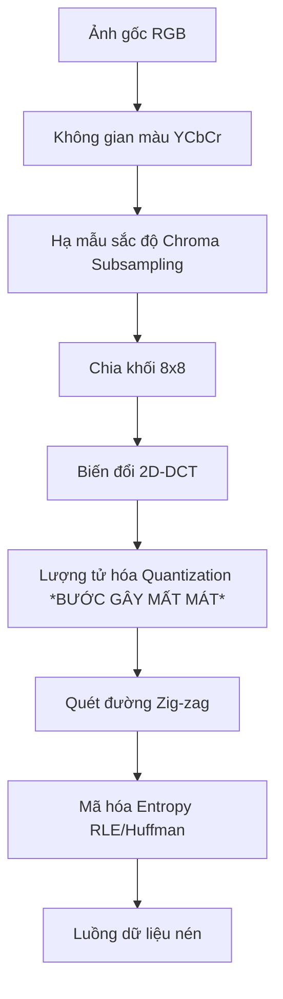

# 📘 ĐỀ CƯƠNG ÔN TẬP TỔNG HỢP (MASTER SYLLABUS) - MÔN IMP302

> [!IMPORTANT]
> **Tài liệu hệ thống hóa toàn bộ kiến thức trọng tâm IMP302 (Image & Video Processing).** 
> Bao gồm công thức toán học đầy đủ, lý thuyết cốt lõi, ví dụ chi tiết từng bước và ứng dụng thực tiễn của từng phần. 
> Đọc kỹ tài liệu này kết hợp với làm bài tập trắc nghiệm trong file [IMP302_Image_Video_Processing.md](file:///d:/Quan/Documents/Obsidian_Vault-main/IMP302_Image_Video_Processing.md).

---

## 📌 MỤC LỤC
1. [Phần 1: Thu nhận, Hiển thị & Tiền xử lý ảnh cơ bản](#phần-1-thu-nhận-hiển-thị--tiền-xử-lý-ảnh-cơ-bản)
2. [Phần 2: Khôi phục ảnh & Biến đổi tần số](#phần-2-khôi-phục-ảnh--biến-đổi-tần-số)
3. [Phần 3: Nén ảnh và Video](#phần-3-nén-ảnh-và-video)
4. [Phần 4: Trích xuất đặc trưng & Nhận diện vật thể](#phần-4-trích-xuất-đặc-trưng--nhận-diện-vật-thể)
5. [Phần 5: Machine Learning & Deep Learning](#phần-5-machine-learning--deep-learning)
6. [Phần 6: Chuyên đề nâng cao (RL & Face Anti-Spoofing)](#phần-6-chuyên-đề-nâng-cao-rl--face-anti-spoofing)

---

## PHẦN 1: THU NHẬN, HIỂN THỊ & TIỀN XỬ LÝ ẢNH CƠ BẢN

### 1. Lấy mẫu & Lượng tử hóa (Sampling & Quantization)
Để chuyển đổi một tín hiệu ánh sáng liên tục $f(x, y)$ từ thế giới thực vào máy tính, ta cần thực hiện hai bước rời rạc hóa:
1. **Lấy mẫu (Sampling):** Rời rạc hóa về mặt không gian (tọa độ $x, y$). Quyết định **độ phân giải** của ảnh (M x N pixel).
2. **Lượng tử hóa (Quantization):** Rời rạc hóa về mặt biên độ (cường độ sáng). Quyết định **độ sâu màu (bit-depth)** của ảnh.

#### ❖ Công thức & Lý thuyết cốt lõi
*   **Định lý lấy mẫu Nyquist:** Để tránh mất mát thông tin khi rời rạc hóa, tần số lấy mẫu $f_s$ phải lớn hơn ít nhất 2 lần tần số cực đại $f_{max}$ của tín hiệu:
    $$f_s > 2 f_{max}$$
*   **Hiện tượng Răng cưa/Bóng ma (Aliasing):** Xảy ra khi lấy mẫu với tần số $f_s \le 2 f_{max}$. Các tần số cao bị chồng lấn và biến dạng thành các tần số thấp hơn.
    *   *Giải pháp:* Dùng một bộ lọc thông thấp (low-pass filter) để lọc bỏ tần số cao trước khi hạ mẫu (downsampling).
*   **Độ sâu màu và số mức xám:** Một ảnh có độ sâu màu $k$-bit sẽ có số mức xám là:
    $$L = 2^k$$
    Dung lượng lưu trữ của ảnh kích thước $M \times N$ là $M \times N \times k$ bits.
*   **Halftoning:** Kỹ thuật in ấn sử dụng các chấm đen có kích thước khác nhau trên nền trắng để đánh lừa thị giác người đọc, tạo cảm giác về một bức ảnh có nhiều mức xám mặc dù máy in chỉ có 2 mực (đen và trắng).

#### ❖ Các phương pháp Nội suy phóng to ảnh (Upsampling)
Khi tăng kích thước ảnh, các điểm ảnh mới cần được tính toán dựa trên các điểm ảnh cũ:
1.  **Nội suy bậc không (Nearest Neighbor):** Chọn giá trị của pixel gần nhất.
    $$f(x, y) = f(\text{round}(x), \text{round}(y))$$
    *   *Nhược điểm:* Gây ra lỗi **vỡ khối ô vuông (blocky/pixelated)**.
2.  **Nội suy song tuyến tính (Bilinear Interpolation):** Sử dụng trung bình trọng số của 4 pixel lân cận gần nhất. Hàm nội suy có dạng:
    $$f(x, y) = ax + by + cxy + d$$
    *   *Đặc điểm:* Kết quả mượt mà hơn nhưng làm mờ các chi tiết cạnh (blurred edges).
3.  **Nội suy song bậc ba (Bicubic Interpolation):** Sử dụng 16 pixel lân cận. Phương trình bậc ba giúp giữ được độ sắc nét tốt nhất nhưng tốn tài nguyên tính toán nhất.

---

### 2. Phép toán điểm & Hình thái học (Point Operations & Morphology)

#### ❖ Cân bằng Lược đồ xám (Histogram Equalization)
Kỹ thuật biến đổi lược đồ mức xám nhằm phân bố đều các pixel trên toàn bộ dải động $[0, L-1]$, giúp cải thiện độ tương phản của ảnh bị thiếu sáng hoặc thừa sáng.

*   **Công thức biến đổi liên tục:**
    $$s = T(r) = (L-1) \int_0^r p_r(w) dw$$
    Trong đó $r$ là mức xám gốc, $s$ là mức xám sau biến đổi, và $p_r(r)$ là hàm mật độ xác suất (PDF) của mức xám gốc.
*   **Công thức rời rạc thực tế:**
    $$s_k = T(r_k) = (L-1) \sum_{j=0}^{k} \frac{n_j}{MN} = \frac{L-1}{MN} \sum_{j=0}^{k} n_j$$
    Với $MN$ là tổng số pixel, $n_j$ là số lượng pixel có mức xám $j$.

##### 📝 Ví dụ chi tiết tính toán Histogram Equalization
Cho ảnh kích thước $64 \times 64$ pixel ($MN = 4096$), số mức xám $L = 8$ (từ $0$ đến $7$). Phân bố mức xám ban đầu như sau:

| Mức xám $r_k$ | Số pixel $n_k$ | Xác suất $p_r(r_k) = n_k/4096$ | Tích lũy CDF $\sum p_r$ | Công thức $s_k = \text{round}(7 \times \text{CDF})$ | Mức xám mới |
|:---:|:---:|:---:|:---:|:---:|:---:|
| 0 | 790 | 0.19 | 0.19 | $7 \times 0.19 = 1.33$ | **1** |
| 1 | 1023 | 0.25 | 0.44 | $7 \times 0.44 = 3.08$ | **3** |
| 2 | 850 | 0.21 | 0.65 | $7 \times 0.65 = 4.55$ | **5** |
| 3 | 656 | 0.16 | 0.81 | $7 \times 0.81 = 5.67$ | **6** |
| 4 | 329 | 0.08 | 0.89 | $7 \times 0.89 = 6.23$ | **6** |
| 5 | 245 | 0.06 | 0.95 | $7 \times 0.95 = 6.65$ | **7** |
| 6 | 122 | 0.03 | 0.98 | $7 \times 0.98 = 6.86$ | **7** |
| 7 | 81 | 0.02 | 1.00 | $7 \times 1.00 = 7.00$ | **7** |

*   **Ứng dụng:** Làm nổi bật chi tiết trong ảnh y khoa (X-quang, MRI) hoặc ảnh chụp vệ tinh dưới điều kiện ánh sáng kém.

---

#### ❖ Thuật toán Otsu (Otsu's Global Thresholding)
Tự động tìm một ngưỡng nhị phân $t^*$ tối ưu để phân chia ảnh thành 2 lớp: Nền ($C_1$) và Đối tượng ($C_2$).

*   **Nguyên lý:** Cực đại hóa phương sai giữa 2 lớp (Between-Class Variance) $\sigma_B^2(t)$:
    $$\sigma_B^2(t) = P_1(t) P_2(t) [\mu_1(t) - \mu_2(t)]^2$$
    Trong đó tại ngưỡng $t$:
    *   $P_1(t) = \sum_{i=0}^t p_i$ và $P_2(t) = 1 - P_1(t)$ là xác suất xuất hiện của 2 lớp.
    *   $\mu_1(t) = \sum_{i=0}^t \frac{i \cdot p_i}{P_1(t)}$ và $\mu_2(t) = \sum_{i=t+1}^{L-1} \frac{i \cdot p_i}{P_2(t)}$ là giá trị xám trung bình của 2 lớp.
*   **Ứng dụng:** Nhị phân hóa tài liệu văn bản quét (OCR), phân đoạn tế bào trong ảnh sinh học, tìm ngưỡng tối ưu bằng cách cực đại hóa phương sai giữa hai lớp (nền và chữ), rất phù hợp để nhị phân hóa tài liệu văn bản

---

#### ❖ Lọc phi tuyến - Lọc trung vị (Median Filter)
*   **Nguyên lý:** Với mỗi pixel, ta lấy các pixel trong cửa sổ lân cận (ví dụ $3 \times 3$), sắp xếp tăng dần và chọn giá trị nằm ở chính giữa để thay thế cho pixel trung tâm.
*   **Điểm vượt trội:** Diệt trừ hoàn toàn **Nhiễu muối tiêu (Salt-and-Pepper)** mà **KHÔNG làm nhòe cạnh** (khác với lọc trung bình/Gaussian làm mờ biên rất nặng).

##### 📝 Ví dụ minh họa:
Cửa sổ ảnh $3 \times 3$ bị nhiễu muối tiêu (điểm nhiễu có giá trị cực đoan 255):
$$\text{Cửa sổ} = \begin{bmatrix} 12 & 14 & 11 \\ 15 & 255 & 13 \\ 10 & 12 & 14 \end{bmatrix}$$
1. Sắp xếp mảng: $[10, 11, 12, 12, \mathbf{13}, 14, 14, 15, 255]$
2. Trung vị (giá trị thứ 5) = **13**.
3. Điểm 255 bị loại bỏ hoàn toàn và thay bằng 13.

---

#### ❖ Toán tử Hình thái học (Mathematical Morphology)
Các phép toán dựa trên việc quét một phần tử cấu trúc $B$ (Structuring Element) qua ảnh $A$.

*   **Giãn nở (Dilation - $A \oplus B$):** Làm đối tượng phình to ra. Tương đương phép toán logic **OR** hoặc **Max Pooling**.
    $$A \oplus B = \{z \mid (\hat{B})_z \cap A \neq \emptyset\}$$
*   **Bào mòn (Erosion - $A \ominus B$):** Làm đối tượng thu hẹp lại. Tương đương phép toán logic **AND** hoặc **Min Pooling**.
    $$A \ominus B = \{z \mid (B)_z \subseteq A\}$$
*   **Mở (Opening - $A \circ B$):** Bào mòn trước, giãn nở sau.
    $$A \circ B = (A \ominus B) \oplus B$$
    *   *Ứng dụng:* Tách rời các vật thể dính nhau, **xóa nhiễu hạt nhỏ, sợi tóc** mà không làm thay đổi hình dạng vật thể lớn.
*   **Đóng (Closing - $A \bullet B$):** Giãn nở trước, bào mòn sau.
    $$A \bullet B = (A \oplus B) \ominus B$$
    *   *Ứng dụng:* **Lấp các lỗ thủng nhỏ bên trong**, nối các nét đứt gãy của chữ viết hoặc đường thẳng.
*   **Top-hat (White Top-hat):** Lấy ảnh gốc trừ đi ảnh sau phép Mở.
    $$T_{hat}(A) = A - (A \circ B)$$
    *   *Ứng dụng:* Phát hiện khuyết tật sáng trên nền tối, hiệu chỉnh ánh sáng không đều.

---

## PHẦN 2: KHÔI PHỤC ẢNH & BIẾN ĐỔI TẦN SỐ

### 1. Mô hình Nhiễu & Khôi phục ảnh

#### ❖ Mô hình suy biến ảnh tổng quát
Ảnh nhận được $g(x, y)$ là kết quả của ảnh gốc $f(x, y)$ đi qua hệ thống suy biến $h(x, y)$ (ví dụ: thấu kính bị nhòe) và cộng thêm nhiễu $\eta(x, y)$:
$$g(x, y) = h(x, y) * f(x, y) + \eta(x, y)$$
Chuyển sang miền tần số Fourier bằng tích chập thành phép nhân:
$$G(u, v) = H(u, v)F(u, v) + N(u, v)$$

#### ❖ Các loại nhiễu phổ biến
*   **Nhiễu Gaussian:** Biểu đồ dạng hình chuông đối xứng. Sinh ra do nhiệt độ linh kiện điện tử.
*   **Nhiễu Rayleigh:** Biểu đồ lệch (không đối xứng), mật độ xác suất:
    $$p(z) = \begin{cases} \frac{2}{b}(z-a)e^{-(z-a)^2/b} & z \ge a \\ 0 & z < a \end{cases}$$
    *   *Ứng dụng:* Thường gặp trong **ảnh Radar và ảnh Siêu âm y tế**.
*   **Nhiễu muối tiêu (Impulse Noise):** Các điểm ảnh đen (0) hoặc trắng (255) xuất hiện ngẫu nhiên do lỗi truyền tải số.

#### ❖ Kỹ thuật khôi phục ảnh (Image Restoration)
*   **Lọc Ngược (Direct Inverse Filtering):**
    $$\hat{F}(u, v) = \frac{G(u, v)}{H(u, v)} = F(u, v) + \frac{N(u, v)}{H(u, v)}$$
    *   *Điểm yếu chí mạng:* Tại những tần số mà hàm suy biến $H(u, v) \approx 0$, thành phần nhiễu $\frac{N(u, v)}{H(u, v)}$ sẽ bị phóng đại lên vô cực, phá hủy toàn bộ bức ảnh. Do đó, lọc ngược thực tế chỉ chạy tốt khi nhiễu bằng 0.
*   **Lọc Wiener (Minimum Mean Square Error Filter):** Tối thiểu hóa kỳ vọng bình phương sai lệch giữa ảnh gốc và ảnh khôi phục $E\{[f(x,y) - \hat{f}(x,y)]^2\}$.
    $$\hat{F}(u, v) = \left[ \frac{1}{H(u, v)} \frac{|H(u, v)|^2}{|H(u, v)|^2 + \frac{S_{\eta}(u, v)}{S_f(u, v)}} \right] G(u, v)$$
    Với $S_{\eta}$ và $S_f$ là mật độ phổ công suất của nhiễu và ảnh gốc. Trong thực tế, ta thường xấp xỉ tỷ số này bằng một hằng số $K$:
    $$\hat{F}(u, v) \approx \left[ \frac{1}{H(u, v)} \frac{|H(u, v)|^2}{|H(u, v)|^2 + K} \right] G(u, v)$$
*   **Lọc Khía (Notch Reject Filter):** Lọc bỏ chọn lọc một dải tần số hẹp xung quanh một tần số trung tâm xác định trong miền Fourier.
    *   *Ứng dụng:* Loại bỏ **nhiễu chu kỳ** (ví dụ: các đường sọc ngang dọc trên tivi cũ, lưới nhiễu sóng điện từ).
*   **Radon Transform & Filtered Backprojection:**
    *   **Phép biến đổi Radon:** Tính toán các tích phân đường của ảnh dọc theo các chùm tia song song ở các góc quét khác nhau.
    *   **Chiếu ngược có lọc (Filtered Backprojection):** Thuật toán tái tạo ảnh 3D từ các lát cắt hình chiếu 1D. Dùng làm thuật toán lõi trong **máy chụp cắt lớp CT Scanner**.

---

### 2. Các phép biến đổi tần số (Image Transforms)

*   **Biến đổi Walsh-Hadamard (WHT):**
    *   Sử dụng các hàm cơ sở là các sóng vuông chỉ mang giá trị $+1$ và $-1$.
    *   *Ưu điểm:* Cực kỳ nhanh trên phần cứng số vì **không cần phép nhân số thực**, chỉ dùng **phép cộng và trừ**.
*   **Biến đổi Cosin rời rạc (DCT):**
    *   Giả định tín hiệu tuần hoàn chu kỳ $2N$ và đối xứng gương ở biên.
    *   *Đặc tính dồn năng lượng (Energy Compaction):* DCT tập trung phần lớn năng lượng của ảnh vào một số ít hệ số tần số thấp ở góc trên bên trái ma trận.
    *   *Ứng dụng:* Trái tim của chuẩn nén ảnh **JPEG**.
*   **Biến đổi Wavelet rời rạc (DWT):**
    *   Cho phép phân tích **đa phân giải (Multiresolution)**: vừa có thông tin thời gian/không gian, vừa có thông tin tần số.
    *   *Ứng dụng:* Chuẩn nén **JPEG2000** (khắc phục lỗi vỡ khối của JPEG).

---

## PHẦN 3: NÉN ẢNH VÀ VIDEO (COMPRESSION)

### 1. Lý thuyết thông tin & Mã hóa Entropy

*   **Độ đo Entropy Shannon:** Đo lượng thông tin trung bình chứa trong một ký hiệu nguồn. Đây là **giới hạn dưới (cận dưới)** của tốc độ bit trung bình để mã hóa không mất mát (lossless).
    $$H(S) = -\sum_{i=1}^{n} P(s_i) \log_2 P(s_i) \quad (\text{bits/symbol})$$

##### 📝 Ví dụ tính toán Entropy:
Một nguồn tin phát ra 3 ký tự $\{A, B, C\}$ với xác suất tương ứng là $P(A) = 0.5, P(B) = 0.25, P(C) = 0.25$.
$$H(S) = - \left( 0.5 \log_2 0.5 + 0.25 \log_2 0.25 + 0.25 \log_2 0.25 \right)$$
$$H(S) = - \left( 0.5 \times (-1) + 0.25 \times (-2) + 0.25 \times (-2) \right) = 0.5 + 0.5 + 0.5 = 1.5 \text{ bits/symbol}$$
Ý nghĩa: Bạn cần tối thiểu trung bình 1.5 bit để biểu diễn một ký hiệu từ nguồn này mà không mất mát thông tin.

*   **Mã hóa Huffman:** Thuật toán mã hóa độ dài thay đổi (Variable-length coding). Ký hiệu xuất hiện nhiều $\to$ mã ngắn; ký hiệu xuất hiện ít $\to$ mã dài. Có tính chất tiền tố (Prefix code).
*   **Mã hóa Số học (Arithmetic Coding):** 
    *   *Cơ chế:* Thay vì ánh xạ từng ký tự thành các bit riêng lẻ, mã hóa số học nén **toàn bộ chuỗi thông điệp** thành **một số thực duy nhất** nằm trong khoảng nửa khoảng $[0, 1)$.
    *   *Ưu điểm:* Đạt tỷ lệ nén tối ưu sát với giới hạn Entropy hơn Huffman, đặc biệt khi xác suất của một ký tự cực kỳ lớn ($> 0.9$).

---

### 2. Chuẩn nén ảnh JPEG & Video H.264

#### ❖ Quy trình nén ảnh JPEG (Mất mát - Lossy)

> [!WARNING]
> **Bước gây mất mát duy nhất trong JPEG** là **Lượng tử hóa (Quantization)**. Việc chia các hệ số DCT cho bảng lượng tử và làm tròn thành số nguyên làm mất vĩnh viễn thông tin tần số cao, gây ra lỗi **vỡ khối (blocking artifacts)** khi giải nén.

#### ❖ Chuẩn nén Video H.264/AVC
*   **Bộ lọc gỡ khối (Deblocking Filter):** Bộ lọc tự động áp dụng trên các cạnh của các khối macroblock $4 \times 4$ hoặc $8 \times 8$ ngay trong vòng lặp giải mã (in-loop) để làm mịn ảnh và triệt tiêu lỗi vỡ khối.
*   **Cấu trúc các khung hình trong dòng MPEG:**
    *   **I-frame (Intra-coded):** Khung hình nén độc lập (tương tự ảnh JPEG tĩnh), không tham chiếu đến bất kỳ khung hình nào khác. Đóng vai trò là **điểm neo để tua video (Fast Forward)**.
    *   **P-frame (Predictive):** Khung hình dự đoán một chiều, tham chiếu đến một khung hình trước đó (I hoặc P) thông qua các vector chuyển động.
    *   **B-frame (Bi-directional):** Khung hình dự đoán hai chiều, tham chiếu đến cả khung hình phía trước và phía sau. Đạt tỷ lệ nén cao nhất nhưng yêu cầu độ trễ tính toán lớn.
*   **Bù chuyển động (Motion Compensation):** Kỹ thuật ước lượng hướng di chuyển của vật thể giữa các khung hình để chỉ lưu trữ vector chuyển động thay vì lưu cả khung hình mới. Được ứng dụng để nội suy tăng tốc độ khung hình (ví dụ từ 24fps lên 60fps tạo slow-motion mượt mà).

---

## PHẦN 4: TRÍCH XUẤT ĐẶC TRƯNG & NHẬN DIỆN VẬT THỂ

### 1. Bất biến Mô-men Hu (Hu Moments)
Để nhận dạng một hình dáng bất kể nó nằm ở vị trí nào, kích thước lớn hay nhỏ, hay bị xoay góc bao nhiêu, ta dùng 7 số bất biến mô-men Hu.
*   **Mô-men hình học gốc (Raw Moments):**
    $$M_{pq} = \sum_{x} \sum_{y} x^p y^q f(x, y)$$
    Trong đó diện tích vùng ảnh $A = M_{00}$, trọng tâm hình học $(\bar{x}, \bar{y})$ là:
    $$\bar{x} = \frac{M_{10}}{M_{00}}, \quad \bar{y} = \frac{M_{01}}{M_{00}}$$
*   **Mô-men trung tâm (Central Moments - Bất biến tịnh tiến):**
    $$\mu_{pq} = \sum_{x} \sum_{y} (x - \bar{x})^p (y - \bar{y})^q f(x, y)$$
*   **Mô-men chuẩn hóa (Normalized Central Moments - Bất biến tỉ lệ co giãn):**
    $$\eta_{pq} = \frac{\mu_{pq}}{\mu_{00}^\gamma} \quad \text{với } \gamma = \frac{p+q}{2} + 1 \quad (\text{cho } p+q \ge 2)$$
*   **7 Bất biến Hu ($\phi_1 \dots \phi_7$):** Được tính toán từ các hệ số $\eta_{pq}$. Ví dụ mô-men thứ nhất:
    $$\phi_1 = \eta_{20} + \eta_{02}$$
    Các giá trị này **không đổi** khi đối tượng bị **dịch chuyển (translation), phóng to/thu nhỏ (scale), hoặc xoay (rotation)**.

---

### 2. Biến đổi Hough (Hough Transform)
Thuật toán tìm kiếm các hình học tham số hóa (đường thẳng, hình tròn) ngay cả khi chúng bị đứt nét hoặc bị che khuất một phần.
*   **Phương trình đường thẳng trong không gian Hough (hệ tọa độ cực):**
    $$r = x \cos \theta + y \sin \theta$$
*   **Nguyên lý hoạt động:** Mỗi điểm $(x_i, y_i)$ trong không gian ảnh sẽ vẽ nên một đường cong hình sin trong không gian Hough $(r, \theta)$. Điểm giao nhau của nhiều đường sin chính là tham số $(r^*, \theta^*)$ của đường thẳng đi qua các điểm đó. Ta tìm điểm giao bằng cách dùng một ma trận tích lũy bỏ phiếu (accumulator array voting).

---

### 3. Ma trận đồng xuất hiện mức xám (GLCM)
GLCM dùng để phân tích **đặc trưng kết cấu bề mặt (Texture)** bằng cách thống kê tần suất xuất hiện của các cặp điểm ảnh có mức xám $i$ và $j$ cách nhau một khoảng cách $d$ theo hướng góc $\theta$.

*   **Các tham số trích xuất phổ biến (sau khi chuẩn hóa GLCM thành ma trận xác suất $P(i,j)$):**
    *   **Năng lượng (Angular Second Moment - ASM):** Đo độ đồng nhất của kết cấu.
        $$\text{Energy} = \sum_{i} \sum_{j} P(i, j)^2$$
    *   **Độ tương phản (Contrast):** Đo mức độ chênh lệch cường độ sáng cục bộ.
        $$\text{Contrast} = \sum_{i} \sum_{j} (i - j)^2 P(i, j)$$
    *   **Entropy:** Đo độ hỗn loạn, phức tạp của bề mặt.
        $$\text{Entropy} = -\sum_{i} \sum_{j} P(i, j) \log_2 P(i, j)$$
    *   **Độ đồng đều (Homogeneity / IDM):**
        $$\text{Homogeneity} = \sum_{i} \sum_{j} \frac{P(i, j)}{1 + |i - j|}$$

---

### 4. Phân tích thành phần chính (PCA)
*   **Nguyên lý:** Chiếu dữ liệu đa chiều (ví dụ ảnh đa phổ gồm nhiều dải sóng vệ tinh) lên các trục trực giao mới sao cho phương sai của dữ liệu trên các trục mới là lớn nhất.
*   **Mục đích:** Khử tương quan giữa các kênh ảnh và giảm chiều dữ liệu (dimensionality reduction) để nén thông tin.
*   **Các bước:** Tính ma trận hiệp phương sai $\Sigma$ của ảnh $\to$ Tìm các trị riêng (eigenvalues) và vector riêng (eigenvectors) $\to$ Chọn $k$ vector riêng ứng với các trị riêng lớn nhất làm ma trận chuyển đổi.

---

### 5. SIFT, RANSAC & Đánh giá IoU

*   **SIFT (Scale-Invariant Feature Transform):**
    *   Trích xuất các điểm đặc trưng (keypoints) và mô tả chúng bằng vector **128 chiều**.
    *   *Tính chất:* Hoàn toàn bất biến với **tỉ lệ (scale), góc xoay (rotation)**, và thay đổi độ sáng.
*   **RANSAC (Random Sample Consensus):**
    *   Thuật toán lặp để ước lượng tham số mô hình toán học (ví dụ ma trận Homography để ghép ảnh Panorama) từ một tập dữ liệu chứa nhiều **nhiễu ngoại lai (outliers - các điểm khớp sai)**.
    *   *Cơ chế:* Chọn ngẫu nhiên tập mẫu tối thiểu $\to$ Khớp mô hình $\to$ Đếm số điểm đồng thuận (inliers) $\to$ Lặp lại để tìm mô hình có nhiều inliers nhất.
*   **Chỉ số IoU (Intersection over Union):**
    Thước đo độ chính xác của hộp dự đoán (Prediction) so với hộp chuẩn (Ground Truth) trong nhận diện vật thể.
    $$\text{IoU} = \frac{\text{Diện tích vùng Giao (Overlap)}}{\text{Diện tích vùng Hợp (Union)}} = \frac{|A \cap B|}{|A \cup B|}$$

---

## PHẦN 5: MACHINE LEARNING & DEEP LEARNING

### 1. Machine Learning Cổ điển

*   **Bộ phân loại Khoảng cách Tối thiểu (Minimum-Distance Classifier):**
    Tính khoảng cách từ điểm dữ liệu cần phân loại $x$ tới Vector trung bình (Mean Vector) $m_i$ của từng lớp. Điểm $x$ thuộc về lớp có khoảng cách ngắn nhất:
    $$d(x, m_i) = \|x - m_i\|$$
*   **Bộ phân loại tối ưu Bayes (Bayes Classifier):**
    Quyết định dựa trên xác suất hậu nghiệm lớn nhất. Công thức Bayes:
    $$P(c_i | x) = \frac{p(x | c_i) P(c_i)}{p(x)}$$
    *   *Rào cản thực tế:* Phải ước lượng chính xác hàm mật độ xác suất (PDF) $p(x | c_i)$ và xác suất tiên nghiệm $P(c_i)$ của tất cả các lớp, điều này rất khó khăn khi số chiều dữ liệu lớn.
*   **Mạng Perceptron:**
    Mô hình mạng nơ-ron cơ bản nhất. Siêu phẳng phân hoạch có dạng $w^T x + b = 0$.
    *   *Định lý hội tụ:* Thuật toán học của Perceptron chắc chắn hội tụ nếu và chỉ nếu dữ liệu đầu vào là **phân tách tuyến tính được (linearly separable)**.
*   **Hiện tượng Overfitting (Quá khớp):**
    *   *Dấu hiệu:* Sai số trên tập huấn luyện (Train loss) giảm rất thấp, nhưng sai số trên tập kiểm thử (Validation loss) lại tăng cao.
    *   *Giải pháp:* Dùng Regularization (L1, L2), Dropout, Early Stopping, hoặc bổ sung thêm dữ liệu (Data Augmentation).

---

### 2. Mạng Nơ-ron Tích chập (CNNs) & Học sâu

*   **VGG16:**
    Đột phá bằng cách thay thế các bộ lọc lớn bằng chuỗi các bộ lọc **kích thước cực nhỏ $3 \times 3$**.
    *   *Tại sao lại là $3 \times 3$?* Hai lớp tích chập $3 \times 3$ xếp chồng có trường thụ cảm (Receptive Field) bằng một lớp $5 \times 5$, nhưng số tham số ít hơn ($2 \times 3^2 \times C^2 = 18C^2$ so với $1 \times 5^2 \times C^2 = 25C^2$), đồng thời tăng thêm số hàm kích hoạt phi tuyến giúp học đặc trưng tốt hơn.
*   **ResNet (Residual Networks):**
    Giải quyết bài toán suy giảm đạo hàm (Vanishing Gradient) khi mạng quá sâu bằng cơ chế **Skip Connection (Đường kết nối tắt)**:
    $$y = \mathcal{F}(x) + x$$
    Đạo hàm có thể truyền trực tiếp qua kênh cộng $x$ mà không bị triệt tiêu khi lan truyền ngược qua nhiều lớp tích chập.
*   **ViT (Vision Transformer):**
    Loại bỏ hoàn toàn phép tích chập (Convolution), chia ảnh thành các mảnh nhỏ (patches), coi mỗi mảnh như một "từ" và sử dụng cơ chế **Self-Attention** để nắm bắt mối quan hệ và sự phụ thuộc toàn cục (global dependencies) trên toàn bức ảnh.

---

### 3. Nhận diện vật thể (Object Detection)

*   **Họ YOLO (You Only Look Once):**
    Mô hình **Single-stage**. Chia ảnh đầu vào thành lưới $S \times S$. Mỗi ô lưới dự đoán trực tiếp các bounding box và điểm tin cậy (confidence score) cùng xác suất phân loại lớp trong một lần lan truyền tiến duy nhất qua mạng. Đạt tốc độ cực nhanh, ứng dụng cho các tác vụ thời gian thực (Real-time).
*   **Mạng Anchor-free (FCOS, CornerNet):**
    Dự đoán trực tiếp tọa độ tâm, góc hoặc khoảng cách biên mà không cần định nghĩa sẵn các hộp neo (anchor boxes).
    *   *Ưu điểm lớn nhất:* Giải quyết vấn đề **mất cân bằng mẫu cực lớn (Background/Foreground imbalance)** vì không phải sinh ra hàng triệu hộp neo chứa toàn ảnh nền (negative samples).

---

## PHẦN 6: CHUYÊN ĐỀ NÂNG CAO (RL & FACE ANTI-SPOOFING)

### 1. Học tăng cường (Reinforcement Learning - RL)

*   **Nhiệm vụ liên tục (Continuing Tasks):**
    Khác với Episodic Tasks (nhiệm vụ có điểm kết thúc rõ ràng như chơi cờ), các nhiệm vụ liên tục diễn ra mãi mãi. Vì vậy, ta không dùng tổng phần thưởng tích lũy có chiết khấu $\sum \gamma^t R_t$ mà mục tiêu tối ưu hóa được chuyển sang **Phần thưởng trung bình trên một bước thời gian (Average Reward)**:
    $$r(\pi) = \lim_{T \to \infty} \frac{1}{T} \mathbb{E} \left[ \sum_{t=1}^{T} R_t \right]$$
*   **Kiến trúc Actor-Critic:**
    *   **Actor (Tác nhân):** Chịu trách nhiệm học và cập nhật **chính sách (Policy - $\pi_\theta(a|s)$)** để quyết định hành động.
    *   **Critic (Người phê bình):** Đánh giá hành động của Actor bằng cách ước lượng **Hàm giá trị (Value Function - $V_w(s)$)** và tính toán sai số hiệu số thời gian (Temporal Difference Error - TD Error $\delta_t$):
        $$\delta_t = R_{t+1} + \gamma V_w(S_{t+1}) - V_w(S_t)$$
*   **Tham số hóa chính sách (Policy Parameterizations):**
    *   **Softmax Policy (Cho hành động rời rạc):** Xác suất chọn hành động $a$ trong trạng thái $s$:
        $$\pi(a|s, \theta) = \frac{e^{h(s, a, \theta)}}{\sum_{b} e^{h(s, b, \theta)}}$$
    *   **Gaussian Policy (Cho hành động liên tục):** Hành động được chọn bằng cách lấy mẫu từ phân phối chuẩn $\mathcal{N}(\mu(s), \sigma^2(s))$ với trung bình $\mu(s)$ và phương sai $\sigma(s)$ được xấp xỉ bởi mạng nơ-ron.

---

### 2. Chống giả mạo khuôn mặt (Face Anti-Spoofing - FAS)

Nhận diện xem khuôn mặt trước camera là người thật (Live) hay ảnh chụp/video phát lại từ màn hình (Spoof).

*   **Mạng CDCN (Central Difference Convolutional Networks):**
    Được thiết kế đặc biệt để bắt các đặc trưng chi tiết cục bộ (lưới pixel in ấn, độ phản chiếu màn hình) vốn rất nhạy cảm với sự thay đổi gradient.
*   **Phép tích chập vi phân trung tâm (Central Difference Convolution - CDC):**
    Thay vì chỉ nhân chập cường độ pixel bình thường như Vanilla Convolution, CDC kết hợp thêm thông tin chênh lệch cường độ (gradient) giữa pixel trung tâm và các pixel lân cận:
    $$y(p_0) = \theta \cdot \sum_{p_n \in \mathcal{R}} w(p_n) \cdot \left( x(p_0 + p_n) - x(p_0) \right) + (1 - \theta) \cdot \sum_{p_n \in \mathcal{R}} w(p_n) \cdot x(p_0 + p_n)$$
    *   Trong đó:
        *   $p_0$ là tọa độ pixel trung tâm, $p_n$ quét qua vùng lân cận $\mathcal{R}$.
        *   Thành phần thứ nhất $\left(x(p_0+p_n) - x(p_0)\right)$ nắm bắt thông tin **Gradient** (biến thiên cục bộ).
        *   Thành phần thứ hai $x(p_0+p_n)$ nắm bắt thông tin **Cường độ (Intensity)** gốc.
    *   **Siêu tham số cân bằng tối ưu:** Qua thực nghiệm kiểm thử trên các tập dữ liệu FAS lớn, hệ số cân bằng cho kết quả tốt nhất là:
        $$\theta = 0.7$$
        *(Tập trung 70% vào đặc trưng gradient vi phân và 30% vào cường độ ảnh gốc).*

---

## 🚨 BỎ TÚI CÔNG THỨC NHANH TRƯỚC GIỜ THI
1.  **Dung lượng ảnh:** $M \times N \times \log_2(L)$ bits.
2.  **Tốc độ Nyquist:** $f_s > 2 f_{max}$.
3.  **Tích lũy Histogram:** $s_k = \frac{L-1}{MN} \sum_{j=0}^k n_j$.
4.  **Phương sai Otsu:** $\sigma_B^2 = P_1 P_2 (\mu_1 - \mu_2)^2$.
5.  **Dilation/Erosion:** Dilation = Max (OR); Erosion = Min (AND).
6.  **Opening/Closing:** Opening = Erosion trước $\to$ Dilation sau; Closing = Dilation trước $\to$ Erosion sau.
7.  **Lọc Wiener:** Có thêm hệ số tỷ lệ nhiễu/tín hiệu $K$ ở mẫu số để chặn nhiễu bùng nổ.
8.  **Hough Transform:** $r = x \cos \theta + y \sin \theta$.
9.  **Entropy:** $H(S) = -\sum P_i \log_2 P_i$.
10. **IoU:** $\frac{\text{Giao}}{\text{Hợp}} = \frac{A \cap B}{A \cup B}$.
11. **CDC (CDCN):** $\theta = 0.7$ là tối ưu cho Face Anti-Spoofing.
