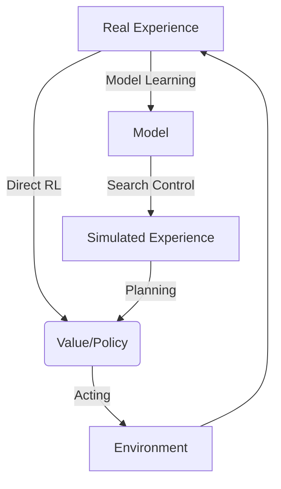

# REL301m – Fundamentals of Reinforcement Learning 

## MỤC LỤC
1. [Phần 1: Cơ sở của Học tăng cường (Chương 1)](#phần-1-cơ-sở-của-học-tăng-cường-chương-1)
2. [Phần 2: Phương pháp dạng bảng dựa trên mẫu (Chương 2)](#phần-2-phương-pháp-dạng-bảng-dựa-trên-mẫu-chương-2)
3. [Phần 3: Xấp xỉ hàm & Học tăng cường sâu (Chương 3)](#phần-3-xấp-xỉ-hàm--học-tăng-cường-sâu-chương-3)
4. [Phần 4: Xây dựng hệ thống hoàn chỉnh & Dự án Tic-Tac-Toe](#phần-4-xây-dựng-hệ-thống-hoàn-chỉnh--dự-án-tic-tac-toe)
5. [ Bí kíp phản xạ từ khóa nhanh (Exam Cheat-sheet)](#-bí-kíp-phản-xạ-từ-khóa-nhanh-exam-cheat-sheet)
6. [ Mẹo làm trắc nghiệm & Cách nhớ sâu kiến thức](#-mẹo-làm-trắc-nghiệm--cách-nhớ-sâu-kiến-thức)
7. [Checklist nhận diện nhanh trong đề thi (Reflex Keywords)](#-checklist-nhận-diện-nhanh-trong-đề-thi-reflex-keywords)
8. [Từ điển khái niệm cốt lõi (REL Glossary)](#-từ-điển-khái-niệm-cốt-lõi-rel-glossary)
9. [Bộ 30 câu hỏi trắc nghiệm ôn tập](#bộ-30-câu-hỏi-trắc-nghiệm-ôn-tập-ai1910---lưu-giang-nam)

---

## PHẦN 1: CƠ SỞ CỦA HỌC TĂNG CƯỜNG (CHƯƠNG 1)

Học tăng cường (Reinforcement Learning - RL) xoay quanh sự tương tác liên tục giữa **Agent** (Tác nhân) và **Environment** (Môi trường) theo thời gian rời rạc $t = 0, 1, 2, \dots$.

*   Tại mỗi bước thời gian $t$, Agent quan sát trạng thái $S_t \in \mathcal{S}$, chọn hành động $A_t \in \mathcal{A}(S_t)$ dựa trên chính sách $\pi(A_t|S_t)$.
*   Môi trường phản hồi bằng cách chuyển sang trạng thái mới $S_{t+1} \in \mathcal{S}$ và trả về một phần thưởng vô hướng $R_{t+1} \in \mathbb{R}$.
*   **Mục tiêu tối thượng:** Tìm một chính sách tối ưu $\pi^*$ nhằm tối đa hóa **Lợi nhuận tích lũy kỳ vọng dài hạn (Expected Cumulative Return)**, ký hiệu là $\mathbb{E}[G_t]$, chứ không chỉ tối ưu phần thưởng tức thời $R_{t+1}$. B. To maximize the expected cumulative reward over time.

### 1. K-Armed Bandit & Sự đánh đổi Exploration vs. Exploitation
Bài toán K-Armed Bandit là mô hình cơ bản nhất của RL, nơi Agent đối mặt với các hành động độc lập không thay đổi trạng thái môi trường nhằm tối đa hóa phần thưởng nhận được.
Reward scaler feedback signal provided by the environment to the learning agent
- **Đặc tính:** Không có state transition ($S_t$ không đổi hoặc không ảnh hưởng đến môi trường).
    
- **Đánh đổi Exploration vs. Exploitation:**
    
    - **Exploitation (Khai thác):** Chọn hành động $a$ có ước lượng giá trị $Q_t(a)$ lớn nhất hiện tại để nhận thưởng cao ngay lập tức.
        
    - **Exploration (Khám phá):** Chọn các hành động khác để thu thập thêm thông tin, giúp ước lượng $Q_t(a)$ chính xác hơn trong tương lai.
        
- **Chiến lược $\epsilon$-greedy:**
    
    - Với xác suất $1 - \epsilon$: Hành động tham lam (Exploit).
        
    - Với xác suất $\epsilon$: Chọn ngẫu nhiên một hành động trong tập hành động khả thi để khám phá (Explore).
    - an algorithm implements an $\epsilon$-greedy policy by picking a random number $r$ between $0$ and $1$:
	    - With probability $1 - \epsilon$ (when $r \ge \epsilon$), the agent chooses the **greedy** choice based on its current knowledge (**Exploitation**).
	    -  With probability $\epsilon$ (when $r < \epsilon$), the agent enters the **exploration** phase.

    - số ngẫu nhiên < $\epsilon$, thuật toán sẽ bước vào giai đoạn **Khám phá (Exploration)**: nó bỏ qua những đánh giá hiện tại và chọn ngẫu nhiên một hành động bất kỳ trong tập hợp các hành động khả thi với xác suất như nhau
        
    - **Tham số $\epsilon$:** $\epsilon$ lớn $\to$ Khám phá nhiều, hội tụ nhanh về ước lượng thực nhưng phần thưởng tích lũy ngắn hạn thấp. $\epsilon$ nhỏ hoặc bằng $0$ $\to$ Khai thác triệt để nhưng dễ bị kẹt ở tối ưu cục bộ.
    - 

* **Công thức cập nhật giá trị hành động (Incremental Update):**
  $$Q_{n+1}(A) = Q_n(A) + \alpha_n \left[ R_n - Q_n(A) \right]$$
  Trong đó:
  * $\alpha_n = \frac{1}{N_n(A)}$: Trung bình số học (Sample-average) cho bài toán tĩnh (stationary).
  * $\alpha_n = \alpha \in (0, 1]$: Hằng số tốc độ học (Constant step-size) cho bài toán biến động theo thời gian (non-stationary).

#### Incremental Action-Value Estimation

Thay vì lưu toàn bộ reward rồi tính trung bình lại, action value có thể cập nhật từng bước:

$$Q_{n+1}(a)=Q_n(a)+\alpha_n[R_n-Q_n(a)]$$

Với sample average, $\alpha_n=1/N_n(a)$. Với bài toán nonstationary, dùng constant step size $\alpha$ để reward mới có trọng số lớn hơn dữ liệu quá cũ.

#### Epsilon-Greedy và Epsilon-Soft Policy

Epsilon-greedy chọn greedy action với phần lớn xác suất nhưng dành xác suất $\epsilon$ để khám phá. Với $|A|$ actions:

- Greedy action: $1-\epsilon+\epsilon/|A|$.
- Mỗi action khác: $\epsilon/|A|$.

Policy là **epsilon-soft** nếu mọi action đều có xác suất được chọn lớn hơn 0, thường ít nhất $\epsilon/|A|$. Từ khóa “all actions have non-zero probability” → epsilon-soft.

#### Deterministic và Stochastic Policy

- Deterministic policy: mỗi state ánh xạ tới đúng một action, $a=\pi(s)$.
- Stochastic policy: policy trả về phân phối xác suất, $\pi(a|s)=P(A_t=a|S_t=s)$.

Softmax và epsilon-greedy là stochastic policies. Greedy policy thuần túy thường deterministic nếu không có trường hợp hòa.

#### Nonstationary Bandit và Optimistic Initial Values

Trong nonstationary bandit, action values thật thay đổi theo thời gian. Constant step size phù hợp hơn sample average vì có thể quên dữ liệu cũ. **Optimistic initial values** khởi tạo $Q_1(a)$ cao để agent tự khám phá các action, nhưng hiệu quả khám phá có thể giảm khi môi trường thay đổi.

**Câu 29 (Question 29):** Trong một bot giao dịch tài chính đóng vai trò là tác nhân RL, các điều kiện thị trường liên tục thay đổi (môi trường không tĩnh - non-stationary). Tác nhân nên thích ứng như thế nào?
*(In a financial trading bot acting as an RL agent, the market conditions constantly shift (non-stationary environment). How should the agent adapt?)*

- [ ] A. Thiết lập tốc độ học $\alpha = 0$ sau vài ngày. *(Set the learning rate $\alpha = 0$ after a few days.)*
- [x] B. Sử dụng tốc độ học hằng số $\alpha > 0$ và duy trì một mức độ khám phá nhất định ($\epsilon > 0$) thay vì giảm dần chúng về không. *(Use a constant learning rate $\alpha > 0$ and maintain a degree of exploration ($\epsilon > 0$) rather than decaying them to zero.)*
- [ ] C. Chuyển đổi từ Q-learning sang Quy hoạch động (Dynamic Programming). *(Switch from Q-learning to Dynamic Programming.)*
- [ ] D. Sử dụng chiến lược $\epsilon$-greedy với $\epsilon = 0$ để tối đa hóa lợi nhuận một cách nghiêm ngặt. *(Use an $\epsilon$-greedy strategy with $\epsilon = 0$ to strictly maximize profit.)*
- **Giải thích (Explanation):**
  * **Vietnamese:** Trong môi trường không tĩnh, động lực học và các giá trị hành động tối ưu thay đổi liên tục theo thời gian. Nếu giảm $\alpha$ hay $\epsilon$ về 0, Agent sẽ ngừng học xu hướng mới và ngừng khám phá cơ hội mới. Duy trì $\alpha > 0$ giúp Agent ưu tiên các trải nghiệm gần đây hơn, và $\epsilon > 0$ giúp duy trì khả năng thích ứng liên tục.
  * **English:** In a non-stationary environment, the optimal actions and transition dynamics change over time. Decaying $\alpha$ or $\epsilon$ to zero causes the agent to stop learning new trends and exploring new opportunities. Maintaining a constant step size $\alpha > 0$ ensures recent experiences are prioritized, while keeping $\epsilon > 0$ guarantees continuous adaptation.

* **Upper Confidence Bound (UCB):** Cân bằng Exploration bằng cách thêm hệ số bất định vào ước lượng:
  $$A_t \doteq \arg\max_{a} \left[ Q_t(a) + c \sqrt{\frac{\ln t}{N_t(a)}} \right]$$
  *Nếu $N_t(a) = 0$, hành động $a$ sẽ được chọn tối đa.*
* **Giá trị khởi tạo lạc quan (Optimistic Initial Values):** Thiết lập $Q_1(a)$ rất cao để khuyến khích Exploration mạnh mẽ ở các bước đầu tiên.

#### ❖ Ứng dụng thực tiễn của K-Armed Bandit:
* **Tối ưu hóa tỷ lệ click quảng cáo (Ad CTR Optimization):** Hiển thị quảng cáo có tỷ lệ click cao đã biết (Exploit) hay thử nghiệm quảng cáo mới (Explore) để tìm quảng cáo hấp dẫn hơn.

**Câu 23 (Question 23):** Sự đánh đổi Exploration-Exploitation (Khám phá - Khai thác) được thể hiện như thế nào trong một hệ thống gợi ý hiển thị quảng cáo (Ad Placement)?
*(How is the Exploration-Exploitation trade-off manifested in an Ad Placement recommendation system?)*

- [x] A. Exploitation (Khai thác): Hiển thị các quảng cáo có Tỷ lệ click (CTR) cao trong lịch sử; Exploration (Khám phá): Hiển thị quảng cáo mới hoặc chưa được kiểm chứng để thu thập dữ liệu CTR của chúng. *(Exploitation: Displaying ads with historically high Click-Through Rates; Exploration: Showing new or unproven ads to gather CTR data.)*
- [ ] B. Exploitation: Trả phí quảng cáo rẻ hơn; Exploration: Tìm kiếm các trang web mới để đặt quảng cáo. *(Exploitation: Paying cheaper ad rates; Exploration: Finding new websites to host ads.)*
- [ ] C. Exploitation: Tắt máy chủ; Exploration: Khởi động một máy chủ mới. *(Exploitation: Turning off the server; Exploration: Booting a new server.)*
- [ ] D. Exploitation: Sử dụng dữ liệu người dùng một cách hợp pháp; Exploration: Thu thập dữ liệu bất hợp pháp. *(Exploitation: Using user data legally; Exploration: Gathering data illegally.)*
- **Giải thích (Explanation):**
  * **Vietnamese:** Khai thác (Exploitation) giúp tối đa hóa doanh thu trước mắt bằng cách hiển thị quảng cáo đã được chứng minh là có CTR cao. Khám phá (Exploration) hiển thị quảng cáo mới để thu thập dữ liệu tỷ lệ click của chúng, phục vụ việc tối ưu hóa doanh thu trong tương lai.
  * **English:** Exploitation maximizes immediate revenue by displaying ads that are already known to have high CTR. Exploration displays new, unproven ads to gather click-through rate data for future optimization.

* **Thử nghiệm lâm sàng y khoa (Clinical Trials):** Phân bổ bệnh nhân vào phác đồ điều trị hiệu quả tốt nhất hiện tại (Exploit) hoặc thử phác đồ mới để kiểm chứng hiệu quả thực tế (Explore).

**Câu 21 (Question 21):** Nếu sử dụng mô hình K-Armed Bandit để tối ưu hóa thử nghiệm lâm sàng y khoa, "Action" (Hành động) và "Reward" (Phần thưởng) tương ứng với các yếu tố nào trong thực tế?
*(If you are using a K-Armed Bandit model to optimize medical clinical trials, what do ”Action” and ”Reward” correspond to in reality?)*

- [ ] A. Action = Chọn bác sĩ; Reward = Lương của bác sĩ. *(Action = Selecting a doctor; Reward = Doctor’s salary.)*
- [x] B. Action = Lựa chọn một loại thuốc/phác đồ điều trị cụ thể; Reward = Tỷ lệ phục hồi hoặc chỉ số phúc lợi/sức khỏe của bệnh nhân. *(Action = Selecting a specific drug/treatment; Reward = Patient recovery rate or well-being.)*
- [ ] C. Action = Cho xuất viện; Reward = Số giường trống của bệnh viện. *(Action = Discharging a patient; Reward = Hospital bed availability.)*
- [ ] D. Action = Xét nghiệm máu; Reward = Độ chính xác của thiết bị phòng thí nghiệm. *(Action = Blood test; Reward = Accuracy of the lab equipment.)*
- **Giải thích (Explanation):**
  * **Vietnamese:** Mỗi "cánh tay" (arm/action) đại diện cho việc chỉ định một phương pháp điều trị hoặc loại thuốc khác nhau cho bệnh nhân. "Phần thưởng" (reward) là hiệu quả điều trị thực tế (sự phục hồi của bệnh nhân). Mục tiêu là tối đa hóa sự phục hồi của bệnh nhân.
  * **English:** Each arm (action) represents prescribing a different treatment or drug to a patient. The reward is the actual treatment outcome (patient recovery rate or well-being). The goal is to maximize patient recovery.

	* **Hệ thống gợi ý (Recommender Systems):** Gợi ý bài hát/video đúng gu người dùng (Exploit) hay thử đề xuất thể loại mới để khám phá sở thích ẩn (Explore).

---

### 2. Markov Decision Process (MDP)
MDP là khung toán học chuẩn hóa để mô tả tương tác giữa **Agent** và **Environment** thông qua Trạng thái (State), Hành động (Action) và Phần thưởng (Reward). The probability of the next state depends only on the current state and action, not the history.

* **Hàm phân bố xác suất chuyển đổi trạng thái (Transition Dynamics):**
  $$p(s', r | s, a) \doteq \mathbb{P}(S_t = s', R_t = r \mid S_{t-1} = s, A_{t-1} = a)$$
  Thỏa mãn thuộc tính Markov: trạng thái tiếp theo $S_t$ chỉ phụ thuộc vào trạng thái hiện tại $S_{t-1}$ và hành động $A_{t-1}$.
* **Phân loại Tác vụ (Tasks):**
  * **Episodic Tasks:** Có điểm kết thúc rõ ràng (Terminal State $S_T$). Tổng phần thưởng (Return): $G_t = R_{t+1} + R_{t+2} + \dots + R_T$.
  * **Continuing Tasks:** Chạy vô hạn. Sử dụng hệ số chiết khấu $\gamma \in [0, 1)$ để tính tổng phần thưởng hữu hạn:
    $$G_t = \sum_{k=0}^{\infty} \gamma^k R_{t+k+1}$$

**Câu 27 (Question 27):** Bạn đang huấn luyện một drone tự hành bay vô hạn mà không bị đâm đụng. Bạn nên mô hình hóa tác vụ này về mặt toán học như thế nào?
*(You are training an autonomous drone to fly indefinitely without crashing. How should you mathematically model this task?)*

- [ ] A. Là một tác vụ Episodic với $\gamma = 1$. *(As an Episodic task with $\gamma = 1$.)*
- [x] B. Là một tác vụ Tiếp diễn (Continuing task) với $\gamma < 1$ để tránh việc tổng phần thưởng tích lũy (Return) tiến đến vô hạn. *(As a Continuing task with $\gamma < 1$ to prevent infinite returns.)*
- [ ] C. Là một bài toán Multi-Armed Bandit. *(As a Multi-Armed Bandit problem.)*
- [ ] D. Là một bài toán phân lớp học có giám sát. *(As a supervised learning classification problem.)*
- **Giải thích (Explanation):**
  * **Vietnamese:** Việc huấn luyện drone bay vô hạn là một tác vụ tiếp diễn (continuing task) vì không có điểm kết thúc tự nhiên. Để tổng lợi nhuận tích lũy $G_t = \sum_{k=0}^{\infty} \gamma^k R_{t+k+1}$ luôn hội tụ về một giá trị hữu hạn khi số bước đi đến vô hạn, ta bắt buộc phải đặt hệ số chiết khấu $\gamma < 1$.
  * **English:** Training a drone to fly indefinitely is modeled as a continuing task because there is no natural terminal state. To ensure that the infinite-horizon discounted return $G_t = \sum_{k=0}^{\infty} \gamma^k R_{t+k+1}$ converges to a finite value, we must set the discount factor $\gamma < 1$.
Khung toán học đầy đủ cho bài toán RL có trạng thái liên tiếp. Một MDP được đặc trưng bởi bộ 5 tham số $\langle \mathcal{S}, \mathcal{A}, \mathcal{P}, \mathcal{R}, \gamma \rangle$:

- $\mathcal{S}$: Tập hợp các trạng thái (State space).
    
- $\mathcal{A}$: Tập hợp các hành động (Action space).
    
- $\mathcal{P}$: Xác suất chuyển đổi trạng thái (Transition dynamics): $p(s' \mid s, a) = \mathbb{P}(S_{t+1} = s' \mid S_t = s, A_t = a)$.
    
- $\mathcal{R}$: Hàm phần thưởng: $r(s, a, s') = \mathbb{E}[R_{t+1} \mid S_t = s, A_t = a, S_{t+1} = s']$.
    
- $\gamma$: Hệ số chiết khấu (Discount factor), $0 \le \gamma \le 1$.
    
- **Thuộc tính Markov (Markov Property):** Trạng thái tiếp theo $S_{t+1}$ chỉ phụ thuộc vào trạng thái hiện tại $S_t$ và hành động hiện tại $A_t$:
    

$$  
\mathbb{P}(S_{t+1} = s', R_{t+1} = r \mid S_t, A_t, S_{t-1}, A_{t-1}, \dots, S_0, A_0) = \mathbb{P}(S_{t+1} = s', R_{t+1} = r \mid S_t, A_t)  
$$

#### ❖ Ứng dụng thực tiễn của MDP:
* **Quản lý kho hàng (Inventory Management):** Trạng thái là lượng hàng hiện tại, hành động là số lượng nhập thêm, phần thưởng là doanh thu trừ đi chi phí lưu trữ/phạt thiếu hàng.
* **Tối ưu hóa danh mục đầu tư (Financial Portfolio Optimization):** Trạng thái là số dư tài khoản và xu hướng thị trường, hành động là tỷ lệ phân bổ tài sản, phần thưởng là tăng trưởng lợi nhuận dài hạn.

---

### 3. Return, Value Functions và Phương trình Bellman

#### 3.1 Lợi nhuận tích lũy (Return - $G_t$)
*   Tổng phần thưởng chiết khấu thu được trong tương lai(The total discounted sum of rewards collected from time step t onwards.):
    $$G_t = R_{t+1} + \gamma R_{t+2} + \gamma^2 R_{t+3} + \dots = \sum_{k=0}^{\infty} \gamma^k R_{t+k+1}$$
*   Nếu $\gamma = 0$: Agent "cận thị" (myopic), chỉ quan tâm đến phần thưởng ngay lập tức $R_{t+1}$.
*   Nếu $\gamma \to 1$: Agent "viễn thị" (farsighted), coi trọng các phần thưởng trong tương lai xa.

discount factor of $$γ ∈ [0,1]$$
To determine the present value of future rewards, making the agent care more about immediate or long-term rewards.
#### 3.2 State-Value Function - Hàm giá trị trạng thái

**State-value function** của policy $\pi$, ký hiệu $v_\pi(s)$, là return kỳ vọng khi agent bắt đầu tại state $s$ và sau đó hành động theo policy $\pi$:

$$V_\pi(s) = \mathbb{E}_\pi [G_t \mid S_t = s]$$

Nó trả lời câu hỏi: **“State này tốt đến đâu nếu từ đây agent tiếp tục tuân theo policy hiện tại?”**

**Ví dụ Gridworld:** state gần đích thường có value cao; state gần vực hoặc vùng phạt thường có value thấp. Cùng một state có thể có value khác nhau nếu agent sử dụng hai policy khác nhau.

**Cách nhận diện trong đề:**

- “Expected return starting from state $s$” → $v_\pi(s)$.
- Chỉ cố định state, chưa cố định action đầu tiên → state-value function.
- “Following policy $\pi$ afterward” → value đang đánh giá policy $\pi$.
- “Maximum expected return obtainable from state” → optimal state value $v_*(s)$.

Bellman expectation equation cho state value:

$$
V_\pi(s)=\sum_a\pi(a\mid s)\sum_{s',r}p(s',r\mid s,a)
\left[r+\gamma v_\pi(s')\right]
$$

#### 3.3 Action-Value Function - Hàm giá trị hành động

**Action-value function**, ký hiệu $q_\pi(s,a)$, là return kỳ vọng khi agent thực hiện action $a$ tại state $s$, sau đó tiếp tục theo policy $\pi$:

$$Q_\pi(s, a) = \mathbb{E}_\pi [G_t \mid S_t = s, A_t = a]$$

Nó trả lời câu hỏi: **“Action này tốt đến đâu khi thực hiện tại state hiện tại?”**

$$V_\pi(s)=\sum_a\pi(a\mid s)q_\pi(s,a)$$

| Tiêu chí | State value $v_\pi(s)$ | Action value $q_\pi(s,a)$ |
|---|---|---|
| Đánh giá | Một state | Một cặp state-action |
| Điều kiện | $S_t=s$ | $S_t=s, A_t=a$ |
| Câu hỏi | State này tốt đến đâu? | Action này tốt đến đâu tại state này? |
| Thuật toán thường gặp | Policy evaluation, TD prediction | Sarsa, Q-learning, Expected Sarsa |

> [!warning] Quan trọng
> Reward là tín hiệu tại một bước. State value là **tổng reward tương lai kỳ vọng** từ một state dưới policy cụ thể. V(s) evaluates a state, while Q(s,a) evaluates taking a specific action in a state

#### 3.4 Các Phương trình Bellman (Bellman Equations)
Các phương trình Bellman thiết lập mối liên hệ đệ quy giữa hàm giá trị hiện tại và các trạng thái kế tiếp. Toexpress the relationship between the value of a state and the values of its successor states.

* **Bellman Expectation Equation cho $v_\pi(s)$:**
  $$v_\pi(s) = \sum_{a} \pi(a|s) \sum_{s', r} p(s', r | s, a) \left[ r + \gamma v_\pi(s') \right]$$
* **Bellman Expectation Equation cho $q_\pi(s, a)$:**
  $$q_\pi(s, a) = \sum_{s', r} p(s', r | s, a) \left[ r + \gamma \sum_{a'} \pi(a'|s') q_\pi(s', a') \right]$$
* **Bellman Optimality Equation cho $v_*(s)$:**
  $$v_*(s) = \max_{a} \sum_{s', r} p(s', r | s, a) \left[ r + \gamma v_*(s') \right]$$
  *(Nhận diện: Phương trình tối ưu loại bỏ chính sách $\pi$ và thay bằng toán tử $\max_a$).*
* **Bellman Optimality Equation cho $q_*(s, a)$:**
  $$q_*(s, a) = \sum_{s', r} p(s', r | s, a) \left[ r + \gamma \max_{a'} q_*(s', a') \right]$$

**Câu 17 (Question 17):** Tại sao việc giải trực tiếp Phương trình Tối ưu Bellman bằng các phương pháp giải tích (ví dụ: nghịch đảo ma trận) là bất khả thi về mặt tính toán đối với các trò chơi phức tạp như Cờ vua?
*(Why is it computationally intractable to solve the Bellman Optimality Equation directly for complex games like Chess using analytic methods (e.g., matrix inversion)?)*

- [ ] A. Vì Cờ vua có xác suất chuyển đổi ngẫu nhiên. *(Because Chess has stochastic transition probabilities.)*
- [x] B. Vì không gian trạng thái quá khổng lồ (ví dụ: $10^{43}$ trạng thái), khiến các phép toán đại số tuyến tính bất khả thi về mặt bộ nhớ và thời gian. *(Because the state space is overwhelmingly large (e.g., $10^{43}$ states), making linear algebra operations impossible in terms of memory and time.)*
- [ ] C. Vì không có phần thưởng tức thời trong Cờ vua. *(Because there are no immediate rewards in Chess.)*
- [ ] D. Vì các quy tắc của Cờ vua mang tính phi Markovian. *(Because the rules of Chess are non-Markovian.)*
- **Giải thích (Explanation):**
  * **Vietnamese:** Việc giải hệ phương trình Bellman phi tuyến tính cho cờ vua bằng các phương pháp giải tích trực tiếp đòi hỏi độ phức tạp tính toán rất lớn ($O(|\mathcal{S}|^3)$). Với không gian trạng thái khổng lồ khoảng $10^{43}$ đến $10^{45}$, việc này hoàn toàn bất khả thi đối với bất kỳ hệ thống máy tính nào.
  * **English:** Solving the non-linear Bellman optimality equation analytically requires a system of equations with $O(|\mathcal{S}|^3)$ computational complexity. With an enormous state space of around $10^{43}$ to $10^{45}$ states, this is physically impossible for any computer system.

---

### 4. Quy hoạch động (Dynamic Programming - DP)
DP yêu cầu **mô hình hoàn hảo** của môi trường (biết trước $p(s',r|s,a)$).

**Câu 28 (Question 28):** Tại sao phương pháp Quy hoạch động (Dynamic Programming - DP) tiêu chuẩn hiếm khi được sử dụng trực tiếp để huấn luyện AI chơi các trò chơi điện tử phức tạp (như StarCraft)?
*(Why is standard Dynamic Programming (DP) rarely used directly to train an AI to play complex video games (like StarCraft)?)*

- [ ] A. DP là một thuật toán lỗi thời và không còn hoạt động được về mặt toán học. *(DP is an outdated algorithm that no longer works mathematically.)*
- [x] B. DP yêu cầu phải biết trước hoàn toàn động lực học chuyển trạng thái của môi trường (quy luật tuyệt đối của game engine) và bị ảnh hưởng cực kỳ nặng nề bởi "lời nguyền chiều dữ liệu". *(DP requires full knowledge of the environment’s transition dynamics (the absolute rule engine) and suffers heavily from the curse of dimensionality.)*
- [ ] C. DP chỉ hoạt động đối với các trò chơi có đúng hai trạng thái. *(DP only works for games that have exactly two states.)*
- [ ] D. DP không hỗ trợ thời gian liên tục. *(DP cannot support continuous time.)*
- **Giải thích (Explanation):**
  * **Vietnamese:** DP đòi hỏi phải biết trước hoàn hảo mô hình động lực học của môi trường ($p(s', r | s, a)$), điều vốn bất khả thi đối với các game phức tạp như StarCraft. Ngoài ra, số lượng trạng thái của StarCraft là khổng lồ, khiến DP bị giới hạn nghiêm trọng bởi lời nguyền chiều dữ liệu (curse of dimensionality).
  * **English:** DP requires complete, perfect knowledge of the environment's transition dynamics ($p(s', r | s, a)$), which is impossible for complex games like StarCraft. Furthermore, StarCraft's state space is massive, making DP computationally intractable due to the curse of dimensionality.

* **Policy Evaluation (Prediction):** Sử dụng Bellman Expectation Equation làm quy tắc cập nhật lặp để tìm $v_\pi$.
* **Policy Improvement (Control):** Cải thiện chính sách bằng cách chọn hành động tham lam theo hàm giá trị hiện tại:
  $$\pi'(s) \doteq \arg\max_{a} \sum_{s', r} p(s', r | s, a) \left[ r + \gamma v_\pi(s') \right]$$
* **Policy Iteration:** Thực hiện lặp lại chu kỳ Đánh giá chính sách và Cải thiện chính sách cho đến khi hội tụ:
  $$\pi_0 \xrightarrow{E} v_{\pi_0} \xrightarrow{I} \pi_1 \xrightarrow{E} v_{\pi_1} \dots \xrightarrow{I} \pi_* \xrightarrow{E} v_*$$

**Câu 19 (Question 19):** Trong bối cảnh Lặp chính sách (Policy Iteration), điều gì xảy ra nếu chính sách ngừng thay đổi trong bước Cải thiện chính sách (Policy Improvement)?
*(In the context of Policy Iteration, what happens if the policy stops changing during the Policy Improvement step?)*

- [ ] A. Agent bị kẹt trong một vòng lặp vô hạn. *(The agent is stuck in an infinite loop.)*
- [ ] B. Tốc độ học (learning rate) cần phải được tăng lên. *(The learning rate must be increased.)*
- [x] C. Thuật toán đã hội tụ về chính sách tối ưu $\pi^*$. *(The algorithm has converged to the optimal policy $\pi^*$.)*
- [ ] D. Động lực học của môi trường đã bị thay đổi. *(The environment’s dynamics have shifted.)*
- **Giải thích (Explanation):**
  * **Vietnamese:** Theo Định lý Cải thiện Chính sách (Policy Improvement Theorem), nếu chính sách cải thiện sau một bước trùng khớp hoàn toàn với chính sách cũ ở tất cả các trạng thái, thì quá trình tối ưu hóa đã kết thúc, thuật toán hội tụ và tìm được chính sách tối ưu $\pi^*$.
  * **English:** According to the Policy Improvement Theorem, if the improved policy is identical to the previous policy for all states, the optimization process is complete, the algorithm has converged, and the optimal policy $\pi^*$ is obtained.
* **Value Iteration:** Tích hợp trực tiếp bước tối ưu hóa vào mỗi vòng lặp bằng cách chuyển đổi phương trình tối ưu Bellman thành quy tắc cập nhật (không cần đợi chính sách hội tụ):
  $$v_{k+1}(s) \doteq \max_{a} \sum_{s', r} p(s', r | s, a) \left[ r + \gamma v_k(s') \right]$$
* **Generalized Policy Iteration (GPI):** Khái niệm tổng quát mô tả sự tương tác giữa tiến trình đánh giá (Evaluation) và cải thiện (Improvement) nhằm hướng tới giá trị tối ưu.

- **Iterative Policy Evaluation** use two arrays $V_{old}$ and $V_{new}$ to prevent states updated early in a sweep from affecting the updates of other states in the same sweep

**Câu 10 (Question 10):** Tại sao thuật toán Đánh giá Chính sách lặp (Iterative Policy Evaluation) thường được cài đặt bằng kỹ thuật 2 mảng (V và V’)?
*(Why is the Iterative Policy Evaluation algorithm often implemented using a two-array technique (V and V’)?)*

- [ ] A. Để tính toán phần thưởng của 2 Agent cùng lúc. *(To calculate rewards for two agents simultaneously.)*
- [x] B. Để đảm bảo các giá trị mới được tính toán bằng cách dùng toàn bộ dữ liệu của vòng lặp cũ, tránh việc ghi đè dữ liệu gây sai lệch toán học trong quá trình quét (sweep). *(To ensure that new values are calculated using the entire data from the old iteration, avoiding data overwrites that cause mathematical inconsistencies during sweeps.)*
- [ ] C. Để lưu trữ đồng thời cả chính sách $\pi$ và mô hình p. *(To simultaneously store both policy $\pi$ and model $p$.)*
- [ ] D. Để giảm một nửa thời gian biên dịch mã Python. *(To cut the Python compilation time in half.)*
- **Giải thích (Explanation):**
  * **Vietnamese:** Khi cập nhật đồng thời (synchronous update), thuật toán cần giữ lại mảng $V$ cũ để tính toán mảng $V'$ mới cho mọi trạng thái mà không bị ảnh hưởng bởi thứ tự duyệt trạng thái (sweep) gây ghi đè giá trị trong bộ nhớ.
  * **English:** During synchronous updates, the algorithm needs to keep the old array $V$ to compute the new array $V'$ for all states, without being affected by the sweep order overwriting values in memory.

**Câu 11 (Question 11):** Điều kiện dừng ($\Delta < \theta$) trong thuật toán Iterative Policy Evaluation có ý nghĩa gì?
*(What does the stopping condition ($\Delta < \theta$) in the Iterative Policy Evaluation algorithm mean?)*

- [ ] A. Dừng khi Agent đã tìm được đường đến đích. *(Stop when the agent has found a path to the goal.)*
- [x] B. Dừng khi sự thay đổi giá trị lớn nhất giữa mảng cũ và mới nhỏ hơn một ngưỡng cực nhỏ (thuật toán đã hội tụ). *(Stop when the maximum change between old and new value arrays is smaller than a tiny threshold (convergence).)*
- [ ] C. Dừng khi phần thưởng nhận được đạt mức tối đa. *(Stop when the received reward reaches a maximum.)*
- [ ] D. Dừng khi hết bộ nhớ RAM. *(Stop when out of RAM.)*
- **Giải thích (Explanation):**
  * **Vietnamese:** $\Delta = \max_{s \in \mathcal{S}} |v_{k+1}(s) - v_k(s)|$. Khi sai lệch lớn nhất giữa hai vòng lặp nhỏ hơn ngưỡng $\theta$, ta coi hàm giá trị đã hội tụ tiệm cận về giá trị thực tế và kết thúc vòng lặp.
  * **English:** $\Delta = \max_{s \in \mathcal{S}} |v_{k+1}(s) - v_k(s)|$. When the maximum discrepancy between iterations is less than the threshold $\theta$, the value function is considered to have converged close to the true values, ending the loop.
#### ❖ Ứng dụng thực tiễn của DP:
* **Định tuyến gói tin trong mạng (Network Routing):** Tìm đường đi ngắn nhất thông qua bảng định tuyến được tính toán trước bằng các thuật toán đệ quy (như Bellman-Ford).
* **Lập lịch tài nguyên (Resource Allocation):** Phân bổ công suất phát của các trạm viễn thông hoặc năng lượng của lưới điện thông minh dựa trên mô hình phụ tải biết trước.

---

## PHẦN 2: PHƯƠNG PHÁP DẠNG BẢNG DỰ TRÊN MẪU (CHƯƠNG 2)

Không giống như Quy hoạch động, các phương pháp dựa trên mẫu **không cần biết trước mô hình môi trường** ($p(s',r|s,a)$) mà học trực tiếp từ các chuỗi trải nghiệm thực tế.

Bootstrapping:  Updating a state’s value estimate based on the estimated values of subsequent states.
### BẢNG SO SÁNH PHƯƠNG PHÁP MONTE CARLO (MC) VÀ TEMPORAL DIFFERENCE (TD)

| Tiêu chí so sánh | Quy hoạch động (DP) | Monte Carlo (MC) | Temporal Difference (TD) |
| :--- | :--- | :--- | :--- |
| **Yêu cầu Mô hình** | Cần mô hình hoàn hảo ($p(s',r\|s,a)$) | Không cần mô hình (Model-free) | Không cần mô hình (Model-free) |
| **Thời điểm cập nhật** | Offline (quét toàn bộ không gian) | Offline (sau khi kết thúc Episode) | Online (sau từng bước chuyển đổi $t$) |
| **Bootstrapping** | Có (dựa trên trạng thái kế tiếp) | **Không** (chờ Return thực tế $G_t$) | Có (dựa trên ước lượng $V(S_{t+1})$) |
| **Độ chệch (Bias)** | Cao (phụ thuộc giá trị khởi tạo) | **Không chệch (Zero Bias)** | Cao (do tự khởi động - bootstrap) |
| **Phương sai (Variance)**| Thấp (tính toán chính xác) | **Rất cao** (tập hợp nhiều bước ngẫu nhiên) | Thấp (chỉ chứa 1 bước ngẫu nhiên) |
| **Mục tiêu cập nhật** | Phân bố xác suất lý thuyết | Return thực tế $G_t$ | TD Target: $R_{t+1} + \gamma V(S_{t+1})$ |

- **Công thức cập nhật TD(0) (One-step TD):**  
    $$V(S_t) \leftarrow V(S_t) + \alpha \left[ R_{t+1} + \gamma V(S_{t+1}) - V(S_t) \right]$$  
    Thành phần $\delta_t = R_{t+1} + \gamma V(S_{t+1}) - V(S_t)$ được gọi là **Lỗi TD (TD Error)**.

**Câu 26 (Question 26):** Tại sao phương pháp học Khác biệt Thời gian (TD) được ưu tiên mạnh mẽ hơn Monte Carlo (MC) trong các ứng dụng thời gian thực như bộ điều khiển nhà máy hóa chất hoạt động liên tục?
*(Why is Temporal Difference (TD) learning strongly preferred over Monte Carlo (MC) for real-time applications like a continuous chemical plant controller?)*

- [ ] A. Vì TD yêu cầu ít bộ nhớ RAM hơn. *(Because TD requires less RAM.)*
- [x] B. Vì MC chỉ có thể áp dụng cho các tác vụ kết thúc (episodic tasks), trong khi TD có thể học trực tiếp từng bước online mà không cần chờ episode kết thúc. *(Because MC can only be applied to tasks that end (episodic tasks), while TD can learn step-by-step online without waiting for an episode to finish.)*
- [ ] C. Vì MC không xử lý được các phần thưởng âm. *(Because MC cannot handle negative rewards.)*
- [ ] D. Vì TD hỗ trợ gốc cho Mạng nơ-ron sâu một cách trực tiếp. *(Because TD natively supports Deep Neural Networks out of the box.)*
- **Giải thích (Explanation):**
  * **Vietnamese:** Môi trường nhà máy hóa chất hoạt động liên tục là một tác vụ tiếp diễn (continuing task) không có trạng thái kết thúc. MC yêu cầu một episode kết thúc hoàn chỉnh mới có thể tính toán Return và cập nhật giá trị nên không áp dụng được. TD cập nhật dựa trên từng bước chuyển đổi ($S_t, A_t, R_{t+1}, S_{t+1}$), cho phép học online thời gian thực.
  * **English:** A continuously operating chemical plant is a continuing task with no terminal state. MC requires complete episodes to compute returns and update value functions, which is impossible here. TD updates based on individual transitions ($S_t, A_t, R_{t+1}, S_{t+1}$), enabling real-time online learning.

---

### 1. Phương pháp Monte Carlo (MC)
* **Đặc điểm:** Chỉ cập nhật giá trị sau khi một tập (Episode) hoàn thành hoàn toàn (Offline learning). They learn directly from episodes of experience and only update at the end of the episode.
* **Phân loại:**
  * *First-visit MC:* Chỉ tính toán phần thưởng nhận được từ lần đầu tiên ghé thăm trạng thái $s$ trong một Episode.
  * *Every-visit MC:* Tính toán trung bình phần thưởng cho tất cả các lần ghé thăm trạng thái $s$ trong Episode.

**Câu 18 (Question 18):** Sự khác biệt chính giữa First-Visit MC và Every-Visit MC trong Đánh giá Chính sách (Policy Evaluation) là gì?
*(What is the primary difference between First-Visit MC and Every-Visit MC for Policy Evaluation?)*

- [x] A. First-Visit chỉ cập nhật giá trị trạng thái vào lần đầu tiên trạng thái đó được ghé thăm trong một episode, trong khi Every-Visit cập nhật cho tất cả các lần xuất hiện của trạng thái đó trong episode. *(First-Visit updates the state value only the first time it is visited within an episode, whereas Every-Visit updates it for all occurrences within the episode.)*
- [ ] B. First-Visit bị chệch (biased), trong khi Every-Visit hoàn toàn không chệch (unbiased). *(First-Visit is biased, while Every-Visit is strictly unbiased.)*
- [ ] C. Every-Visit yêu cầu môi trường phải mang tính xác định (deterministic). *(Every-Visit requires the environment to be deterministic.)*
- [ ] D. First-Visit không thể dùng để ước lượng giá trị hành động Q(s,a). *(First-Visit cannot be used for action-value Q(s,a) estimation.)*
- **Giải thích (Explanation):**
  * **Vietnamese:** Sự khác biệt nằm ở cách xử lý khi một trạng thái xuất hiện nhiều lần trong một episode. First-Visit MC chỉ lấy phần thưởng tích lũy tính từ lần đầu tiên ghé thăm trạng thái đó để cập nhật ước lượng. Every-Visit MC cập nhật giá trị trung bình dựa trên mọi lượt ghé thăm trạng thái đó. Cả hai phương pháp đều không chệch.
  * **English:** The difference lies in handling multiple visits to the same state within an episode. First-Visit MC only uses the return from the first visit to update the estimate, whereas Every-Visit MC averages the returns from all visits. Both methods are unbiased.
* **Exploring Starts:** Giả định mọi cặp trạng thái - hành động đều có xác suất được chọn làm điểm khởi đầu để đảm bảo tính khám phá.
* **On-policy vs. Off-policy:**
  * **On-policy:** Học về chính sách $\pi$ bằng dữ liệu được sinh ra bởi chính $\pi$. Để duy trì khám phá, $\pi$ thường được cấu hình là $\epsilon$-soft. On-policy algorithms evaluate and improve the same policy that is used to make decisions.
  * **Off-policy:** Học về chính sách mục tiêu $\pi$ (Target policy) từ dữ liệu sinh ra bởi một chính sách hành vi $b$ (Behavior policy) khác. Off-policy algorithms learn the value of the optimal policy **independently** of the agent’s actions
* **Tỷ số tầm quan trọng (Importance Sampling Ratio):**
  $$\rho_{t:T-1} \doteq \prod_{k=t}^{T-1} \frac{\pi(A_k|S_k)}{b(A_k|S_k)}$$
  * **Ordinary Importance Sampling (Phương sai vô hạn, không chệch):**
    $$V(s) \doteq \frac{\sum_{t \in \mathcal{T}(s)} \rho_{t:T(t)-1} G_t}{|\mathcal{T}(s)|}$$
  * **Weighted Importance Sampling (Phương sai hữu hạn, bị chệch nhưng thực tế dùng nhiều hơn):**
    $$V(s) \doteq \frac{\sum_{t \in \mathcal{T}(s)} \rho_{t:T(t)-1} G_t}{\sum_{t \in \mathcal{T}(s)} \rho_{t:T(t)-1}}$$

#### Gradient Monte Carlo

Gradient MC xem return thực tế $G_t$ là target và cập nhật tham số value approximation:

$$\mathbf{w}\leftarrow\mathbf{w}+\alpha[G_t-\hat v(S_t,\mathbf{w})]\nabla\hat v(S_t,\mathbf{w})$$

Nó là Monte Carlo nên phải chờ return, nhưng dùng gradient để học hàm xấp xỉ thay vì bảng value.

#### ❖ Ứng dụng thực tiễn của Monte Carlo:
* **Trò chơi có kết thúc (Blackjack, Poker, Tic-Tac-Toe):** Đánh giá sức mạnh của các nước đi hoặc chiến thuật bằng cách tự đấu thử nghiệm hàng triệu ván đấu hoàn chỉnh để tính trung bình phần thưởng.

**Câu 24 (Question 24):** Khi mô hình hóa trò chơi Blackjack thành một MDP để giải quyết bằng phương pháp Monte Carlo, yếu tố nào sau đây KHÔNG nên là một phần trong Không gian trạng thái (State space) của Agent?
*(When modeling the game of Blackjack as an MDP to solve using Monte Carlo methods, which of the following should NOT be part of the agent’s State space?)*

- [ ] A. Tổng số điểm hiện tại của Agent. *(The agent’s current sum of cards.)*
- [ ] B. Việc Agent có quân Át linh hoạt ("usable Ace") hay không. *(Whether the agent possesses a ”usable Ace”.)*
- [ ] C. Quân bài đang ngửa (hiển thị) của nhà cái. *(The dealer’s face-up (showing) card.)*
- [x] D. Quân bài đang úp (bị ẩn) của nhà cái. *(The dealer’s face-down (hidden) card.)*
- **Giải thích (Explanation):**
  * **Vietnamese:** Không gian trạng thái trong MDP chỉ được phép chứa các thông tin mà Agent quan sát được (observable) để đưa ra hành động. Quân bài úp của nhà cái là thông tin ẩn tại thời điểm người chơi quyết định (rút hay dừng), do đó không thể đưa vào không gian trạng thái của Agent.
  * **English:** The state space of an MDP must only contain information that the agent can observe to make decisions. The dealer's face-down card is hidden information at the time of decision-making, so it cannot be part of the agent's state space.
* **Mô phỏng rủi ro và định giá phái sinh tài chính:** Đánh giá các kịch bản biến động thị trường qua nhiều quỹ đạo đóng để tính toán giá trị rủi ro tối đa (VaR).

---

### 2. Temporal Difference (TD) Learning
TD kết hợp ưu điểm của MC (học từ thực tế) và DP (tự khởi động - bootstrapping, cập nhật dựa trên ước lượng khác mà không cần đợi kết thúc tập).

**Câu 20 (Question 20):** Các phương pháp Khác biệt Thời gian (Temporal Difference - TD) kết hợp các ý tưởng từ hai phương pháp RL lớn nào khác?
*(Temporal Difference (TD) methods combine ideas from which two other major RL approaches?)*

- [x] A. Quy hoạch động (tự khởi động - bootstrapping) và Monte Carlo (học từ trải nghiệm thực tế). *(Dynamic Programming (bootstrapping) and Monte Carlo (learning from raw experience).)*
- [ ] B. Dyna-Q và K-Armed Bandits. *(Dyna-Q and K-Armed Bandits.)*
- [ ] C. Học có giám sát và Học không giám sát. *(Supervised Learning and Unsupervised Learning.)*
- [ ] D. Q-Learning và SARSA. *(Q-Learning and SARSA.)*
- **Giải thích (Explanation):**
  * **Vietnamese:** Phương pháp TD kết hợp cơ chế học trực tiếp từ trải nghiệm thực tế, không cần mô hình môi trường giống như Monte Carlo (model-free), cùng cơ chế cập nhật ước lượng dựa trên các ước lượng trạng thái tương lai giống như Quy hoạch động (bootstrapping).
  * **English:** TD combines the model-free capability of learning directly from raw experience (similar to Monte Carlo) with the mechanism of updating estimates based on other future estimates (bootstrapping, similar to Dynamic Programming).

* **Cập nhật TD(0) (One-step TD):**
  $$V(S_t) \leftarrow V(S_t) + \alpha \left[ R_{t+1} + \gamma V(S_{t+1}) - V(S_t) \right]$$
  * **TD Target:** $R_{t+1} + \gamma V(S_{t+1})$
  * **TD Error ($\delta_t$):** $R_{t+1} + \gamma V(S_{t+1}) - V(S_t)$
* **TD Control Algorithms:**

| Thuật toán         | Loại chính sách        | Quy tắc cập nhật hành động tiếp theo                                                                                                                                                         | Ưu điểm / Nhược điểm                                                                                |
| :----------------- | :--------------------- | :------------------------------------------------------------------------------------------------------------------------------------------------------------------------------------------- | :-------------------------------------------------------------------------------------------------- |
| **Sarsa**          | On-policy              | Dùng hành động thực tế tiếp theo $A_{t+1}$ được chọn bởi $\pi$: $Q(S_t, A_t) \leftarrow Q(S_t, A_t) + \alpha [R_{t+1} + \gamma Q(S_{t+1}, A_{t+1}) - Q(S_t, A_t)]$                        | An toàn, tránh các khu vực nguy hiểm có phần thưởng phạt cao (ví dụ: Cliff Walking).                |
| **Q-Learning**     | Off-policy             | Dùng hành động tối ưu (greedy) bất kể hành động thực tế tiếp theo: $Q(S_t, A_t) \leftarrow Q(S_t, A_t) + \alpha [R_{t+1} + \gamma \max_{a} Q(S_{t+1}, a) - Q(S_t, A_t)]$                  | Học trực tiếp chính sách tối ưu, nhưng dễ bị **Overestimation Bias** (thiên kiến đánh giá quá cao). |
| **Expected Sarsa** | On-policy / Off-policy | Sử dụng giá trị kỳ vọng của tất cả hành động khả thi tại $S_{t+1}$: $Q(S_t, A_t) \leftarrow Q(S_t, A_t) + \alpha [R_{t+1} + \gamma \sum_{a} \pi(a\|S_{t+1}) Q(S_{t+1}, a) - Q(S_t, A_t)]$ | Giảm phương sai so với Sarsa thông thường; tốn thêm chi phí tính toán kỳ vọng.                      |

* **Double Q-Learning:** Giải quyết vấn đề thiên kiến đánh giá quá cao bằng cách sử dụng hai bảng độc lập ($Q_1, Q_2$), bảng này ước lượng giá trị cho hành động được chọn greedy bởi bảng kia. "Overestimation bias caused by the $max$ operator"
- **Q-Learning** enforce off-policy learning during its update step by using the maximum Q-value over all possible actions in the next state to compute the target, regardless of the policy being followed.
#### PHÂN BIỆT SARSA, Q-LEARNING VÀ EXPECTED SARSA

> [!IMPORTANT]  
> Đây là các thuật toán TD Control (học hàm giá trị hành động $Q(s, a)$ để đưa ra quyết định). Cần phân biệt rõ quy tắc cập nhật của chúng:

##### 1. Sarsa (On-policy TD Control)

- **Nguyên lý:** Cập nhật dựa trên hành động thực tế tiếp theo $A_{t+1}$ được chọn bởi chính sách hiện tại $\pi$.
    
- **Công thức:**  
    $$Q(S_t, A_t) \leftarrow Q(S_t, A_t) + \alpha \left[ R_{t+1} + \gamma Q(S_{t+1}, A_{t+1}) - Q(S_t, A_t) \right]$$
    
- _Đặc điểm:_ An toàn hơn trong môi trường nguy hiểm vì nó tính tới cả hành động ngẫu nhiên khám phá của chính nó (On-policy).

##### 2. Q-Learning (Off-policy TD Control)

- **Nguyên lý:** Cập nhật dựa trên hành động tối ưu nhất (greedy) tại trạng thái tiếp theo $S_{t+1}$, bất kể hành động thực tế tiếp theo $A_{t+1}$ là gì.
    
- **Công thức:**  
    $$Q(S_t, A_t) \leftarrow Q(S_t, A_t) + \alpha \left[ R_{t+1} + \gamma \max_{a} Q(S_{t+1}, a) - Q(S_t, A_t) \right]$$
    
- _Đặc điểm:_ Học trực tiếp chính sách tối ưu, nhưng dễ bị **Overestimation Bias** (thiên kiến đánh giá quá cao giá trị).

##### 3. Expected Sarsa (On-policy / Off-policy)

- **Nguyên lý:** Thay vì chọn một hành động cụ thể tại $S_{t+1}$, Expected Sarsa sử dụng giá trị kỳ vọng toán học của tất cả các hành động khả thi dưới chính sách $\pi$.
    
- **Công thức:**  
    $$Q(S_t, A_t) \leftarrow Q(S_t, A_t) + \alpha \left[ R_{t+1} + \gamma \sum_{a} \pi(a|S_{t+1}) Q(S_{t+1}, a) - Q(S_t, A_t) \right]$$
    
- _Đặc điểm:_ Giảm phương sai cập nhật đáng kể so với Sarsa, nhưng tốn chi phí tính toán hơn.

Expected Sarsa uses the expected value of the next state according to the target policy, which often reduces the variance of the updates compared to Q-learning

**Câu 22 (Question 22):** Trong môi trường thử nghiệm "Cliff Walking" (Đi bộ trên mép vực), tại sao Q-learning thỉnh thoảng lại rơi xuống vực trong quá trình học, dẫn đến hiệu năng tích lũy (online performance) thấp hơn SARSA?
*(In the ”Cliff Walking” lab environment, why does Q-learning occasionally fall off the cliff while learning, resulting in lower online performance than SARSA?)*

- [x] A. Q-learning tính toán các bản cập nhật giả định theo con đường tối ưu (đi ngay sát mép vực), nhưng hành vi $\epsilon$-greedy của nó thỉnh thoảng ép nó thực hiện một hành động ngẫu nhiên rơi xuống vực. *(Q-learning computes its updates assuming the optimal path (right on the edge of the cliff), but its $\epsilon$-greedy behavior occasionally forces it to take a random step off the cliff.)*
- [ ] B. SARSA biết trước bản đồ môi trường, trong khi Q-learning thì không. *(SARSA knows the map beforehand, whereas Q-learning does not.)*
- [ ] C. Q-learning không cập nhật được bảng Q đối với các phần thưởng âm. *(Q-learning fails to update its Q-table for negative rewards.)*
- [ ] D. SARSA sử dụng tốc độ học (learning rate) cao hơn. *(SARSA uses a higher learning rate.)*
- **Giải thích (Explanation):**
  * **Vietnamese:** Q-learning là thuật toán ngoại chính sách (off-policy), cập nhật bảng giá trị dựa trên hành động tối ưu tuyệt đối ($\max_a Q(S_{t+1},a)$ - tức đi sát mép vực). Tuy nhiên, khi hành động thực tế, nó sử dụng chính sách $\epsilon$-greedy chứa hành vi ngẫu nhiên, dẫn đến việc thỉnh thoảng trượt chân ngã vực. SARSA là thuật toán nội chính sách (on-policy), học trực tiếp từ hành vi thực tế của chính nó nên nhận ra sự nguy hiểm và chọn đi vòng xa hơn nhưng an toàn.
  * **English:** Q-learning is an off-policy algorithm that updates value estimates based on the absolute optimal action ($\max_a Q(S_{t+1}, a)$—along the cliff edge). However, the actual behavior policy is still $\epsilon$-greedy, making it occasionally choose a random step and fall off the cliff. SARSA is an on-policy algorithm that learns from its actual behavior (including exploration steps), realizing the danger and choosing the safer detour.
#### ❖ Ứng dụng thực tiễn của TD Learning:
* **Hệ thống điều hướng xe tự hành (Autonomous Driving):** Xe học cách giữ khoảng cách an toàn, bám làn và rẽ hướng theo thời gian thực dựa trên các phản hồi phạt (khi lệch làn) cập nhật tức thì qua từng giây.
* **Game AI (TD-Gammon):** Tác nhân tự học cách chơi cờ Backgammon ở cấp độ thế giới bằng cách tự đấu và tự cập nhật điểm số ước lượng sau mỗi nước đi đơn lẻ.

---

### 3. MODEL, PLANNING VÀ KIẾN TRÚC DYNA
* **Model (Mô hình môi trường):** Bất kỳ cơ chế nào giúp Agent dự đoán cách môi trường phản hồi (trạng thái tiếp theo và phần thưởng) sau một hành động.
    - _Sample Model:_ Trả về duy nhất một mẫu chuyển đổi ngẫu nhiên.
    - _Distribution Model:_ Trả về toàn bộ phân phối xác suất của các kết quả có thể xảy ra.
* **Planning (Lập kế hoạch):** Quy trình chạy mô phỏng thông qua Model để tạo ra trải nghiệm ảo (Simulated Experience), từ đó cập nhật hàm giá trị hoặc chính sách mà không cần tương tác vật lý với môi trường thực.
* **Kiến trúc Dyna-Q:** Kết hợp song song việc học trực tiếp từ môi trường (Direct RL) và lập kế hoạch từ mô hình giả lập (Planning):
    1. Tương tác thực tế $\to$ Cập nhật $Q(s, a)$ (Direct RL) + Huấn luyện Model (Model Learning).
    2. Model sinh trải nghiệm ảo $\to$ Cập nhật $Q(s, a)$ nhiều lần (Planning).

* **Dyna-Q+:** Thêm phần thưởng khám phá (exploration bonus) $R_{bonus} = \kappa \sqrt{\tau}$ (với $\tau$ là số bước trôi qua kể từ lần cuối cặp $(s, a)$ được thử thực tế) để khuyến khích Agent quay lại kiểm tra xem môi trường động có thay đổi gì mới không.

	Dyna-Q architecture improves sample efficiency by integrating  Direct reinforcement learning (Model-free) and Model-based planning.
	
	The main motivation behind adding the bonus reward $R_{\text{bonus}} = R + \kappa\sqrt{\tau}$ in the **Dyna-Q+ algorithm** is to encourage the agent to explore **state-action pairs that have not been visited for a long time**.

**Câu 25 (Question 25):** Xét trường hợp một robot đang định hướng trong mê cung. Đột nhiên, một chướng ngại vật được loại bỏ, tạo ra một con đường tắt rất ngắn. Thuật toán nào được thiết kế tốt nhất để phát hiện và khai thác con đường tắt mới này một cách nhanh chóng?
*(Consider a robot navigating a maze. Suddenly, an obstacle is removed, creating a massive shortcut. Which algorithm is best designed to discover and exploit this new shortcut rapidly?)*

- [ ] A. Dyna-Q tiêu chuẩn. *(Standard Dyna-Q)*
- [x] B. Dyna-Q+ (với phần thưởng khám phá). *(Dyna-Q+ (with exploration bonus))*
- [ ] C. Q-Learning cơ bản. *(Basic Q-Learning)*
- [ ] D. Iterative Policy Evaluation (Đánh giá chính sách lặp). *(Iterative Policy Evaluation)*
- **Giải thích (Explanation):**
  * **Vietnamese:** Dyna-Q+ giới thiệu một phần thưởng khám phá bổ sung $R_{bonus} = \kappa \sqrt{\tau}$ cho những hành động đã lâu không được lựa chọn (khoảng thời gian $\tau$ lớn). Khi có chướng ngại vật bị dỡ bỏ tạo đường tắt mới, Dyna-Q+ sẽ thúc đẩy Agent quay lại thử nghiệm lối đi này (vì đã lâu không đi qua do trước đó bị chặn), giúp nhanh chóng phát hiện và khai thác con đường mới.
  * **English:** Dyna-Q+ introduces an exploration bonus $R_{bonus} = \kappa \sqrt{\tau}$ for actions that have not been selected for a long time (large $\tau$). When an obstacle is removed and a shortcut opens, Dyna-Q+ prompts the agent to revisit and explore this path, allowing it to rapidly discover and exploit the shortcut.

#### ❖ Ứng dụng thực tiễn của Dyna-Q:
* **Huấn luyện cánh tay robot (Robotic Manipulation):** Giảm thiểu va chạm vật lý gây hỏng hóc thiết bị bằng cách học một mô hình mô phỏng môi trường (Model), sau đó chạy giả lập hàng ngàn lượt trong đầu (Planning) để tinh chỉnh chính sách trước khi thực thi thực tế.

---

## PHẦN 3: XẤP XỈ HÀM & HỌC TĂNG CƯỜNG SÂU (CHƯƠNG 3)

Khi không gian trạng thái quá lớn hoặc liên tục (như cờ vây hay robot tự hành), phương pháp dạng bảng (Tabular) không còn khả thi. Chúng ta bắt buộc phải sử dụng hàm xấp xỉ tham số hóa (Mạng nơ-ron, hàm tuyến tính).

### 1. Hàm mục tiêu xấp xỉ trị số (Value Function Approximation)
* **Hàm mục tiêu On-policy Prediction ($\overline{\text{VE}}$):**
  $$\overline{\text{VE}}(\mathbf{w}) \doteq \sum_{s \in \mathcal{S}} d(s) \left[ v_\pi(s) - \hat{v}(s, \mathbf{w}) \right]^2$$
  Trong đó:
  * $\mathbf{w}$: Vector trọng số của mô hình xấp xỉ.
  * $d(s)$: Phân bố trạng thái ổn định (State distribution) dưới chính sách $\pi$.
* **Cập nhật Semi-gradient TD(0):**
  $$\mathbf{w}_{t+1} \doteq \mathbf{w}_t + \alpha \left[ R_{t+1} + \gamma \hat{v}(S_{t+1}, \mathbf{w}_t) - \hat{v}(S_t, \mathbf{w}_t) \right] \nabla \hat{v}(S_t, \mathbf{w}_t)$$
  *Giải thích: Gọi là "Semi-gradient" vì mục tiêu (TD Target) phụ thuộc vào trọng số hiện tại $\mathbf{w}_t$, bỏ qua đạo hàm của thành phần này trong quá trình tối ưu.*

#### Value Error Objective và Parameterized Value Function

Parameterized value function dùng vector tham số $\mathbf w$, ví dụ tuyến tính:

$$\hat v(s,\mathbf w)=\mathbf w^T\mathbf x(s)$$

Value-error objective đo mean-squared error có trọng số theo state distribution:

$$\overline{VE}(\mathbf w)=\sum_s d(s)[v_\pi(s)-\hat v(s,\mathbf w)]^2$$

#### TD Fixed Point và Semi-Gradient TD

Semi-gradient TD dùng target có chứa estimate nhưng khi đạo hàm chỉ lấy gradient của prediction hiện tại. Với linear on-policy TD, thuật toán hội tụ về **TD fixed point** - nghiệm mà expected TD update bằng 0; nghiệm này không nhất thiết trùng tuyệt đối với minimum value error.

#### Episodic Sarsa với Function Approximation

Thay bảng $Q(s,a)$ bằng $\hat q(s,a,\mathbf w)$:

$$\mathbf w\leftarrow\mathbf w+\alpha\delta_t\nabla\hat q(S_t,A_t,\mathbf w)$$

$$\delta_t=R_{t+1}+\gamma\hat q(S_{t+1},A_{t+1},\mathbf w)-\hat q(S_t,A_t,\mathbf w)$$

Tại terminal state, giá trị bước kế tiếp bằng 0.

#### ❖ Ứng dụng thực tiễn của Xấp xỉ hàm & Học tăng cường sâu (Deep RL):
* **Học máy cho các trò chơi phức tạp (AlphaGo, AlphaZero, Atari):** Sử dụng mạng nơ-ron tích chập (CNN) hoặc mạng nơ-ron truyền thẳng để biểu diễn bàn cờ hoặc khung hình game làm đặc trưng trạng thái, giúp xử lý không gian trạng thái vô hạn mà bảng tra cứu thông thường không thể lưu trữ.

---

### 2. Feature Construction trong phương pháp tuyến tính
Với phương pháp tuyến tính: $\hat{v}(s, \mathbf{w}) = \mathbf{w}^T \mathbf{x}(s)$. Hiệu quả phụ thuộc rất lớn vào cách thiết lập vector đặc trưng $\mathbf{x}(s)$:
* **State Aggregation:** Chia không gian trạng thái thành các nhóm/miền rời rạc. Các trạng thái trong cùng một nhóm chia sẻ cùng một giá trị ước lượng.
* **Coarse Coding:** Biểu diễn các đặc trưng bằng các vùng chồng lấn nhau.
* **Tile Coding:** Một dạng Coarse Coding đa chiều hiệu quả. Không gian trạng thái được chia nhỏ bởi nhiều lưới phân vùng (tilings) dịch chuyển lệch nhau. Mỗi trạng thái sẽ kích hoạt chính xác một ô (tile) trong mỗi tiling.
* **Radial Basis Functions (RBF):** Xấp xỉ liên tục bằng cách sử dụng các hàm phân bố Gaussian để biểu diễn mức độ gần của trạng thái với các tâm điểm xác định.

---

### 3. Tác vụ tiếp diễn với Phần thưởng trung bình (Average Reward Settings)
Trong các continuing tasks không phân rã, việc sử dụng hệ số chiết khấu $\gamma$ với hàm xấp xỉ có thể dẫn đến các vấn đề về hội tụ. Do đó, người ta chuyển sang tối ưu **Tốc độ phần thưởng trung bình (Average Reward Rate)**:

* **Tốc độ phần thưởng trung bình:**
  $$r(\pi) \doteq \lim_{h \to \infty} \frac{1}{h} \sum_{t=1}^{h} \mathbb{E}[R_t \mid A_{0:t-1} \sim \pi]$$
* **Hàm lợi nhuận sai lệch (Differential Return):**
  $$G_t \doteq \sum_{k=1}^{\infty} \left( R_{t+k} - r(\pi) \right)$$
* **Lỗi TD sai lệch (Differential TD Error):**
  $$\delta_t \doteq R_{t+1} - \bar{R}_t + \hat{v}(S_{t+1}, \mathbf{w}_t) - \hat{v}(S_t, \mathbf{w}_t)$$
  Trong đó $\bar{R}_t$ là giá trị ước lượng của phần thưởng trung bình $r(\pi)$, được cập nhật liên tục qua mỗi bước:
  $$\bar{R}_{t+1} \leftarrow \bar{R}_t + \beta \delta_t$$

#### Average Reward và Differential Sarsa

Continuing task có thể tối ưu average reward thay vì discounted return. Differential return so sánh reward với average reward $\bar R$:

$$\delta_t=R_{t+1}-\bar R_t+Q(S_{t+1},A_{t+1})-Q(S_t,A_t)$$

Differential Sarsa cập nhật cả $Q$ và estimate của average reward, phù hợp task chạy liên tục không có terminal state.

---

### 4. Thuật toán Policy Gradient & Actor-Critic
Thay vì tối ưu hóa hàm giá trị rồi suy ra chính sách, các phương pháp Policy Gradient tối ưu hóa trực tiếp các tham số $\boldsymbol{\theta}$ của chính sách $\pi(a|s, \boldsymbol{\theta})$.

* **Các dạng tham số hóa chính sách (Policy Parameterizations):**
  * **Softmax Policy (Cho hành động rời rạc):**
    $$\pi(a|s, \boldsymbol{\theta}) \doteq \frac{e^{h(s, a, \boldsymbol{\theta})}}{\sum_{b} e^{h(s, b, \boldsymbol{\theta})}}$$
  * **Gaussian Policy (Cho hành động liên tục):**
    $$\pi(a|s, \boldsymbol{\theta}) \doteq \frac{1}{\sigma(s, \boldsymbol{\theta})\sqrt{2\pi}} \exp\left( -\frac{(a - \mu(s, \boldsymbol{\theta}))^2}{2\sigma(s, \boldsymbol{\theta})^2} \right)$$
* **Định lý Policy Gradient (Policy Gradient Theorem):**
  $$\nabla J(\boldsymbol{\theta}) \propto \sum_{s} d^\pi(s) \sum_{a} q_\pi(s, a) \nabla \pi(a|s, \boldsymbol{\theta})$$
* **Thuật toán REINFORCE (Monte Carlo Policy Gradient):**
  $$\boldsymbol{\theta}_{t+1} \doteq \boldsymbol{\theta}_t + \alpha G_t \nabla \ln \pi(A_t | S_t, \boldsymbol{\theta}_t)$$
* **Kiến trúc Actor-Critic:**
  * **Actor (Tham số $\boldsymbol{\theta}$):** Đóng vai trò thực thi hành động, cập nhật tham số chính sách theo chiều tăng của gradient:
    $$\boldsymbol{\theta}_{t+1} \leftarrow \boldsymbol{\theta}_t + \alpha^{\boldsymbol{\theta}} \delta_t \nabla \ln \pi(A_t | S_t, \boldsymbol{\theta}_t)$$
  * **Critic (Tham số $\mathbf{w}$):** Đóng vai trò đánh giá, cập nhật hàm giá trị trạng thái $v(s, \mathbf{w})$ bằng cách sử dụng lỗi TD để dẫn dắt Actor:
    $$\mathbf{w}_{t+1} \leftarrow \mathbf{w}_t + \alpha^{\mathbf{w}} \delta_t \nabla \hat{v}(S_t, \mathbf{w}_t)$$
  * **Lỗi TD ($\delta_t$):**
    $$\delta_t = R_{t+1} + \gamma \hat{v}(S_{t+1}, \mathbf{w}_t) - \hat{v}(S_t, \mathbf{w}_t)$$

- **Xấp xỉ hàm (Function Approximation):** Khi không gian trạng thái quá lớn hoặc liên tục, ta không thể sử dụng bảng tra cứu $Q(s,a)$. Ta dùng một hàm tham số hóa $\hat{v}(s,\mathbf{w}) \approx v_\pi(s)$, ví dụ mạng nơ-ron hoặc mô hình tuyến tính $\mathbf{w}^{T}\mathbf{x}(s)$, để ước lượng giá trị.
    
- **Policy Gradient:** Tối ưu hóa trực tiếp các tham số $\boldsymbol{\theta}$ của chính sách $\pi(a \mid s,\boldsymbol{\theta})$ bằng cách đi theo chiều tăng của gradient của hàm mục tiêu $J(\boldsymbol{\theta})$:
    

$$  
\boldsymbol{\theta}_{t+1} = \boldsymbol{\theta}_{t} + \alpha \nabla J(\boldsymbol{\theta}_{t})  
$$

- **Kiến trúc Actor–Critic:** Phân rã hệ thống thành hai thành phần chính:
    
    - **Actor (Tác nhân):** Quản lý chính sách $\pi(a \mid s,\boldsymbol{\theta})$, quyết định chọn hành động và cập nhật tham số $\boldsymbol{\theta}$ theo hướng dẫn của Critic.
        
    - **Critic (Người phê bình):** Ước lượng hàm giá trị $\hat{v}(s,\mathbf{w})$ bằng lỗi TD $\delta_t$, đánh giá hành động Actor vừa chọn tốt hay xấu để đưa ra phản hồi hiệu chỉnh.

#### ❖ Ứng dụng thực tiễn của Policy Gradient & Actor-Critic:
* **Điều khiển chuyển động liên tục của Robot (Robotic Locomotion):** Robot đi bộ, chạy nhảy hoặc giữ thăng bằng (như robot Spot của Boston Dynamics) đòi hỏi điều khiển lực mô-tơ ở các khớp dưới dạng biến liên tục (Gaussian Policy).
* **Tối ưu hóa phản hồi từ con người (RLHF trong LLMs):** Actor sinh câu trả lời (Softmax Policy trên tập từ vựng), Critic (hoặc Reward Model) đánh giá chất lượng câu trả lời để hướng dẫn Actor phản hồi tự nhiên, chính xác và an toàn hơn.

---

## PHẦN 4: XÂY DỰNG HỆ THỐNG HOÀN CHỈNH & DỰ ÁN TIC-TAC-TOE

### 1. Phân tích thiết kế hệ thống RL Capstone
Quy trình xây dựng một hệ thống RL hoàn chỉnh ứng dụng vào các bài toán công nghiệp thực tế gồm 4 bước:
1. **Định hình bài toán (Problem Formulation):**
   * Định nghĩa chính xác State Space (không gian trạng thái), Action Space (không gian hành động) và Reward Signal (tín hiệu phần thưởng).
   * Đảm bảo phần thưởng phản ánh đúng mục tiêu cuối cùng (Ví dụ: Thắng ván cờ được +1, thua -1; không nên thưởng cho các bước trung gian để tránh Agent "học lách" hệ thống).

**Câu 30 (Question 30):** Khi thiết kế hàm phần thưởng cho xe tự hành, làm thế nào để bạn mã hóa một ràng buộc an toàn quan trọng (ví dụ: tránh va chạm) tương tự như trong bài toán Cliff Walking?
*(When designing a reward function for an autonomous vehicle, how would you encode a critical safety constraint (e.g., avoiding collisions), similar to the Cliff Walking problem?)*

- [ ] A. Tặng phần thưởng bằng 0 cho mỗi bước đi an toàn và +1 khi xảy ra va chạm. *(Give a reward of 0 for every safe step and +1 for a collision.)*
- [x] B. Đưa ra một phần thưởng âm cực lớn (ví dụ: -1000) khi xảy ra va chạm và kết thúc episode lập tức. *(Give a massive negative reward (e.g.,-1000) upon collision and terminate the episode.)*
- [ ] C. Bỏ qua va chạm và chỉ thưởng cho tốc độ di chuyển của xe. *(Ignore the collision and only reward speed.)*
- [ ] D. Sử dụng phương trình Bellman để tính toán khoảng cách tới chiếc xe gần nhất. *(Use the Bellman equation to calculate the distance to the nearest car.)*
- **Giải thích (Explanation):**
  * **Vietnamese:** Để xe tránh được va chạm bằng mọi giá, ta gán một hình phạt cực kỳ lớn (reward = -1000) ngay khi xảy ra va chạm và lập tức kết thúc episode. Việc kết thúc episode là bắt buộc để tránh việc Agent tiếp tục di chuyển và tích lũy phần thưởng dương từ các bước đi bình thường sau đó.
  * **English:** To prevent collisions at all costs, we assign a massive negative reward (e.g., -1000) upon collision and immediately terminate the episode. Termination is crucial because it stops the agent from continuing to accumulate positive step rewards after a crash.
2. **Lựa chọn thuật toán phù hợp (Algorithm Selection):**
   * Sử dụng thuật toán Tabular (Q-learning, Sarsa) cho bài toán không gian nhỏ.
   * Sử dụng Function Approximation hoặc Policy Gradient khi không gian trạng thái liên tục hoặc quá lớn.
3. **Triển khai lập trình (Implementation):**
   * Thiết kế môi trường tuân thủ giao thức tiêu chuẩn (như cấu trúc gym/gymnasium: `reset()`, `step()`).
4. **Đánh giá thực nghiệm (Empirical Study):**
   * So sánh hiệu quả của các siêu tham số (Hyperparameters) như $\alpha$, $\epsilon$, $\gamma$. Đánh giá mức độ hội tụ qua đồ thị tổng phần thưởng tích lũy theo số tập học.

### 2. Thiết kế trò chơi Tic-Tac-Toe trong Python
* **State Representation:** Bàn cờ $3 \times 3$ có thể được biểu diễn bằng một mảng 1D hoặc 2D gồm 9 phần tử. Giá trị: `0` (trống), `1` (X), `-1` (O).
* **Action Space:** Tập hợp các vị trí ô trống còn lại trên bàn cờ (từ 0 đến 8).
* **Reward Structure:**
  * Thắng ván đấu: $+10$ (hoặc $+1$).
  * Thua ván đấu: $-10$ (hoặc $-1$).
  * Hòa hoặc các bước đi bình thường không kết thúc game: $0$.
* **Thuật toán áp dụng tối ưu:** Q-learning hoặc Monte Carlo Control là lựa chọn lý tưởng cho Tic-Tac-Toe vì số lượng trạng thái tối đa của bàn cờ tương đối nhỏ ($\approx 3^9 = 19683$ trạng thái).

---

## 🔑 BÍ KÍP PHẢN XẠ TỪ KHÓA NHANH (EXAM CHEAT-SHEET)

> [!TIP]
> Ghi nhớ các cặp từ khóa cốt lõi dưới đây giúp quét nhanh đề bài tiếng Anh và chọn đáp án chính xác nhất trong phòng thi.

* Thấy **"Finite number of pulls / Optimize winning"** hoặc **"Arm"** $\rightarrow$ Chọn **K-Armed Bandit**.
* Thấy **"Try something new vs Order the same meal"** $\rightarrow$ Chọn **Exploration vs Exploitation Tradeoff**.
* Thấy **"Discount the rewards / Future"** $\rightarrow$ Chọn **Hệ số chiết khấu $\gamma$ (với $0 \le \gamma < 1$)**.
* Thấy **"Relate current and future values"** $\rightarrow$ Chọn **Bellman Equation**.
* Thấy **"Average of the return / Blackjack"** hoặc **"End of episode"** $\rightarrow$ Chọn **Monte Carlo (MC)**.
* Thấy **"Off-policy Temporal Difference Control"** $\rightarrow$ Chọn **Q-Learning**.
* Thấy **"On-policy Temporal Difference Control"** $\rightarrow$ Chọn **Sarsa**.
* Thấy **"Allows for planning / Simulate environment"** $\rightarrow$ Chọn **Model / Planning**.
* Thấy **"Formalism for planning"** $\rightarrow$ Chọn **Dyna (hoặc Dyna-Q)**.
* Thấy **"Minimize mean-squared error / Gradient Descent"** $\rightarrow$ Chọn **Value Function Approximation**.
* Thấy **"Overlapping receptive fields / Multidimensional grids"** $\rightarrow$ Chọn **Tile Coding**.
* Thấy **"Objective for Continuing Tasks with function approximation"** $\rightarrow$ Chọn **Average Reward (Differential Return)**.
* Thấy **"Actor-Critic"** $\rightarrow$ Chọn **Actor cập nhật Policy, Critic cập nhật Value / TD Error**.
* Thấy **"Discrete Actions"** (Hành động rời rạc) $\rightarrow$ Chọn **Softmax Policy**.
* Thấy **"Continuous Actions"** (Hành động liên tục như lái xe) $\rightarrow$ Chọn **Gaussian Policy**.
* Thấy **"Double Q-Learning"** $\rightarrow$ Chọn **Giải quyết Overestimation Bias**.
* Thấy **"Bootstrapping"** $\rightarrow$ Chọn **Cập nhật dựa trên ước lượng khác (TD, DP)** (MC không bootstrap).

---

## 💡 MẸO LÀM TRẮC NGHIỆM & CÁCH NHỚ SÂU KIẾN THỨC

### 1. Mẹo làm bài trắc nghiệm phản xạ nhanh (Exam Tips)
> [!TIP]
> Áp dụng các nguyên lý loại trừ nhanh dưới đây khi làm bài thi trắc nghiệm:

* **Mẹo 1: Nhận diện On-Policy vs. Off-Policy qua công thức:**
  * Nhìn vào phần cập nhật giá trị tương lai:
    * Nếu có hành động thực tế tiếp theo ($A_{t+1}$ hoặc dạng xác suất $\sum_a \pi(a|s)$) $\rightarrow$ Chắc chắn là **On-Policy** (Sarsa, Expected Sarsa).
    * Nếu xuất hiện toán tử tìm cực trị ($\max_{a} Q(s_{t+1}, a)$) hoặc hoàn toàn không phụ thuộc hành động thực tế tiếp theo $\rightarrow$ Chắc chắn là **Off-Policy** (Q-Learning).
* **Mẹo 2: Tam giác quan hệ DP - MC - TD:**
  * **DP (Quy hoạch động):** Có Bootstrap ($V(S_{t+1})$) + Không Sample (phải biết trước mô hình $p$).
  * **MC (Monte Carlo):** Không Bootstrap (phải đợi hết episode lấy $G_t$) + Có Sample (học từ tương tác thực tế).
  * **TD (Temporal Difference):** Có Bootstrap ($V(S_{t+1})$) + Có Sample (học step-by-step ngoài thực tế).
* **Mẹo 3: Phân biệt Reward vs. Value:**
  * **Reward (Phần thưởng):** Do môi trường trả về tức thời tại thời điểm $t$, không phụ thuộc vào chính sách.
  * **Value (Giá trị):** Kỳ vọng tổng phần thưởng trong tương lai, hoàn toàn phụ thuộc vào chính sách đi đứng của Agent.
* **Mẹo 4: Softmax vs. Gaussian trong Policy Gradient:**
  * Không gian hành động **Rời rạc (Discrete)** $\rightarrow$ Dùng **Softmax parameterization**.
  * Không gian hành động **Liên tục (Continuous)** $\rightarrow$ Dùng **Gaussian parameterization**.

---

### 2. Phương pháp nhớ sâu kiến thức Học Tăng Cường
Để biến lý thuyết REL khô khan thành trực quan sinh động, hãy sử dụng các phương pháp liên tưởng sau:

* **Sự khác biệt thực tế giữa Q-learning và Sarsa (Ví dụ Cliff Walking):**
  * Tưởng tượng mép vực nguy hiểm:
    * **Q-learning** là một kẻ liều lĩnh, nó lập kế hoạch dựa trên hành động tối ưu nhất (max) nên nó chọn đi sát mép vực (đường ngắn nhất). Nó quên mất rằng khi chạy thực tế nó vẫn đi ngẫu nhiên để khám phá ($\epsilon$-greedy), dẫn tới việc thỉnh thoảng trượt chân ngã vực.
    * **Sarsa / Expected Sarsa** là người cẩn thận, khi lập kế hoạch nó tính toán cả những bước đi loạng choạng ngẫu nhiên của chính nó (on-policy). Vì thế nó thấy mép vực quá nguy hiểm và chủ động chọn đường vòng xa hơn nhưng an toàn.
* **Tại sao cần Double Q-learning? (Overestimation Bias):**
  * Q-learning thông thường giống như một người nghe tin đồn: luôn chọn giá trị lớn nhất ($\max$). Nếu các ước lượng có nhiễu, toán tử $\max$ sẽ liên tục thiên vị các ước lượng bị phóng đại quá mức.
  * **Double Q-learning** giải quyết bằng cách dùng 2 người độc lập kiểm chứng lẫn nhau: Người A chọn hành động tốt nhất theo ý mình, nhưng Người B sẽ là người định giá hành động đó. Điều này triệt tiêu hoàn toàn thiên kiến đánh giá quá cao.
* **Mối liên kết Dyna (Planning & Learning):**
  * Hãy hình dung **Dyna-Q** giống như một vận động viên: Ban ngày chạy thực tế để lấy kinh nghiệm (Direct RL) và ghi nhớ quy luật (Model Learning). Ban đêm ngủ nằm mơ, tự diễn tập các tình huống giả định trong đầu để cải thiện kỹ năng (Planning).
  * **Dyna-Q+** là vận động viên có thêm tính tò mò ($R_{bonus} = \kappa \sqrt{\tau}$): Nếu có một lối đi nào đó đã quá lâu anh ta chưa đi qua, anh ta sẽ chủ động quay lại kiểm tra xem môi trường có thay đổi gì mới không (phát hiện đường tắt).

---

## 📋 CHECKLIST NHẬN DIỆN NHANH TRONG ĐỀ THI (REFLEX KEYWORDS)

> [!TIP]
> Lưu lại checklist này để quét nhanh câu hỏi trắc nghiệm tiếng Anh trong kỳ thi:

*   🔑 **"No state transition / Pulling arms / Contextual"** $\to$ **K-Armed Bandit**.
*   🔑 **"Discount future rewards / Mathematical framework"** $\to$ **Markov Decision Process (MDP)**.
*   🔑 **"State transition only depends on current state and action"** $\to$ **Markov Property**.
*   🔑 **"Recursive relationship between current and future values"** $\to$ **Bellman Equation**.
*   🔑 **"Analytical solution complexity $O(|\mathcal{S}|^3)$ / Infeasible for chess"** $\to$ **Dynamic Programming limitation**.
*   🔑 **"Update only after episode ends / Complete trajectory / Zero bias"** $\to$ **Monte Carlo (MC)**.
*   🔑 **"Update step-by-step / Online / Bootstrapping / TD Target"** $\to$ **Temporal Difference (TD)**.
*   🔑 **"On-policy TD Control / Uses actual next action $A_{t+1}$"** $\to$ **Sarsa**.
*   🔑 **"Off-policy TD Control / Uses $\max_{a} Q(S_{t+1}, a)$"** $\to$ **Q-Learning**.
*   🔑 **"Avoids overestimation bias / Two independent Q-tables"** $\to$ **Double Q-Learning**.
*   🔑 **"Uses expected value over all next actions under policy $\pi$"** $\to$ **Expected Sarsa**.
*   🔑 **"Real experience + Simulated experience / Dream state simulation"** $\to$ **Dyna-Q**.
*   🔑 **"Exploration bonus $R + \kappa\sqrt{\tau}$ for changing environments"** $\to$ **Dyna-Q+**.
*   🔑 **"Continuous/Infinite state spaces / Tile coding / Radial basis functions"** $\to$ **Function Approximation**.
*   🔑 **"Optimize policy parameter $\theta$ directly / Softmax or Gaussian"** $\to$ **Policy Gradient**.
*   🔑 **"Actor updates Policy / Critic updates Value using TD error"** $\to$ **Actor-Critic**.

---

## 📖 TỪ ĐIỂN KHÁI NIỆM CỐT LÕI (REL GLOSSARY)

### 1. Agent (Tác nhân)
*   **Định nghĩa:** Bộ não trung tâm đưa ra quyết định, thực hiện hành động dựa trên việc quan sát trạng thái và nhận phản hồi từ môi trường.
*   **Ví dụ:** Thuật toán AI chơi game Pacman, hệ thống lái xe tự động, hoặc chương trình phân phối quảng cáo tự động.

### 2. Environment (Môi trường)
*   **Định nghĩa:** Tất cả những gì nằm ngoài tầm kiểm soát trực tiếp của Agent. Môi trường tiếp nhận hành động của Agent, cập nhật trạng thái nội tại và trả về phần thưởng.
*   **Ví dụ:** Bàn cờ vua, phần cứng chiếc xe tự lái kết hợp với điều kiện đường sá vật lý xung quanh.

### 3. State (Trạng thái - $S_t$)
*   **Định nghĩa:** Thông tin tổng hợp biểu thị tình cảnh hiện tại của môi trường mà Agent có thể quan sát để đưa ra quyết định.
*   **Ví dụ:** Tọa độ chiếc xe trên bản đồ GPS, cách sắp xếp các quân cờ hiện tại trên bàn cờ.

### 4. Action (Hành động - $A_t$)
*   **Định nghĩa:** Tập hợp tất cả các quyết định hoặc bước đi hợp lệ mà Agent có thể thực hiện tại một trạng thái cụ thể.
*   **Ví dụ:** Rẽ trái, rẽ phải, tăng tốc, hoặc hạ lệnh mua cổ phiếu.

### 5. Reward (Phần thưởng - $R_t$)
*   **Định nghĩa:** Giá trị số vô hướng tức thời do môi trường trả về ngay sau khi Agent thực hiện một hành động, phản ánh kết quả của hành động đó tốt hay xấu.
*   **Ví dụ:** $+1$ điểm khi ăn được thức ăn, $-100$ điểm nếu đâm vào tường.

### 6. Policy (Chính sách - $\pi(a|s)$)
*   **Định nghĩa:** Chiến lược hành động của Agent, ánh xạ từ một trạng thái cụ thể sang xác suất lựa chọn các hành động khả thi.
*   **Ví dụ:** Chính sách $\epsilon$-greedy, chính sách tham lam (greedy policy).

### 7. Exploration (Khám phá)
*   **Định nghĩa:** Việc Agent thử các hành động mới hoặc chưa được đánh giá kỹ nhằm thu thập thông tin và hiểu sâu hơn về môi trường.
*   **Ví dụ:** Khách hàng thử gọi một món ăn mới toanh trong thực đơn thay vì gọi món quen thuộc.

### 8. Exploitation (Khai thác)
*   **Định nghĩa:** Việc Agent sử dụng tối đa những kiến thức hiện tại, chọn hành động có ước lượng phần thưởng cao nhất để thu lợi ngay lập tức.
*   **Ví dụ:** Gọi lại món ăn ngon nhất mà mình đã từng ăn nhiều lần tại nhà hàng.

### 9. Exploration-Exploitation Trade-off
*   **Định nghĩa:** Sự đánh đổi cốt lõi trong RL. Khám phá giúp tăng cơ hội tìm ra hành động tốt hơn trong tương lai nhưng phải đánh đổi bằng tổn thất phần thưởng ngắn hạn; Khai thác tối ưu hóa lợi ích trước mắt nhưng có nguy cơ bỏ qua các cơ hội tốt hơn chưa được khám phá.

### 10. Episode (Tập/Ván đấu)
*   **Định nghĩa:** Một chuỗi tương tác hoàn chỉnh từ trạng thái bắt đầu cho đến khi chạm tới trạng thái kết thúc (Terminal State).
*   **Ví dụ:** Một ván cờ vua hoàn chỉnh kết thúc bằng thắng/thua/hòa, hoặc một màn chơi game kết thúc khi nhân vật hết mạng.

### 11. Trajectory (Quỹ đạo)
*   **Định nghĩa:** Chuỗi lịch sử ghi lại chi tiết các trạng thái, hành động và phần thưởng theo thời gian: $S_0, A_0, R_1, S_1, A_1, R_2, \dots$

### 12. Return (Lợi nhuận tích lũy - $G_t$)
*   **Định nghĩa:** Tổng các phần thưởng nhận được trong tương lai kể từ thời điểm $t$, thường được nhân với hệ số chiết khấu $\gamma$ qua từng bước.

### 13. Discount Factor (Hệ số chiết khấu - $\gamma$)
*   **Định nghĩa:** Giá trị số nằm trong khoảng $[0, 1]$ dùng để xác định mức độ quan trọng của các phần thưởng tương lai so với phần thưởng hiện tại. $\gamma$ càng nhỏ, Agent càng thực tế và ngắn hạn; $\gamma$ càng lớn, Agent càng hướng tới tương lai dài hạn.

### 14. Value Function (Hàm giá trị)
*   **Định nghĩa:** Ước lượng tổng lợi nhuận tích lũy kỳ vọng dài hạn từ một trạng thái (hoặc cặp trạng thái-hành động) cụ thể dưới một chính sách xác định.

### 15. Terminal State (Trạng thái kết thúc)
*   **Định nghĩa:** Trạng thái mà tại đó tương tác kết thúc, không có hành động tiếp theo và mọi phần thưởng sau đó đều mặc định bằng 0.

### 16. On-policy và Off-policy
*   **On-policy:** Học và tối ưu hóa chính sách $\pi$ bằng cách sử dụng chính dữ liệu trải nghiệm sinh ra từ chính sách $\pi$ đó. (Ví dụ: Sarsa).
*   **Off-policy:** Học chính sách mục tiêu tối ưu $\pi$ (target policy) bằng dữ liệu được thu thập từ một chính sách hành vi khác $b$ (behavior policy). (Ví dụ: Q-learning).

### 17. Model-free và Model-based
*   **Model-free:** Agent học trực tiếp từ các tương tác thực tế với môi trường mà không cần quan tâm hay xây dựng mô hình dự đoán phản hồi của môi trường. (Ví dụ: MC, TD).
*   **Model-based:** Agent xây dựng hoặc sử dụng một mô hình môi trường để lập kế hoạch (planning) trước khi thực hiện hành động. (Ví dụ: Dyna-Q).

---

## ❓ CÂU HỎI MẪU ÔN TẬP PHẢN XẠ NHANH (SAMPLE Q&A)

**Hỏi:** Việc một nền tảng thương mại điện tử liên tục hiển thị sản phẩm mà người dùng đã click nhiều lần trong quá khứ là biểu hiện của Exploration hay Exploitation?  
**Đáp:** **Exploitation (Khai thác)**, vì hệ thống đang tận dụng dữ liệu lịch sử để tối đa hóa khả năng mua hàng tức thời của người dùng.

**Hỏi:** Tín hiệu số vô hướng nhận được ngay sau khi thực hiện một hành động được gọi là gì?  
**Đáp:** **Reward (Phần thưởng)**.

**Hỏi:** Tổng phần thưởng chiết khấu kỳ vọng từ thời điểm hiện tại cho đến hết ván đấu được gọi là gì?  
**Đáp:** **Return (Lợi nhuận tích lũy)** hoặc cụ thể là hàm **Value (Giá trị)** của trạng thái đó.

**Hỏi:** Trong môi trường Cliff Walking, tại sao Sarsa lại chọn con đường vòng xa hơn nhưng an toàn hơn so với Q-learning?  
**Đáp:** Vì **Sarsa là On-policy**, nó tính toán hàm giá trị dựa trên hành động thực tế tiếp theo (bao gồm cả các bước đi ngẫu nhiên khám phá $\epsilon$-greedy). Nó nhận thấy nếu đi sát mép vực, các hành động ngẫu nhiên khám phá có xác suất cao đẩy nó ngã xuống vực. Ngược lại, **Q-learning là Off-policy**, nó cập nhật dựa trên hành động tối ưu nhất (greedy - đi sát mép vực là ngắn nhất) và bỏ qua sự nguy hiểm của các bước đi ngẫu nhiên khám phá ngoài thực tế.

---

## BỘ 30 CÂU HỎI TRẮC NGHIỆM ÔN TẬP (AI1910 - LƯU GIANG NAM)
*(30 PRACTICE MULTIPLE-CHOICE QUESTIONS)*

**Câu 1 (Question 1):** Tín hiệu "Phần thưởng" (Reward) trong cấu trúc Học tăng cường (Reinforcement Learning) có định dạng toán học là gì?
*(What is the mathematical format of the "Reward" signal in the Reinforcement Learning framework?)*

- [ ] A. Một chuỗi (sequence) các trạng thái. *(A sequence of states.)*
- [ ] B. Một vector đa chiều chứa các đặc trưng của môi trường. *(A multidimensional vector containing environmental features.)*
- [x] C. Một giá trị vô hướng (scalar feedback signal). *(A scalar feedback signal.)*
- [ ] D. Một ma trận xác suất chuyển đổi. *(A transition probability matrix.)*
- **Giải thích (Explanation):**
  * **Vietnamese:** Theo định nghĩa chuẩn của RL, tín hiệu phần thưởng $R_t$ luôn là một giá trị số vô hướng thực ($R_t \in \mathbb{R}$), đại diện cho phản hồi trực tiếp từ môi trường tại mỗi bước thời gian.
  * **English:** In standard RL, the reward signal $R_t$ is always a scalar real value ($R_t \in \mathbb{R}$), representing direct feedback from the environment at each time step.

**Câu 2 (Question 2):** Trong ứng dụng thử nghiệm lâm sàng y khoa bằng mô hình K-Armed Bandit, "Action" (hành động) và "Reward" (phần thưởng) tương ứng với đại lượng nào trong thực tế?
*(In a clinical trial application using the K-Armed Bandit model, what do "Action" and "Reward" correspond to in practice?)*

- [ ] A. Action: Chọn bác sĩ; Reward: Giá tiền thuốc. *(Action: Choosing a doctor; Reward: Price of medicine.)*
- [x] B. Action: Chọn phác đồ điều trị; Reward: Sự phục hồi/phúc lợi của bệnh nhân. *(Action: Choosing a treatment protocol; Reward: Patient recovery/well-being.)*
- [ ] C. Action: Khám bệnh; Reward: Mức độ chính xác của chẩn đoán. *(Action: Examination; Reward: Accuracy of diagnosis.)*
- [ ] D. Action: Bệnh nhân uống thuốc; Reward: Tác dụng phụ của thuốc. *(Action: Patient taking medicine; Reward: Side effects of medicine.)*
- **Giải thích (Explanation):**
  * **Vietnamese:** Mỗi cánh tay (arm) của Bandit tương ứng với một phác đồ điều trị (Action). Mục tiêu là tối đa hóa sự phục hồi hoặc chỉ số phúc lợi y khoa của bệnh nhân (Reward) dựa trên việc thử nghiệm và khai thác các phác đồ điều trị khác nhau.
  * **English:** Each arm of the Bandit corresponds to a treatment protocol (Action). The goal is to maximize the patient's recovery or medical well-being index (Reward) based on exploring and exploiting different treatment protocols.

**Câu 3 (Question 3):** Trong chiến lược $\epsilon$-greedy, nếu đặt $\epsilon = 0.0$, Agent sẽ có hành vi như thế nào?
*(In an $\epsilon$-greedy strategy, if $\epsilon = 0.0$, how will the agent behave?)*

- [ ] A. Khám phá (Explore) ngẫu nhiên 100% thời gian. *(Explore randomly 100% of the time.)*
- [x] B. Khai thác (Exploit) liên tục, chỉ chọn hành động có giá trị kỳ vọng cao nhất hiện tại. *(Exploit continuously, only choosing the action with the highest estimated expected value.)*
- [ ] C. Luôn chọn các hành động chưa từng được thử nghiệm. *(Always choose actions that have never been tried.)*
- [ ] D. Dừng học hỏi và tắt chương trình. *(Stop learning and terminate the program.)*
- **Giải thích (Explanation):**
  * **Vietnamese:** Tham số $\epsilon$ quyết định xác suất chọn hành động ngẫu nhiên (exploration). Khi $\epsilon = 0.0$, xác suất khai thác (exploitation) là $1 - \epsilon = 1.0$, nghĩa là Agent luôn hành động tham lam (greedy) chọn hành động có giá trị $Q(s,a)$ lớn nhất.
  * **English:** The parameter $\epsilon$ determines the probability of choosing a random action (exploration). When $\epsilon = 0.0$, the exploitation probability $1 - \epsilon = 1.0$, meaning the agent always acts greedily to choose the action with the largest value $Q(s,a)$.

**Câu 4 (Question 4):** Nếu hành động A có 50% xác suất nhận phần thưởng -11 và 50% xác suất nhận phần thưởng +9. Giá trị hành động (Action-value) $q_*(A)$ là bao nhiêu?
*(If action A has a 50% probability of receiving a reward of -11 and a 50% probability of receiving a reward of +9, what is the action-value $q_*(A)$?)*

- [ ] A. 1
- [x] B. -1
- [ ] C. -2
- [ ] D. 0
- **Giải thích (Explanation):**
  * **Vietnamese:** Giá trị hành động $q_*(a)$ được định nghĩa là kỳ vọng toán học của phần thưởng nhận được:
    $$q_*(A) = \mathbb{E}[R \mid A] = 0.5 \times (-11) + 0.5 \times (+9) = -5.5 + 4.5 = -1$$
  * **English:** The action-value $q_*(a)$ is defined as the mathematical expectation of the received reward:
    $$q_*(A) = \mathbb{E}[R \mid A] = 0.5 \times (-11) + 0.5 \times (+9) = -5.5 + 4.5 = -1$$

**Câu 5 (Question 5):** Mục đích chính của việc sử dụng công thức cập nhật tăng dần (incremental update rule): $Q_{new} = Q_{old} + \frac{1}{n}[R - Q_{old}]$ là gì?
*(What is the main purpose of using the incremental update rule: $Q_{new} = Q_{old} + \frac{1}{n}[R - Q_{old}]$?)*

- [x] A. Tiết kiệm bộ nhớ vì không cần lưu trữ toàn bộ lịch sử phần thưởng. *(Saving memory because there is no need to store the entire reward history.)*
- [ ] B. Tăng cường khả năng khám phá (exploration). *(Enhancing exploration.)*
- [ ] C. Ngăn Agent rơi xuống vách đá trong môi trường Cliff Walking. *(Preventing the agent from falling off the cliff in the Cliff Walking environment.)*
- [ ] D. Ép môi trường phải thay đổi xác suất trả thưởng. *(Forcing the environment to change reward probabilities.)*
- **Giải thích (Explanation):**
  * **Vietnamese:** Bằng cách biến đổi toán học về dạng cập nhật tăng dần, thuật toán chỉ cần lưu trữ giá trị ước lượng hiện tại $Q_{old}$ và số lượng mẫu $n$ mà không cần lưu lại toàn bộ chuỗi phần thưởng lịch sử trong bộ nhớ RAM.
  * **English:** By mathematically transforming the update into an incremental form, the algorithm only needs to store the current estimate $Q_{old}$ and the sample count $n$ without keeping the entire history of rewards in RAM.

**Câu 6 (Question 6):** Phương trình Bellman đóng vai trò nền tảng trong Học tăng cường vì nó biểu diễn điều gì?
*(Why do Bellman equations serve as a foundation in Reinforcement Learning? What do they represent?)*

- [x] A. Mối quan hệ đệ quy (recursive) giữa giá trị của một trạng thái hiện tại và giá trị của các trạng thái kế tiếp. *(The recursive relationship between the value of the current state and the values of successor states.)*
- [ ] B. Quỹ đạo (trajectory) tối ưu duy nhất để Agent đi đến đích. *(The unique optimal trajectory for the agent to reach the goal.)*
- [ ] C. Công thức tính gradient cho mạng nơ-ron sâu. *(The gradient computation formula for deep neural networks.)*
- [ ] D. Mức độ nhiễu (variance) của các phần thưởng ngẫu nhiên. *(The variance of random rewards.)*
- **Giải thích (Explanation):**
  * **Vietnamese:** Phương trình Bellman phân rã hàm giá trị thành phần thưởng tức thời và giá trị chiết khấu của trạng thái kế tiếp, tạo cơ sở đệ quy cho các thuật toán học (bootstrapping).
  * **English:** The Bellman equation decomposes the value function into the immediate reward and the discounted value of the next state, establishing a recursive basis for learning algorithms (bootstrapping).

**Câu 7 (Question 7):** Sự khác biệt toán học cốt lõi giữa Phương trình Kỳ vọng Bellman (Expectation) và Phương trình Tối ưu Bellman (Optimality) là gì?
*(What is the core mathematical difference between the Bellman Expectation Equation and the Bellman Optimality Equation?)*

- [ ] A. Phương trình Tối ưu không có hệ số chiết khấu $\gamma$. *(The Optimality Equation does not have a discount factor $\gamma$.)*
- [x] B. Phương trình Tối ưu loại bỏ tổng xác suất chính sách $\pi$ và thay bằng toán tử max. *(The Optimality Equation removes the policy probability sum $\sum \pi(a|s)$ and replaces it with a max operator.)*
- [ ] C. Phương trình Kỳ vọng chỉ áp dụng cho bài toán Bandit. *(The Expectation Equation only applies to the Bandit problem.)*
- [ ] D. Phương trình Kỳ vọng sử dụng trung bình nhân thay vì trung bình cộng. *(The Expectation Equation uses geometric mean instead of arithmetic mean.)*
- **Giải thích (Explanation):**
  * **Vietnamese:** Phương trình tối ưu Bellman mô tả trạng thái lý tưởng khi Agent đi theo chính sách tối ưu nhất. Do đó, thay vì lấy trung bình có trọng số theo phân bố chính sách $\sum_a \pi(a|s)$, ta sử dụng toán tử $\max_a$ để chọn hành động mang lại giá trị lớn nhất.
  * **English:** The Bellman Optimality Equation describes the ideal state when the agent follows the optimal policy. Thus, instead of taking a weighted average over the policy distribution $\sum_a \pi(a|s)$, the $\max_a$ operator is used to select the action that yields the highest value.

**Câu 8 (Question 8):** Tại sao việc giải trực tiếp phương trình Bellman bằng phương pháp giải tích (lập hệ phương trình tuyến tính) không khả thi cho bài toán cờ vua (Chess)?
*(Why is solving the Bellman equation analytically (solving a system of linear equations) infeasible for Chess?)*

- [ ] A. Vì cờ vua không có điểm kết thúc rõ ràng. *(Chess does not have a clear terminal state.)*
- [ ] B. Vì phần thưởng trong cờ vua luôn bằng 0. *(The reward in chess is always 0.)*
- [x] C. Vì số lượng trạng thái quá khổng lồ (khoảng $10^{45}$), không máy tính nào giải nổi hệ phương trình này. *(The state space is astronomically large (about $10^{45}$ states), making it physically impossible for any computer to solve.)*
- [ ] D. Vì cờ vua yêu cầu phải có hai Agent cạnh tranh nhau. *(Chess requires two competing agents.)*
- **Giải thích (Explanation):**
  * **Vietnamese:** Dù cờ vua có thể biểu diễn dưới dạng MDP tuyến tính, kích thước không gian trạng thái $\mathcal{S}$ của nó quá lớn ($\approx 10^{45}$). Giải tích trực tiếp bằng cách nghịch đảo ma trận có độ phức tạp $O(|\mathcal{S}|^3)$ là điều bất khả thi về mặt vật lý.
  * **English:** Although chess can be represented as a linear MDP, its state space size $|\mathcal{S}|$ is too large ($\approx 10^{45}$). Directly solving it analytically via matrix inversion requires $O(|\mathcal{S}|^3)$ complexity, which is physically impossible.

**Câu 9 (Question 9):** Trong Quy hoạch động (Dynamic Programming), sự phân biệt giữa "Policy Evaluation" và "Control" là:
*(In Dynamic Programming (DP), the distinction between "Policy Evaluation" and "Policy Control" is:)*

- [x] A. Evaluation là ước lượng giá trị của một chính sách cụ thể; Control là tìm ra chính sách tốt nhất. *(Evaluation estimates the value of a specific policy; Control finds the optimal policy.)*
- [ ] B. Evaluation là tìm chính sách tối ưu; Control là tính toán phương sai. *(Evaluation finds the optimal policy; Control computes variance.)*
- [ ] C. Evaluation chỉ dùng cho Monte Carlo; Control chỉ dùng cho Temporal Difference. *(Evaluation is only for Monte Carlo; Control is only for Temporal Difference.)*
- [ ] D. Cả hai thuật ngữ đều mang cùng một ý nghĩa. *(Both terms have the same meaning.)*
- **Giải thích (Explanation):**
  * **Vietnamese:** Policy Evaluation (đánh giá chính sách) trả lời câu hỏi "Chính sách $\pi$ hiện tại tốt đến mức nào?" bằng cách ước lượng $v_\pi(s)$. Policy Control (điều khiển/tối ưu chính sách) giải quyết bài toán tìm kiếm chính sách tối ưu nhất $\pi_*$.
  * **English:** Policy Evaluation answers "How good is the current policy $\pi$?" by estimating $v_\pi(s)$. Policy Control solves the problem of finding the optimal policy $\pi_*$.

**Câu 12 (Question 12):** Phương pháp Monte Carlo (MC) khác biệt cơ bản với Quy hoạch động (DP) ở điểm nào?
*(How does the Monte Carlo (MC) method fundamentally differ from Dynamic Programming (DP)?)*

- [ ] A. MC cần biết trước hoàn toàn mô hình động lực học của môi trường, DP thì không. *(MC needs to know the complete transition dynamics of the environment, whereas DP does not.)*
- [x] B. MC là phương pháp không cần mô hình (model-free) và học trực tiếp từ kinh nghiệm tương tác thực tế. *(MC is a model-free method that learns directly from actual interaction experience.)*
- [ ] C. MC hội tụ nhanh hơn DP trong mọi trường hợp. *(MC converges faster than DP in all cases.)*
- [ ] D. MC chỉ có thể giải quyết các bài toán có phần thưởng liên tục. *(MC can only solve problems with continuous rewards.)*
- **Giải thích (Explanation):**
  * **Vietnamese:** Quy hoạch động (DP) bắt buộc phải biết rõ phân bố xác suất chuyển trạng thái $p$, còn Monte Carlo (MC) thu thập mẫu qua các ván đấu thực tế (sample experience) nên hoạt động mà không cần biết quy luật vật lý của môi trường (model-free).
  * **English:** Dynamic Programming (DP) requires knowing the transition probability distribution $p$, while Monte Carlo (MC) collects samples through actual episodes (sample experience), thus functioning without knowing the rules of the environment (model-free).

**Câu 13 (Question 13):** Tại sao phương pháp Monte Carlo cổ điển chỉ áp dụng được cho các bài toán Episodic (có trạng thái kết thúc)?
*(Why can classical Monte Carlo methods only be applied to Episodic tasks (tasks that terminate)?)*

- [ ] A. Vì nó cần Agent bị trừ điểm liên tục để học. *(Because the agent needs to lose points continuously to learn.)*
- [ ] B. Vì bộ nhớ máy tính không đủ để lưu trữ. *(Because computer memory is insufficient to store it.)*
- [x] C. Vì nó bắt buộc phải đợi đến khi episode kết thúc hoàn toàn thì mới quan sát được phần thưởng tích lũy (Return $G_t$) để cập nhật hàm giá trị. *(Because it must wait until the episode completely ends to observe the actual accumulated return $G_t$ for updating the value function.)*
- [ ] D. Vì nó không hỗ trợ hệ số chiết khấu $\gamma$. *(Because it does not support the discount factor $\gamma$.)*
- **Giải thích (Explanation):**
  * **Vietnamese:** Monte Carlo cập nhật giá trị trạng thái dựa vào toàn bộ lượng lợi nhuận thực tế thu được từ bước thời gian đó cho đến hết episode: $V(S_t) \leftarrow V(S_t) + \alpha [G_t - V(S_t)]$. Nếu episode không bao giờ kết thúc, ta không thể có giá trị cụ thể của $G_t$ để thực hiện phép trừ.
  * **English:** Monte Carlo updates state values based on the actual total return from that step onwards until the end of the episode: $V(S_t) \leftarrow V(S_t) + \alpha [G_t - V(S_t)]$. If the episode never ends, a concrete value of $G_t$ cannot be computed.

**Câu 14 (Question 14):** Khi mô hình hóa trò chơi Blackjack thành MDP để giải bằng Monte Carlo, yếu tố nào KHÔNG nằm trong Không gian trạng thái (State Space) của Agent?
*(When modeling Blackjack as an MDP to solve using Monte Carlo, which of the following is NOT part of the agent's State Space?)*

- [ ] A. Tổng điểm số hiện tại của Agent. *(The agent's current total score.)*
- [ ] B. Việc Agent có quân Át linh hoạt (usable ace) hay không. *(Whether the agent has a usable ace.)*
- [x] C. Quân bài đang úp (chưa lật) của nhà cái. *(The dealer's face-down card.)*
- [ ] D. Quân bài đang lật ngửa của nhà cái. *(The dealer's face-up card.)*
- **Giải thích (Explanation):**
  * **Vietnamese:** Trong Blackjack, quân bài úp của nhà cái là thông tin ẩn (hidden information). Để MDP hợp lệ, trạng thái quan sát của Agent chỉ chứa các thông tin công khai: tổng điểm của mình, sự xuất hiện của quân Át hữu dụng và quân bài ngửa của đối thủ.
  * **English:** In Blackjack, the dealer's face-down card is hidden information. For a valid MDP, the agent's observation state must only contain public information: its own card total, whether it has a usable ace, and the dealer's showing face-up card.

**Câu 15 (Question 15):** Trong lập trình thuật toán Monte Carlo Prediction, tại sao việc tính Return ($G_t$) lại được thiết lập bằng vòng lặp chạy ngược từ cuối episode về đầu?
*(In implementing Monte Carlo Prediction, why is the return ($G_t$) calculation structured as a backward loop from the end of the episode to the beginning?)*

- [x] A. Nhằm tận dụng công thức đệ quy $G_t = R_{t+1} + \gamma G_{t+1}$, giúp tính toán toàn bộ chuỗi phần thưởng hiệu quả với độ phức tạp $O(T)$. *(To utilize the recursive formula $G_t = R_{t+1} + \gamma G_{t+1}$, allowing efficient computation of the entire sequence with $O(T)$ complexity.)*
- [ ] B. Vì Agent chỉ có thể lùi lại phía sau. *(Because the agent can only move backward.)*
- [ ] C. Để loại bỏ hoàn toàn các phần thưởng âm. *(To eliminate negative rewards entirely.)*
- [ ] D. Vì Python không hỗ trợ vòng lặp chạy tiến với ma trận. *(Because Python does not support forward iteration with matrices.)*
- **Giải thích (Explanation):**
  * **Vietnamese:** Bằng cách duyệt ngược từ bước cuối cùng $T-1$ về $0$, ta có thể tính $G_t$ ở thời điểm hiện tại trực tiếp từ $G_{t+1}$ đã tính ở bước trước đó chỉ bằng một phép tính nhân cộng đơn giản, giảm độ phức tạp tính toán từ $O(T^2)$ xuống $O(T)$.
  * **English:** By iterating backwards from the last step $T-1$ to $0$, we compute $G_t$ at the current step directly from $G_{t+1}$ using a simple multiplication and addition, reducing the complexity from $O(T^2)$ to $O(T)$.

**Câu 16 (Question 16):** Công thức đúng để tính Sai số Khác biệt Thời gian (TD Error - $\delta_t$) trong thuật toán TD(0) là:
*(What is the correct formula to compute the Temporal Difference (TD) Error ($\delta_t$) in TD(0)?)*

- [ ] A. $\delta_t = R_{t+1} - V(S_t)$
- [x] B. $\delta_t = R_{t+1} + \gamma V(S_{t+1}) - V(S_t)$
- [ ] C. $\delta_t = R_{t+1} + \gamma \max_a Q(S_{t+1}, a)$
- [ ] D. $\delta_t = V(S_t) - V(S_{t+1})$
- **Giải thích (Explanation):**
  * **Vietnamese:** Công thức định nghĩa lỗi TD một bước: lấy mục tiêu ước lượng (Target) $R_{t+1} + \gamma V(S_{t+1})$ trừ đi giá trị ước lượng hiện tại $V(S_t)$.
  * **English:** The formula defines the one-step TD error: subtracting the current estimate $V(S_t)$ from the estimated target $R_{t+1} + \gamma V(S_{t+1})$.

**Câu 17 (Question 17):** Đại lượng $R_{t+1} + \gamma V(S_{t+1})$ trong phương trình TD được gọi là gì?
*(What is the quantity $R_{t+1} + \gamma V(S_{t+1})$ in the TD equation called?)*

- [ ] A. Kích thước bước (Learning rate). *(Learning rate / Step size.)*
- [x] B. Mục tiêu TD (TD Target). *(TD Target.)*
- [ ] C. Xác suất chuyển đổi (Transition probability). *(Transition probability.)*
- [ ] D. Lợi nhuận thực tế (Actual return). *(Actual return.)*
- **Giải thích (Explanation):**
  * **Vietnamese:** Đây là giá trị mục tiêu mà hàm ước lượng $V(S_t)$ hướng tới trong quá trình cập nhật từng bước một của TD.
  * **English:** This is the target value that the estimated function $V(S_t)$ updates towards in each step of TD learning.

**Câu 18 (Question 18):** Đặc tính "Bootstrapping" trong Học tăng cường mang ý nghĩa gì?
*(What does the term "Bootstrapping" mean in Reinforcement Learning?)*

- [ ] A. Reset lại toàn bộ hệ thống khi Agent rơi xuống vách đá. *(Resetting the entire system when the agent falls off a cliff.)*
- [x] B. Cập nhật ước lượng hiện tại dựa vào một ước lượng của trạng thái tương lai (dự đoán dựa trên dự đoán). *(Updating a current estimate based on an estimate of a future state (guessing based on another guess).)*
- [ ] C. Tính trung bình cộng của toàn bộ phần thưởng trong quá khứ. *(Computing the average of all past rewards.)*
- [ ] D. Chọn hành động ngẫu nhiên để tăng tính khám phá. *(Choosing random actions to increase exploration.)*
- **Giải thích (Explanation):**
  * **Vietnamese:** Bootstrapping là hành vi cập nhật một giá trị dự báo dựa trên một giá trị dự báo khác ở bước tiếp theo (như TD dùng $V(S_{t+1})$ để cập nhật cho $V(S_t)$), thay vì chờ đợi kết quả thực tế cuối cùng như MC.
  * **English:** Bootstrapping refers to updating an estimated value based on subsequent estimated values (e.g., TD using $V(S_{t+1})$ to update $V(S_t)$), rather than waiting for the final actual outcome as in MC.

**Câu 19 (Question 19):** Đâu là lợi thế tuyệt đối của phương pháp TD(0) so với Monte Carlo (MC) đối với các hệ thống thời gian thực (real-time)?
*(What is the absolute advantage of TD(0) over Monte Carlo (MC) for real-time systems?)*

- [x] A. TD có thể cập nhật kiến thức ngay lập tức sau mỗi một bước đi (Online Learning) mà không cần chờ kết thúc Episode. *(TD can update its knowledge immediately after each single step (Online Learning) without waiting for the episode to end.)*
- [ ] B. TD có thể giải được cờ vua bằng phương pháp phân tích. *(TD can solve chess analytically.)*
- [ ] C. TD sử dụng ít bộ nhớ RAM hơn. *(TD uses less RAM.)*
- [ ] D. TD không cần sử dụng hệ số $\gamma$. *(TD does not require the discount factor $\gamma$.)*
- **Giải thích (Explanation):**
  * **Vietnamese:** MC bắt buộc phải đợi hết Episode mới có thể học, không phù hợp cho các bài toán chạy liên tục hoặc quá dài. TD(0) cập nhật ước lượng ngay lập tức tại mỗi bước chuyển đổi đơn lẻ (step-by-step).
  * **English:** MC must wait until the end of the episode to learn, making it unsuitable for continuous or extremely long tasks. TD(0) updates the estimate immediately at each individual state transition (step-by-step).

**Câu 20 (Question 20):** Tại sao Temporal Difference (TD) lại xử lý cực tốt các "chuỗi dữ liệu không hoàn chỉnh" (incomplete sequences)?
*(Why does Temporal Difference (TD) handle "incomplete sequences" extremely well?)*

- [ ] A. Vì TD tự động điền phần thưởng lớn nhất vào dữ liệu bị thiếu. *(Because TD automatically fills in the maximum reward for missing data.)*
- [x] B. Vì TD cập nhật dựa trên từng bước chuyển đổi (step-by-step), không phụ thuộc vào việc Episode có kết thúc hay không. *(Because TD updates step-by-step based on individual transitions, independent of whether the episode has completed.)*
- [ ] C. Vì TD yêu cầu người dùng nạp dữ liệu thủ công. *(Because TD requires the user to feed data manually.)*
- [ ] D. Vì TD chỉ quan tâm đến trạng thái khởi đầu. *(Because TD only cares about the starting state.)*
- **Giải thích (Explanation):**
  * **Vietnamese:** Do đặc tính cập nhật từng bước đơn lẻ và không cần đợi hết ván đấu để lấy Return $G_t$, TD có thể học từ bất kỳ đoạn quỹ đạo (trajectory) ngắn nào bị cắt nửa chừng.
  * **English:** Due to step-by-step updates without waiting for the episode to end to get return $G_t$, TD can learn from any short segment of a trajectory cut mid-way.

**Câu 21 (Question 21):** Trong môi trường Cliff Walking, thực nghiệm cho thấy Q-Learning thường rơi xuống vách đá nhiều hơn Expected Sarsa. Giải thích nào sau đây là chính xác?
*(In the Cliff Walking environment, experiments show that Q-learning falls off the cliff more often than Expected Sarsa. Which explanation is correct?)*

- [ ] A. Vì Q-Learning không hỗ trợ môi trường dạng lưới. *(Because Q-learning does not support gridworld environments.)*
- [x] B. Vì Q-Learning là thuật toán Off-policy, nó cập nhật hàm Q giả định rằng nó luôn chọn hành động tối ưu (sát vách đá), nhưng khi thực thi nó lại dùng $\epsilon$-greedy nên thỉnh thoảng trượt chân. *(Because Q-learning is an Off-policy algorithm, it updates the Q-function assuming it always chooses the optimal action (along the cliff edge), but in practice it executes using $\epsilon$-greedy, occasionally stepping off the cliff randomly.)*
- [ ] C. Vì Expected Sarsa tính toán nhanh hơn Q-Learning. *(Because Expected Sarsa computes faster than Q-learning.)*
- [ ] D. Vì $\epsilon$ của Q-learning luôn lớn hơn 1. *(Because $\epsilon$ of Q-learning is always greater than 1.)*
- **Giải thích (Explanation):**
  * **Vietnamese:** Q-learning cập nhật dựa trên giả thuyết Agent luôn chọn hành động Greedy ($\max$). Tuy nhiên trong quá trình tương tác thực tế, Agent vẫn dùng $\epsilon$-greedy để khám phá. Khi Agent di chuyển sát mép vực, các bước đi ngẫu nhiên do $\epsilon$ sẽ khiến Agent ngã xuống vực thường xuyên.
  * **English:** Q-learning updates assuming the agent always chooses the greedy action ($\max$). However, in practice, the agent still uses $\epsilon$-greedy for exploration. Moving right next to the cliff edge, the random steps caused by $\epsilon$ result in frequent falls.

**Câu 22 (Question 22):** Tại sao Expected Sarsa lại chọn con đường vòng xa hơn và an toàn hơn trong môi trường Cliff Walking?
*(Why does Expected Sarsa choose a longer, safer path in Cliff Walking?)*

- [x] A. Vì nó là thuật toán On-policy, nó tính kỳ vọng bao gồm cả xác suất xảy ra các hành động khám phá (đi sai bước), do đó nó đánh giá việc đi sát vách đá là quá rủi ro. *(Because it is an On-policy algorithm that computes expectations over all actions (including exploratory ones), thereby evaluating pathing close to the cliff edge as too risky.)*
- [ ] B. Vì nó không biết đường ngắn nhất. *(Because it does not know the shortest path.)*
- [ ] C. Vì nó nhận được phần thưởng dương khi đi đường vòng. *(Because it receives a positive reward when detouring.)*
- [ ] D. Vì nó không sử dụng tham số $\alpha$. *(Because it does not use the parameter $\alpha$.)*
- **Giải thích (Explanation):**
  * **Vietnamese:** Expected Sarsa tính toán mục tiêu cập nhật bằng cách nhân giá trị $Q(S_{t+1}, a)$ với xác suất chọn hành động tương ứng $\pi(a|S_{t+1})$. Điều này bao gồm cả xác suất Agent sẽ chọn bước đi ngẫu nhiên (rơi xuống vực), dẫn đến giá trị ước lượng ở gần vách vực bị kéo giảm rất mạnh, khiến Agent chủ động chọn đường vòng xa hơn nhưng an toàn hơn.
  * **English:** Expected Sarsa computes the update target by weighting $Q(S_{t+1}, a)$ by the probability of choosing each action under the policy $\pi(a|S_{t+1})$. This incorporates the probability of choosing random steps (falling off), which dramatically drops the value estimate near the cliff and drives the agent to take the safer detour.

**Câu 23 (Question 23):** Kiến trúc Dyna trong Học tăng cường là sự kết hợp (cầu nối) giữa hai cơ chế nào?
*(The Dyna architecture in Reinforcement Learning bridges which two mechanisms?)*

- [ ] A. Tối ưu hàm mất mát và Backpropagation. *(Loss optimization and backpropagation.)*
- [x] B. Học trực tiếp từ thực tế (Model-Free RL) và Lập kế hoạch dựa trên mô phỏng (Model-Based Planning). *(Direct learning from real experience (Model-Free RL) and planning based on simulation (Model-Based Planning).)*
- [ ] C. Khai thác (Exploitation) và Hệ số chiết khấu ($\gamma$). *(Exploitation and discount factor $\gamma$.)*
- [ ] D. Monte Carlo and Q-learning. *(Monte Carlo and Q-learning.)*
- **Giải thích (Explanation):**
  * **Vietnamese:** Dyna là kiến trúc tích hợp, sử dụng kinh nghiệm thực tế để vừa cập nhật hàm giá trị (Direct RL), vừa xây dựng Mô hình môi trường (Model). Sau đó, nó dùng Mô hình này để giả lập trải nghiệm ảo phục vụ bước Lập kế hoạch (Planning).
  * **English:** Dyna is an integrated architecture that uses real experience to update value/policy directly (Direct RL) and to learn a model of the environment (Model). It then uses this model to generate simulated experiences for Planning.

**Câu 24 (Question 24):** Trong thuật toán Dyna-Q, kho dữ liệu để Agent thực hiện pha "Lập kế hoạch" (Planning) được lấy từ đâu?
*(In Dyna-Q, where does the agent source data from to perform the Planning phase?)*

- [ ] A. Tải từ bộ dữ liệu có sẵn trên Internet. *(Downloading from pre-existing datasets on the internet.)*
- [x] B. Từ một Mô hình (Model) do chính Agent tự xây dựng thông qua việc ghi nhớ các cặp Trạng thái- Hành động đã trải qua trong thực tế. *(From a Model built by the agent itself by recording past state-action-reward pairs experienced in reality.)*
- [ ] C. Từ một thuật toán Monte Carlo chạy ngầm. *(From a background Monte Carlo algorithm.)*
- [ ] D. Từ mã nguồn cứng (hardcode) của kỹ sư. *(From hardcoded rules by engineers.)*
- **Giải thích (Explanation):**
  * **Vietnamese:** Trong Dyna-Q, Mô hình (Model) đóng vai trò ghi nhớ các cặp $(S, A) \rightarrow (S', R)$ đã xảy ra. Khi lập kế hoạch, Agent truy vấn ngẫu nhiên các cặp đã lưu từ Model này để thực hiện cập nhật Q-value ảo.
  * **English:** In Dyna-Q, the Model functions to remember the experienced transitions $(S, A) \rightarrow (S', R)$. During planning, the agent queries randomly from the recorded transitions to perform virtual Q-value updates.

**Câu 25 (Question 25):** Trong biến thể Dyna-Q+, mục đích của việc cộng thêm phần thưởng $R_{bonus} = R + \kappa\sqrt{\tau}$ (với $\tau$ là thời gian trôi qua) là để giải quyết vấn đề gì?
*(In the Dyna-Q+ variant, what problem does adding the exploration bonus $R_{bonus} = R + \kappa\sqrt{\tau}$ (where $\tau$ is time elapsed) solve?)*

- [ ] A. Bù đắp phần thưởng cho những trận thua. *(Compensating rewards for losses.)*
- [x] B. Khuyến khích Agent quay lại khám phá những khu vực đã lâu không ghé thăm, đặc biệt hữu ích khi môi trường bất ngờ mở ra một đường tắt mới. *(Encouraging the agent to return and explore states/actions not visited for a long time, particularly useful when the environment opens up a new shortcut.)*
- [ ] C. Giảm thiểu hiện tượng Overfitting. *(Reducing overfitting.)*
- [ ] D. Tính toán thời gian thực thi của thuật toán. *(Measuring algorithmic execution time.)*
- **Giải thích (Explanation):**
  * **Vietnamese:** Khi môi trường thay đổi theo hướng có lợi hơn (ví dụ xuất hiện đường đi tắt mới), một Agent Dyna-Q thuần túy sẽ bỏ lỡ vì nó chỉ đi theo con đường đã tìm thấy trước đó. Dyna-Q+ thêm phần thưởng khám phá $\kappa\sqrt{\tau}$ để thôi thúc Agent kiểm tra lại các khu vực đã lâu không ghé thăm ($\tau$ lớn).
  * **English:** When the environment changes to be more favorable (e.g., a new shortcut appears), a basic Dyna-Q agent misses it because it follows the previously discovered optimal path. Dyna-Q+ adds an exploration bonus $\kappa\sqrt{\tau}$ to prompt the agent to re-check areas unvisited for a long time (large $\tau$).

**Câu 26 (Question 26):** Sự khác biệt cơ bản giữa Q-Learning và SARSA trong cách cập nhật hàm giá trị là:
*(The fundamental difference between Q-learning and SARSA in value function updating is:)*

- [x] A. Q-learning cập nhật dựa trên hành động có giá trị Max ở trạng thái kế tiếp, trong khi SARSA cập nhật dựa trên hành động thực tế tiếp theo được chọn. *(Q-learning updates based on the action with the maximum estimated value in the next state, whereas SARSA updates based on the actual next action chosen by the policy.)*
- [ ] B. SARSA không cần tính TD Error. *(SARSA does not need to compute the TD Error.)*
- [ ] C. Q-Learning dùng phương pháp DP, SARSA dùng Monte Carlo. *(Q-learning uses DP, SARSA uses Monte Carlo.)*
- [ ] D. Q-Learning chỉ dùng cho không gian liên tục. *(Q-learning is only for continuous state spaces.)*
- **Giải thích (Explanation):**
  * **Vietnamese:** Q-learning là Off-policy, dùng $\max_a Q(S_{t+1}, a)$ làm target. SARSA là On-policy, dùng $Q(S_{t+1}, A_{t+1})$ thực tế được chọn bởi chính sách làm target.
  * **English:** Q-learning is Off-policy, using $\max_a Q(S_{t+1}, a)$ as the target. SARSA is On-policy, using the actual action $Q(S_{t+1}, A_{t+1})$ chosen by the policy as the target.

**Câu 27 (Question 27):** Hai phương pháp Monte Carlo (MC) và Temporal Difference (TD) chia sẻ điểm chung cốt lõi nào?
*(What core commonality do Monte Carlo (MC) and Temporal Difference (TD) methods share?)*

- [ ] A. Đều sử dụng cơ chế Bootstrapping. *(Both use bootstrapping.)*
- [ ] B. Đều bắt buộc phải chờ đến khi Episode kết thúc. *(Both must wait until the episode ends.)*
- [x] C. Đều là các phương pháp Học không cần mô hình (Model-Free), học trực tiếp từ kinh nghiệm. *(Both are Model-Free methods that learn directly from experience.)*
- [ ] D. Cả hai thuật toán không dùng cho bài toán Episodic. *(Neither algorithm can be used for Episodic tasks.)*
- **Giải thích (Explanation):**
  * **Vietnamese:** Cả hai phương pháp đều là Model-free, nghĩa là chúng không đòi hỏi thông tin phân bố xác suất chuyển trạng thái của môi trường để cập nhật hàm giá trị.
  * **English:** Both are Model-free, meaning they do not require environmental transition dynamics distributions to update the value function.

**Câu 28 (Question 28):** Trong hệ thống phân phối quảng cáo (Ad CTR), sự đánh đổi "Khám phá - Khai thác" được thể hiện cụ thể bằng hành động nào?
*(In ad serving systems (Ad CTR), how is the "Exploration - Exploitation" tradeoff specifically manifested?)*

- [ ] A. Khai thác: Chi tiền chạy quảng cáo giờ vàng; Khám phá: Chạy quảng cáo lúc nửa đêm. *(Exploitation: Spending money on prime-time ads; Exploration: Running ads at midnight.)*
- [x] B. Khai thác: Hiển thị các quảng cáo đã biết là có tỷ lệ click cao; Khám phá: Hiển thị thử các quảng cáo mới/lạ để đo lường tỷ lệ click thực tế. *(Exploitation: Displaying ads known to have high click-through rates; Exploration: Displaying new/unfamiliar ads to measure their click-through rate.)*
- [ ] C. Khai thác: Tắt máy chủ; Khám phá: Bật máy chủ mới. *(Exploitation: Turning off servers; Exploration: Booting new servers.)*
- [ ] D. Khai thác: Dùng AI; Khám phá: Dùng nhân viên thủ công. *(Exploitation: Using AI; Exploration: Using manual labor.)*
- **Giải thích (Explanation):**
  * **Vietnamese:** Khai thác (Exploitation) là hiển thị các mẫu quảng cáo đã biết chắc chắn thu hút lượng click lớn để giữ doanh thu. Khám phá (Exploration) là đưa ra quảng cáo mới để tìm kiếm xem liệu chúng có tiềm năng tốt hơn các quảng cáo hiện tại hay không.
  * **English:** Exploitation is showing ads that are known to yield high click-through rates to maintain revenue. Exploration is introducing new ads to see if they might perform better than current ones.

**Câu 29 (Question 29):** Khi triển khai Monte Carlo, sự khác biệt giữa thuật toán "First-Visit" và "Every Visit" là gì?
*(When implementing Monte Carlo, what is the difference between "First-visit" and "Every-visit" algorithms?)*

- [x] A. First-Visit chỉ cập nhật phần thưởng cho lần gặp mặt đầu tiên của trạng thái S trong 1 episode; Every-Visit cập nhật cho tất cả các lần gặp mặt của S trong episode đó. *(First-visit only updates return estimates for the first occurrence of state S in an episode; Every-visit updates for all occurrences of state S in that episode.)*
- [ ] B. First-Visit chỉ học ở episode đầu tiên. *(First-visit only learns on the first episode.)*
- [ ] C. Every-Visit tốn ít RAM hơn First-Visit. *(Every-visit uses less RAM than First-visit.)*
- [ ] D. First-Visit luôn hội tụ về 0. *(First-visit always converges to 0.)*
- **Giải thích (Explanation):**
  * **Vietnamese:** Đây là định nghĩa phân loại của 2 biến thể MC. First-visit chỉ tính trung bình return cho lượt xuất hiện đầu tiên của trạng thái trong mỗi tập; Every-visit tính trung bình cho mọi lượt xuất hiện của trạng thái đó.
  * **English:** This defines the classification of the two MC variants. First-visit averages the returns only from the first visit to a state in each episode; Every-visit averages the returns of all visits to that state across the episode.

**Câu 30 (Question 30):** Tại sao trong các môi trường có không gian trạng thái cực lớn, Temporal Difference (TD) lại có hiệu năng tính toán tốt hơn Monte Carlo (MC)?
*(Why does Temporal Difference (TD) have better computational efficiency than Monte Carlo (MC) in environments with extremely large state spaces?)*

- [ ] A. Vì TD bỏ qua các trạng thái không quan trọng. *(Because TD ignores unimportant states.)*
- [x] B. Vì TD hội tụ nhanh chóng dựa trên các bước chuyển đổi đơn lẻ (single transitions), trong khi MC tốn rất nhiều tài nguyên để tính toán và lưu trữ trung bình cộng cho các chuỗi dữ liệu cực dài. *(Because TD converges quickly based on individual transitions, whereas MC consumes massive resources computing and storing returns for extremely long sequences.)*
- [ ] C. Vì MC không tương thích với ngôn ngữ Python. *(Because MC is incompatible with Python.)*
- [ ] D. Vì TD chạy thuật toán song song trên GPU. *(Because TD runs in parallel on GPU.)*
- **Giải thích (Explanation):**
  * **Vietnamese:** TD(0) chỉ cần lưu trữ và tính toán trên một bước chuyển trạng thái duy nhất tại mỗi lần cập nhật. Ngược lại, MC yêu cầu lưu trữ toàn bộ chuỗi lịch sử vô cùng dài trong một episode trước khi có thể bắt đầu tính toán trung bình cộng ngược, dẫn đến chi phí bộ nhớ khổng lồ.
  * **English:** TD(0) only needs to store and compute on a single transition step per update. Conversely, MC requires storing the entire long episode trajectory before commencing backward return calculations, leading to massive memory overhead.

## PHẦN 5: BỘ CÂU HỎI TRẮC NGHIỆM QUIZLET TỔNG HỢP (REL301m - FPTU AI)

> [!note]
> Bộ 120 câu hỏi trắc nghiệm chuẩn từ bộ Quizlet khóa học **REL301m (Fundamentals of Reinforcement Learning - FPTU AI)** giúp sinh viên ôn luyện lý thuyết, công thức toán học và phản xạ nhanh cho bài thi.

### 1. Multi-Armed Bandits & Đánh đổi Exploration/Exploitation

**Câu Q1:** Công thức cập nhật tăng tiến (Incremental update rule / Sample average) cho giá trị hành động {n+1}$ là gì?
- [x] A. ${n+1} = Q_n + \frac{1}{n} [R_n - Q_n]$
- [ ] B. ${n+1} = Q_n - \frac{1}{n} [R_n - Q_n]$
- [ ] C. ${n+1} = Q_n + \frac{1}{n} [Q_n]$
- [ ] D. ${n+1} = Q_n + \frac{1}{n} [R_n + Q_n]$
- **Giải thích:** Công thức cập nhật tăng tiến có dạng tổng quát: $\text{NewEstimate} = \text{OldEstimate} + \text{StepSize} [ \text{Target} - \text{OldEstimate} ]$. Với phương pháp lấy trung bình mẫu, kích thước bước nhảy (step-size) là $\alpha_n = \frac{1}{n}$.

**Câu Q2:** Trong công thức cập nhật giá trị {n+1} = q_n + \alpha_n [R_n - q_n]$, sự đánh đổi Exploration vs. Exploitation được thể hiện như thế nào?
- [x] A. Agent muốn khám phá (explore) để có ước lượng giá trị chính xác hơn, đồng thời muốn khai thác (exploit) để nhận phần thưởng lớn hơn. Agent không thể chọn làm cả hai cùng một lúc trên một bước thời gian.
- [ ] B. Agent luôn chọn hành động tốt nhất để khai thác tối đa phần thưởng.
- **Giải thích:** Đánh đổi Exploration/Exploitation là mấu chốt của RL: Khám phá giúp thu thập thông tin về các hành động chưa biết rõ, Khai thác dựa trên thông tin hiện có để tối đa hóa phần thưởng ngay lập tức.

**Câu Q3:** Tại sao chiến lược $\epsilon = 0.1$ lại hoạt động tốt hơn $\epsilon = 0.01$ qua 1000 bước thử nghiệm?
- [x] A. Agent với $\epsilon = 0.01$ không khám phá đủ nhiều, dẫn đến việc chọn một hành động không tối ưu (suboptimal arm) trong thời gian dài hơn.
- [ ] B. Agent với $\epsilon = 0.01$ khám phá quá nhiều.
- **Giải thích:** Khi $\epsilon$ quá nhỏ (.01$), xác suất khám phá chỉ là \%$, làm cho agent mất rất nhiều thời gian mới tìm ra tay kéo tốt nhất. Trong khi $\epsilon = 0.1$ cân bằng tốt hơn giữa học hỏi và khai thác.

---

### 2. Markov Decision Process (MDP) & Return Calculation

**Câu Q4:** Trong bài toán liên tục với phần thưởng  = +1$ ở mọi bước thời gian, tổng lợi nhuận tích lũy chiết khấu $ khi $\gamma < 1$ bằng bao nhiêu?
- [ ] A.  = $1 \cdot \gamma^k$
- [ ] B. Vô cực (Infinity)
- [x] C.  = $\frac{1}{1 - \gamma}$
- [ ] D.  = $\frac{\gamma}{1 - \gamma}$
- **Giải thích:** Đây là tổng của chuỗi số nhân vô hạn:  = $\sum_{k=0}^{\infty} \gamma^k R = 1 + \gamma + \gamma^2 + \dots = \frac{1}{1 - \gamma}$.

**Câu Q5:** Cho hệ số chiết khấu $\gamma = 0.8$, chuỗi phần thưởng nhận được là  = 5$ theo sau bởi vô hạn các phần thưởng $. Giá trị $ bằng bao nhiêu?
- [x] A. $
- [ ] B. $
- [ ] C. $
- **Giải thích:**  = $R_1 + \gamma R_2 + \gamma^2 R_3 + \dots = 5 + 0.8 \times (10 + 10\gamma + 10\gamma^2 + \dots) = 5 + 0.8 \times \frac{10}{1 - 0.8} = 5 + 0.8 \times 50 = 5 + 40 = 45$.

**Câu Q6:** Việc cộng thêm một hằng số $ vào tất cả các phần thưởng (rewards) có làm thay đổi tập các chính sách tối ưu (optimal policies) hay không?
- [x] A. Trong bài toán Episodic (theo hồi): CÓ làm thay đổi chính sách tối ưu (vì các quỹ đạo dài/ngắn bị thay đổi tổng giá trị khác nhau).
- [x] B. Trong bài toán Continuing (liên tục): KHÔNG làm thay đổi chính sách tối ưu (vì chênh lệch tương đối giữa các chính sách được giữ nguyên).
- **Giải thích:** Trong bài toán episodic, việc cộng hằng số dương khuyến khích agent kéo dài episode (hoặc cộng hằng số âm phạt agent kết thúc nhanh). Trong continuing task với hệ số $\gamma < 1$, cộng $ làm (s)$ tăng thêm một lượng cố định $\frac{C}{1-\gamma}$ cho mọi chính sách, nên thứ tự ưu tiên các hành động không đổi.

---

### 3. Dynamic Programming, Monte Carlo & Temporal Difference (TD)

**Câu Q7:** Sự khác biệt cốt lõi về Mô hình (Model) giữa Quy hoạch động (DP), Monte Carlo (MC) và Temporal Difference (TD) là gì?
- [x] A. Phương pháp DP yêu cầu phải biết mô hình môi trường (s', r|s, a)$; trong khi MC và TD là phương pháp Model-free (không cần biết trước mô hình).
- [ ] B. MC và DP đều cần mô hình, TD thì không.
- **Giải thích:** DP dựa vào hàm chuyển trạng thái $ để tính kỳ vọng (expected update). MC và TD học trực tiếp từ trải nghiệm thực tế (sample update) mà không cần mô hình $.

**Câu Q8:** So sánh đặc điểm giữa Monte Carlo (MC) và TD(0):
- [x] A. **Bootstrapping:** DP và TD(0) có sử dụng Bootstrapping (cập nhật dựa trên ước lượng khác); MC KHÔNG sử dụng Bootstrapping (dùng toàn bộ Return $).
- [x] B. **Variance:** MC có phương sai cao (High Variance Target); TD(0) có phương sai thấp (Low Variance Target).
- [x] C. **Cập nhật:** TD(0) là phương pháp Online (cập nhật tại từng bước $); MC là phương pháp Offline (chờ kết thúc episode mới cập nhật).

**Câu Q9:** Phân biệt chính sách mục tiêu (Target Policy) trong các thuật toán TD Control:
- [x] A. **Q-Learning:** Off-policy (chính sách mục tiêu là Greedy $\max_a Q(S_{t+1}, a)$ bất kể hành động thực tế chọn theo $\epsilon$-greedy).
- [x] B. **Sarsa:** On-policy (chính sách mục tiêu chính là chính sách hành vi hiện tại $\epsilon$-greedy).
- [x] C. **Expected Sarsa:** On-policy hoặc Off-policy (dùng giá trị kỳ vọng $\sum_a \pi(a|S_{t+1}) Q(S_{t+1}, a)$, giúp giảm phương sai so với Sarsa).

---

### 4. Kiến trúc Dyna & Xấp xỉ Hàm (Function Approximation)

**Câu Q10:** Trong kiến trúc Dyna-Q, bước nào chiếm nhiều chi phí tính toán nhất khi số bước planning  > 1True
- [x] A. Bước Planning (Indirect RL - cập nhật từ trải nghiệm mô phỏng).
- [ ] B. Bước Direct RL (cập nhật từ tương tác thực tế).
- **Giải thích:** Với $ bước planning (ví dụ =20$ hoặc =50$), loop lặp mô phỏng $ lần cho mỗi tương tác thực tế sẽ tốn nhiều tài nguyên tính toán nhất.

**Câu Q11:** Khi sử dụng Tile Coding trong Xấp xỉ hàm tuyến tính (Linear Function Approximation), số lượng đặc trưng kích hoạt (active/non-zero features) tại mỗi trạng thái bằng bao nhiêu?
- [x] A. Bằng đúng số lượng lưới phủ (number of tilings).
- [ ] B. Bằng số lượng ô vuông (number of tiles).
- **Giải thích:** Mỗi tiling đóng góp đúng 1 ô tile chứa trạng thái hiện tại. Do đó, số lượng đặc trưng active ($=1$) luôn luôn bằng số lượng tilings.

**Câu Q12:** Tại sao thuật toán Lan truyền ngược (Backpropagation) lại tính các đạo hàm riêng bắt đầu từ lớp cuối cùng (Output layer) trở về trước?
- [x] A. Để tiết kiệm chi phí tính toán bằng cách tái sử dụng các kết quả đạo hàm đã tính ở các lớp sau (Chain Rule).
- [ ] B. Vì không thể tính đạo hàm từ lớp đầu tiên.
- **Giải thích:** Backpropagation áp dụng quy tắc chuỗi (Chain Rule) từ đầu ra ngược về đầu vào, tránh việc phải tính lại các chuỗi đạo hàm trùng lặp.
